# Dependency Checker

Produces a structured dependency health report for every package in the DevDigest monorepo. The report is designed to be scannable by developers — tables first, prose second, actionable suggestions last.

**Only runs when explicitly invoked with `/dependency-checker` or when the user asks about dependency health/sizes/audit. Never auto-activate.**

---

## Packages to Analyze

| Package | Path | Manager | Lock file |
|---------|------|---------|-----------|
| @devdigest/api | `server/` | pnpm | `pnpm-lock.yaml` |
| @devdigest/web | `client/` | pnpm | `pnpm-lock.yaml` |
| @devdigest/reviewer-core | `reviewer-core/` | npm | `package-lock.json` |
| @devdigest/e2e | `e2e/` | npm | `package-lock.json` |

---

## Step 1 — Collect dependency data

For each package, run these commands. Adapt to the package manager (pnpm vs npm).

### 1a. List direct dependencies with versions

```bash
# pnpm packages (server, client)
cd <package> && pnpm list --depth 0 --json 2>/dev/null

# npm packages (reviewer-core, e2e)
cd <package> && npm list --depth 0 --json 2>/dev/null
```

### 1b. Count transitive dependencies

```bash
# pnpm
cd <package> && pnpm list --json 2>/dev/null | node -e "
  const data = JSON.parse(require('fs').readFileSync('/dev/stdin','utf8'));
  const count = new Set();
  function walk(deps) { if(!deps) return; for(const [k,v] of Object.entries(deps)) { count.add(k); if(v.dependencies) walk(v.dependencies); } }
  walk(data[0]?.dependencies);
  console.log(count.size);
"

# npm
cd <package> && npm list --all --json 2>/dev/null | node -e "
  const data = JSON.parse(require('fs').readFileSync('/dev/stdin','utf8'));
  const count = new Set();
  function walk(deps) { if(!deps) return; for(const [k,v] of Object.entries(deps)) { count.add(k); if(v.dependencies) walk(v.dependencies); } }
  walk(data.dependencies);
  console.log(count.size);
"
```

### 1c. Measure node_modules disk size

```bash
# Works on both
du -sh <package>/node_modules 2>/dev/null || echo "N/A"
```

### 1d. Get individual package sizes (top direct deps)

For each direct dependency listed in `package.json` (both `dependencies` and `devDependencies`), estimate its installed size:

```bash
# Get size of each direct dep's folder inside node_modules
# For pnpm (hoisted in .pnpm store, symlinked):
cd <package> && for dep in $(node -e "
  const pkg = require('./package.json');
  const all = {...pkg.dependencies, ...pkg.devDependencies};
  console.log(Object.keys(all).join(' '));
"); do
  size=$(du -sk "node_modules/$dep" 2>/dev/null | cut -f1)
  echo "$dep ${size:-0}"
done
```

### 1e. Check for outdated packages

```bash
# pnpm
cd <package> && pnpm outdated --format json 2>/dev/null || pnpm outdated 2>/dev/null

# npm
cd <package> && npm outdated --json 2>/dev/null || npm outdated 2>/dev/null
```

### 1f. Check for known vulnerabilities

```bash
# pnpm
cd <package> && pnpm audit --json 2>/dev/null || pnpm audit 2>/dev/null

# npm
cd <package> && npm audit --json 2>/dev/null || npm audit 2>/dev/null
```

Store all outputs internally. Do not print raw command output.

---

## Step 2 — Detect cross-package patterns

### ⚠ NOT a monorepo
This repo does NOT use pnpm workspaces or `workspace:*` protocol. Packages share code via
TypeScript path aliases (`@devdigest/shared` → `server/src/vendor/shared`) and direct relative
imports — not npm-linked packages. Never describe cross-package relationships as
`workspace:*` or pnpm workspaces in the report.

### 2a. Shared dependencies

Identify packages that appear as direct dependencies in multiple packages. For each shared dep, check if versions match or diverge.

### 2b. Duplicate/overlapping dependencies

Flag cases where:
- Same package appears at different versions across packages (version skew)
- A dependency is both direct and transitive (unnecessary explicit dep)
- Dev dependencies that could be shared (e.g., typescript, vitest)

### 2c. Heavy hitters

Rank all direct dependencies by installed size. Flag any single dependency that:
- Exceeds 50 MB installed size → **HEAVY**
- Exceeds 20 MB installed size → **NOTABLE**
- Pulls in more than 100 transitive dependencies → **DEEP**

---

## Step 3 — Generate the report

Output the report using this exact structure. Every section is mandatory — if no data, write "None detected."

```
══════════════════════════════════════════════════════════
  DEPENDENCY HEALTH REPORT — DevDigest — YYYY-MM-DD
══════════════════════════════════════════════════════════

┌─────────────────────────────────────────────────────────
│ 1. OVERVIEW
└─────────────────────────────────────────────────────────

Package                    | Direct | Dev   | Transitive | node_modules
---------------------------|--------|-------|------------|-------------
@devdigest/api  (server)   |   XX   |  XX   |    XXX     |   XXX MB
@devdigest/web  (client)   |   XX   |  XX   |    XXX     |   XXX MB
@devdigest/reviewer-core   |    X   |   X   |     XX     |    XX MB
@devdigest/e2e             |    0   |   X   |     XX     |    XX MB
---------------------------|--------|-------|------------|-------------
TOTAL (unique)             |   XX   |  XX   |    XXX     |   XXX MB


┌─────────────────────────────────────────────────────────
│ 2. SIZE BREAKDOWN BY PACKAGE
└─────────────────────────────────────────────────────────

For each package, a table of top 10 heaviest direct dependencies:

### @devdigest/api (server)

 #  | Dependency              | Installed Size | Transitive Deps | Flag
----|-------------------------|----------------|-----------------|------
 1  | <name>                  |    XX MB       |      XX         | HEAVY
 2  | <name>                  |    XX MB       |      XX         |
 ...

### @devdigest/web (client)
[same format]

### @devdigest/reviewer-core
[same format]

### @devdigest/e2e
[same format — NOTE: e2e has no runtime dependencies; include devDependencies in this table.
playwright is a devDependency and must appear here with its HEAVY flag if size > 50 MB.]


┌─────────────────────────────────────────────────────────
│ 3. DEPENDENCY MAP (Mermaid)
└─────────────────────────────────────────────────────────

Generate a Mermaid diagram showing the dependency landscape. Use a mindmap or flowchart
showing packages → their heaviest deps, with size annotations.

IMPORTANT: Follow Mermaid escaping rules — use HTML char codes for special characters
(parentheses → &#40; &#41;, braces → &#123; &#125;, tildes → &#126;, quotes → &#34;).

```mermaid
mindmap
  root((DevDigest Dependencies))
    server &#40;XXX MB&#41;
      fastify &#40;XX MB&#41;
      drizzle-orm &#40;XX MB&#41;
      octokit &#40;XX MB&#41;
      ...top 5 heaviest
    client &#40;XXX MB&#41;
      next &#40;XX MB&#41;
      react &#40;XX MB&#41;
      mermaid &#40;XX MB&#41;
      ...top 5 heaviest
    reviewer-core &#40;XX MB&#41;
      openai &#40;XX MB&#41;
      zod &#40;XX MB&#41;
    e2e &#40;XX MB&#41;
      tsx &#40;XX MB&#41;
```




┌─────────────────────────────────────────────────────────
│ 4. CROSS-PACKAGE ANALYSIS
└─────────────────────────────────────────────────────────

### 4a. Shared Dependencies

Dependency     | Packages              | Versions         | Status
---------------|-----------------------|------------------|---------
zod            | server, client, r-c   | 3.24.x, 3.24.x  | ALIGNED
typescript     | all 4                 | 5.7.x            | ALIGNED
vitest         | server, client, r-c   | 2.1.x            | ALIGNED
<dep>          | server, r-c           | 4.77.x, 4.77.x   | SKEW ⚠

### 4b. Version Skew

[List any deps where versions diverge across packages. If none, "None detected."]

### 4c. Duplicate / Unnecessary

[List any deps that are both direct and transitive unnecessarily. If none, "None detected."]


┌─────────────────────────────────────────────────────────
│ 5. OUTDATED PACKAGES
└─────────────────────────────────────────────────────────

Severity: MAJOR = major version behind, MINOR = minor behind, PATCH = patch behind

Package        | Dependency       | Current | Latest  | Severity | Breaking?
---------------|------------------|---------|---------|----------|---------
server         | <dep>            | 4.77.0  | 5.1.0   | MAJOR    | Yes
client         | <dep>            | 15.1.3  | 15.4.0  | MINOR    | No
...

Total: XX outdated (XX major, XX minor, XX patch)


┌─────────────────────────────────────────────────────────
│ 6. SECURITY AUDIT
└─────────────────────────────────────────────────────────

Severity  | Count | Packages affected
----------|-------|------------------
CRITICAL  |   X   | <list>
HIGH      |   X   | <list>
MODERATE  |   X   | <list>
LOW       |   X   | <list>

[If no vulnerabilities: "No known vulnerabilities detected."]


┌─────────────────────────────────────────────────────────
│ 7. PRIORITIZED SUGGESTIONS
└─────────────────────────────────────────────────────────

Suggestions ordered by impact (highest first). Each includes:
- Priority tag: [P0-CRITICAL], [P1-HIGH], [P2-MEDIUM], [P3-LOW]
- What: the specific action to take
- Why: the measurable benefit (size saved, security fixed, version aligned)
- Risk: what could break

Format:

[P0-CRITICAL] Fix security vulnerability in <dep>
  What : Upgrade <dep> from X.Y.Z to A.B.C in <package>
  Why  : Resolves CVE-XXXX-XXXX (remote code execution)
  Risk : Breaking API change in <dep> — check migration guide

[P1-HIGH] Replace <heavy-dep> with lighter alternative
  What : Switch from <dep> (XX MB) to <alt> (X MB) in <package>
  Why  : Saves XX MB installed, XX fewer transitive deps
  Risk : API differs — requires changes in <files>

[P2-MEDIUM] Align <dep> versions across packages
  What : Upgrade <dep> in <package> from X.Y to X.Z
  Why  : Prevents dual-instance bugs (see Zod instanceof gotcha)
  Risk : Minor — patch-level change

[P3-LOW] Remove unused dependency <dep>
  What : Remove <dep> from <package>/package.json
  Why  : Not imported anywhere in src/
  Risk : None — verify with grep first

Generate 5-10 suggestions. If fewer than 5 findings exist, that's fine — quality over quantity.


══════════════════════════════════════════════════════════
  END OF REPORT
══════════════════════════════════════════════════════════
```

---

## Priority Classification Rules

Assign priorities based on these criteria:

| Priority | Criteria |
|----------|----------|
| **P0-CRITICAL** | Known CVE with CRITICAL/HIGH severity, or dependency no longer maintained with known exploit |
| **P1-HIGH** | Single dep > 50 MB that has a lighter alternative; major version skew causing runtime bugs; security MODERATE with exploit path |
| **P2-MEDIUM** | Version skew across packages; outdated by 1+ major version; dep > 20 MB with alternative; unused direct deps |
| **P3-LOW** | Patch-level outdated; minor size optimization; devDependency alignment |

---

## What this skill does NOT do

- Does not modify `package.json` or lock files
- Does not install or remove packages
- Does not run `npm install` or `pnpm install`
- Does not make git commits
- Does not analyze bundle size (webpack/rollup output) — only installed `node_modules` size
- Does not check license compliance (use a dedicated tool for that)

---

## Error Handling

- If a package manager command fails, note the failure and continue with available data
- If `node_modules` doesn't exist for a package, note "Not installed" and skip size analysis
- If `pnpm outdated` or `npm audit` fails, note "Could not check" and continue
- Never block the entire report because one package's analysis failed
