# Blast Radius

## Overview

Blast Radius is a panel in the PR Overview tab that answers "What is affected by this diff?" without calling any AI model. It reads data already captured by the repo-intel indexer — which symbols are declared in changed files, which other files import or call those symbols, and which HTTP endpoints those caller files expose. The result appears side-by-side with IntentCard and lets engineers assess downstream risk before merging a PR.

## Architecture

```mermaid
flowchart TD
    subgraph Client["client — @devdigest/web"]
        OT["OverviewTab"]
        IC["IntentCard"]
        BC["BlastCard"]
        Hook["useBlastRadius&#40;prId&#41;"]
        TV["TreeView"]
        GV["GraphView"]
        SN["SymbolNode &#40;collapsible&#41;"]
        SG["SymbolGraph &#40;SVG edges&#41;"]

        OT --> IC
        OT --> BC
        BC --> Hook
        BC --> TV
        BC --> GV
        TV --> SN
        GV --> SG
    end

    subgraph Server["server — @devdigest/api"]
        Route["GET /pulls/:id/blast"]
        PS["PullsService.getBlastForPr&#40;&#41;"]
        RIS["RepoIntelService.getBlastRadius&#40;&#41;"]
        PB["tryPersistentBlast&#40;&#41;"]
        Rg["Ripgrep fallback"]

        Route --> PS
        PS --> RIS
        RIS --> PB
        RIS --> Rg
    end

    subgraph DB["PostgreSQL"]
        Sym["symbols"]
        Ref["references"]
        FR["file_rank"]
        FF["file_facts"]
        PrF["pr_files"]
    end

    Hook -->|"GET /pulls/:id/blast"| Route
    PB --> Sym
    PB --> Ref
    PB --> FR
    PB --> FF
    PS --> PrF
```



## Key Components

### BlastCard

**File:** `client/src/app/repos/[repoId]/pulls/[number]/_components/OverviewTab/_components/BlastCard/BlastCard.tsx`

The top-level client component. Calls `useBlastRadius(prId)` and renders loading/error/degraded states before delegating to `TreeView` or `GraphView`. Also renders a counters row (symbols, callers, endpoints, crons) and a Tree/Graph toggle button group. Clicking a caller link navigates to the Files Changed tab by pushing `?tab=diff&file=...&line=...` to the router.

On error the component returns `null` (no crash banner). On a `no_files` reason it shows a prompt to open the Files tab first, since `pr_files` is populated on demand.

### OverviewTab

**File:** `client/src/app/repos/[repoId]/pulls/[number]/_components/OverviewTab/OverviewTab.tsx`

Renders a two-column CSS grid (`cardsRow` style from `styles.ts`) that places `IntentCard` and `BlastCard` side by side.

### useBlastRadius

**File:** `client/src/lib/hooks/reviews.ts`

TanStack Query hook. Cache key: `["blast-radius", prId]`. Stale time: 30 seconds. Disabled when `prId` is falsy. Returns a `BlastRadiusResponse` typed from the shared contract.

### TreeView and SymbolNode

Subcomponents inside `BlastCard.tsx`. `TreeView` renders a `<ul>` of `SymbolNode` entries, one per changed symbol that has at least one non-declaration caller. Each `SymbolNode` is expanded by default and collapses on click. Callers are sorted descending by `rank` and capped at `MAX_CALLERS_DISPLAY` (20). Below the symbol list, `TreeView` renders a flat endpoint list with HTTP method color badges.

### GraphView and SymbolGraph

Subcomponents inside `BlastCard.tsx`. `GraphView` renders one `SymbolGraph` per symbol — there is no overlap between symbols. Each `SymbolGraph` lays out three columns (symbol / callers / endpoints) using a CSS grid. An SVG overlay computes connecting lines from DOM `getBoundingClientRect()` after mount and after a 50 ms settle timer. Caller files are deduplicated by path before rendering.

When `factsByFile` provides no attribution but `impacted_endpoints` is non-empty, `SymbolGraph` renders an amber "DEGRADED — need indexing" placeholder node instead of endpoint nodes.

## Data Flow

```mermaid
sequenceDiagram
    participant Client as BlastCard
    participant Hook as useBlastRadius
    participant API as GET /pulls/:id/blast
    participant PS as PullsService
    participant RIS as RepoIntelService
    participant DB as PostgreSQL

    Client->>Hook: prId
    Hook->>API: fetch /pulls/:prId/blast
    API->>PS: getBlastForPr&#40;wsId, prId&#41;
    PS->>DB: SELECT path FROM pr_files WHERE pr_id = prId
    DB-->>PS: changedFiles[]

    alt pr_files is empty
        PS-->>API: degraded:true, reason:"no_files"
    else files present
        PS->>RIS: getBlastRadius&#40;repoId, changedFiles&#41;

        alt repoIntelEnabled AND persistent index exists
            RIS->>DB: symbols + resolved references + file_rank
            DB-->>RIS: rows
            alt callers found
                RIS->>DB: file_facts for caller files
                DB-->>RIS: factsByFile
                RIS-->>PS: BlastResult &#40;degraded:false, factsByFile populated&#41;
            else no callers from strict join
                RIS->>DB: references table only &#40;getCachedReferencesTo&#41;
                DB-->>RIS: rows with rank:0
                RIS-->>PS: BlastResult &#40;degraded:true, reason:"unranked_callers"&#41;
            end
        else no index
            RIS->>RIS: ripgrep symbols + references in clone
            RIS-->>PS: BlastResult &#40;degraded:true, reason:"no_data"&#41;
        end

        PS-->>API: snake_case BlastRadiusResponse
    end

    API-->>Hook: JSON
    Hook-->>Client: BlastRadiusResponse
```



## Degradation Strategy

The backend applies a three-tier fallback so Blast Radius always returns something rather than failing silently.

| Tier | Condition | Caller rank | `factsByFile` | `degraded` | `reason` |
|------|-----------|-------------|---------------|------------|----------|
| Full persistent | `repoIntelEnabled`, index status `full`/`partial`, `getResolvedCallers` returns rows | Actual PageRank score | Populated | `false` | — |
| Unranked callers | Persistent index exists but `getResolvedCallers` returns empty (no `file_rank` join hit) | `0` | Populated | `true` | `unranked_callers` |
| Ripgrep | `repoIntelEnabled` off, or no index at all | `0` | Absent | `true` | `no_data` |
| No PR files | `pr_files` table empty for this PR | — | — | `true` | `no_files` |

On the client, `BlastCard` shows a banner when `degraded` is true and `reason` is not `no_files`. The Graph view shows an amber "DEGRADED — need indexing" node per symbol when `factsByFile` has no attribution for any caller file.

## Endpoint Attribution Chain

Blast Radius links a changed symbol to an HTTP endpoint through the following chain:

1. A symbol is declared in a changed file (`symbols` table, `decl_file` matches).
2. Another file (caller file) has a reference to that symbol (`references` table, `decl_file` resolved).
3. The caller file declares one or more HTTP endpoints (`file_facts` table).
4. Those endpoints appear in `factsByFile[callerFilePath].endpoints` and in `impacted_endpoints`.

This chain is only traversed on the persistent path. The ripgrep fallback reads caller file content directly from the clone and applies `extractEndpoints()` as a best-effort regex scan.

## API Contract

**Route:** `GET /pulls/:id/blast`

**Auth:** workspace context resolved via `getContext()` (same pattern as all pulls routes).

**Response shape** (`BlastRadiusResponse` from `server/src/vendor/shared/contracts/blast-api.ts`):

```
{
  changed_symbols: Array<{ file, name, kind }>
  callers: Array<{ file, symbol, via_symbol, line, rank }>
  impacted_endpoints: string[]          // "METHOD /path" format
  facts_by_file?: Record<string, {      // per caller file; absent on ripgrep path
    endpoints: string[],
    crons: string[]
  }>
  degraded?: boolean
  reason?: string                       // "no_files" | "no_data" | "unranked_callers"
}
```

**Naming convention:** The internal `BlastResult` type (camelCase) is mapped to snake\_case in `PullsService.getBlastForPr()` before returning from the route. The client types `BlastChangedSymbolApi` and `BlastCallerApi` reflect the snake\_case shape.

## MCP Server Integration

**File:** `mcp-server/src/tools.ts`

The tool `get_blast_radius` accepts a `pr_id` string and calls the same `/pulls/:id/blast` route via the MCP API client. It formats the response as human-readable text grouped by symbol, including degradation notes when `degraded` is true. This enables programmatic blast-radius queries from AI agents or CLI integrations without going through the React UI.

## Configuration

No feature flags are specific to BlastRadius on the client. The quality of results depends on the server-side `repoIntelEnabled` config flag and whether the repo has been indexed. When the flag is off or the index is absent, the feature degrades gracefully and continues to show a result via the ripgrep fallback.

## Related

- `server/src/modules/repo-intel/service.ts` — `getBlastRadius` and `tryPersistentBlast`
- `server/src/modules/repo-intel/types.ts` — `BlastResult`, `BlastCallerRow`, `BlastChangedSymbol`, `DegradedReason`
- `server/src/vendor/shared/contracts/blast-api.ts` — public API contract (Zod schemas)
- `docs/BlastRadius/plan.md` — original implementation plan with step-by-step breakdown
- `server/src/modules/repo-intel/README.md` — repo-intel indexing pipeline overview
