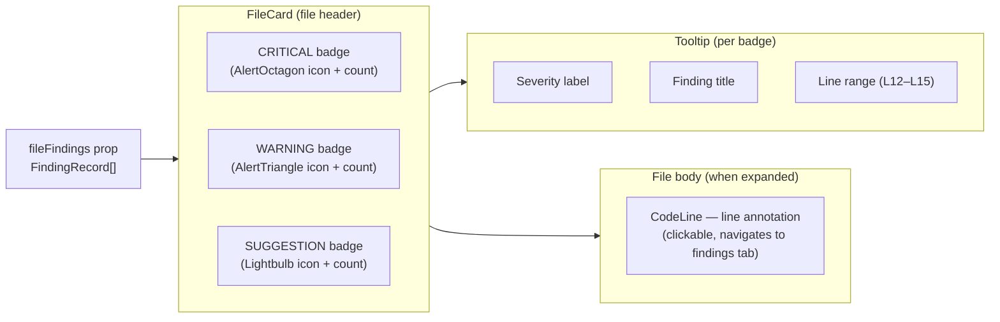
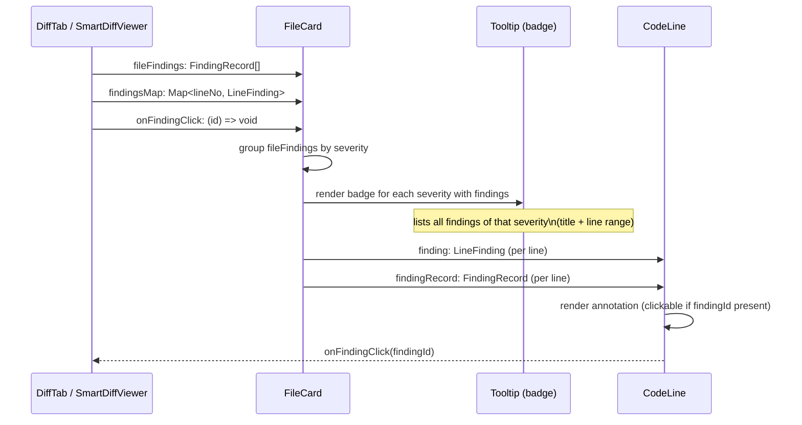

# DiffViewer — FileCard Finding Badges

## Overview

The `FileCard` component renders one collapsible file entry inside the diff view. When AI review findings exist for a file, the component displays per-severity badges in the file header — one badge each for **Critical**, **Warning**, and **Suggestion** findings. Each badge shows a count and opens a tooltip that lists every finding of that severity with its title and line range. Badges are display-only (not clickable). Line-level annotations inside the file body (`CodeLine`) remain a separate, clickable feature.

## Architecture

## Key Components

### FileCard

**File:** `client/src/components/diff-viewer/FileCard/FileCard.tsx`

Renders the collapsible file header and body. Receives the full `FindingRecord[]` list for the file via the `fileFindings` prop. Inside the header, it groups those records by `severity`, then renders one `Tooltip`-wrapped badge per severity that has at least one finding. The rendering order is always `CRITICAL → WARNING → SUGGESTION`, controlled by the `order` constant inside the component.

The badge itself is a `` with `onClick={(e) => e.stopPropagation()}` to prevent the header's collapse toggle from firing when the user interacts with the tooltip target.

### CodeLine

**File:** `client/src/components/diff-viewer/CodeLine/CodeLine.tsx`

Renders individual diff lines. Receives a `LineFinding` annotation and an optional `FindingRecord` for the clickable in-line annotation on the right side of each affected line. This annotation is independent from the header badges — it belongs to a single finding, it is clickable (fires `onFindingClick`), and it supports a tooltip with confidence score and rationale excerpt.

## Data Flow

## API / Interface

### FileCard props

| Prop | Type | Description |
|------|------|-------------|
| `file` | `PrFile` | File metadata (path, additions, deletions, patch) |
| `commenting` | `DiffCommentApi` (optional) | Inline comment infrastructure |
| `defaultExpanded` | `boolean` (optional) | Forces the card open; falls back to auto-expand for files ≤ 200 changed lines |
| `findingLines` | `number[]` (optional) | New-side line numbers to highlight (fallback when `findingsMap` is absent) |
| `findingsMap` | `Map<number, LineFinding>` (optional) | Per-line finding annotation with severity and title |
| `fileFindings` | `FindingRecord[]` (optional) | Full finding records for this file — drives the header badges and their tooltips |
| `onFindingClick` | `(findingId: string) => void` (optional) | Fired by `CodeLine` line annotations when clicked; typically navigates to the findings tab |

### Severity badge appearance

| Severity | Icon | Color token |
|----------|------|-------------|
| `CRITICAL` | `AlertOctagon` | `var(--crit)` / `var(--crit-bg)` |
| `WARNING` | `AlertTriangle` | `var(--warn)` / `var(--warn-bg)` |
| `SUGGESTION` | `Lightbulb` | `var(--sugg)` / `var(--sugg-bg)` |

### Tooltip content

Each badge tooltip renders a header line with the severity label and count, followed by one entry per finding showing:
- `f.title` — finding title (bold)
- Line range in monospace: `L{start_line}` or `L{start_line}–{end_line}` when start and end differ

## Behavior Notes

- Badges only appear when `fileFindings` is provided and contains at least one record.
- The three badges are rendered in fixed order (Critical, Warning, Suggestion); a severity with zero findings for this file is omitted entirely.
- Clicking a badge trigger does not toggle the file card; `stopPropagation` is called on the wrapper ``.
- Badges are not keyboard-navigable or focusable by design — they are display surfaces, not actions.
- `CodeLine` annotations (the right-margin label on each affected line) are a separate mechanism. They are clickable and use `onFindingClick` to navigate to the findings tab. Multi-line findings promote the first visible line to show the badge when `start_line` falls outside the rendered diff hunk.

## Related

- `client/src/components/diff-viewer/CodeLine/CodeLine.tsx` — line-level annotation implementation
- `client/src/components/diff-viewer/constants.ts` — `AUTO_EXPAND_MAX_LINES` threshold
- `vendor/ui/` — `Tooltip`, `Icon`, `SEV` primitives used by badges
- `vendor/shared/` — `FindingRecord` contract type
