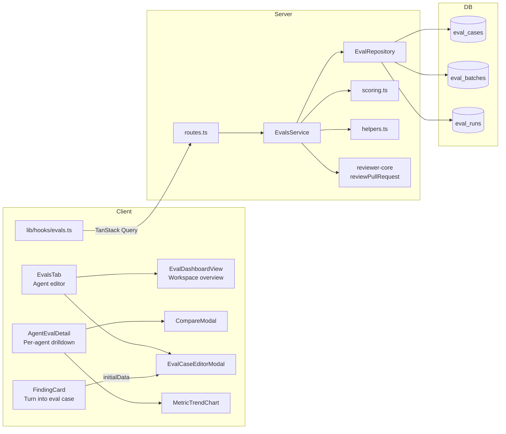
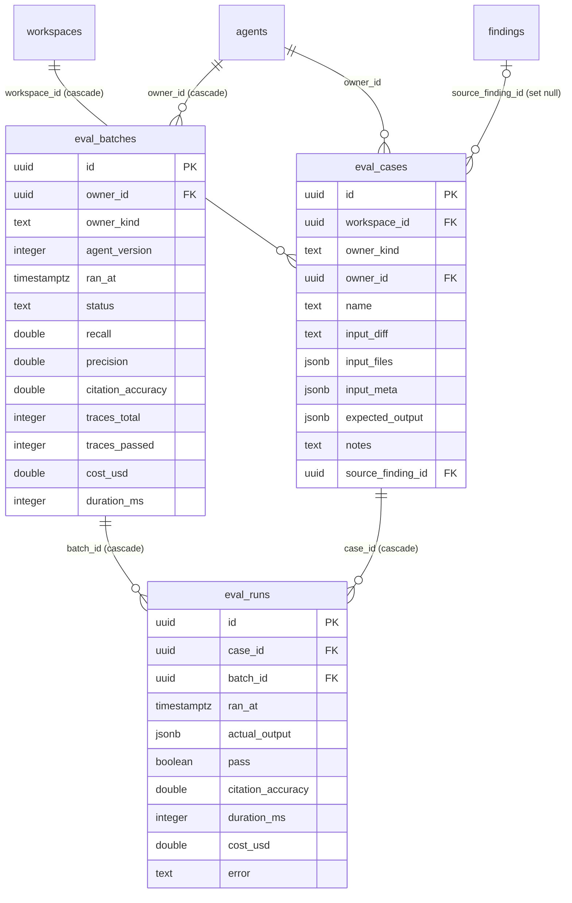
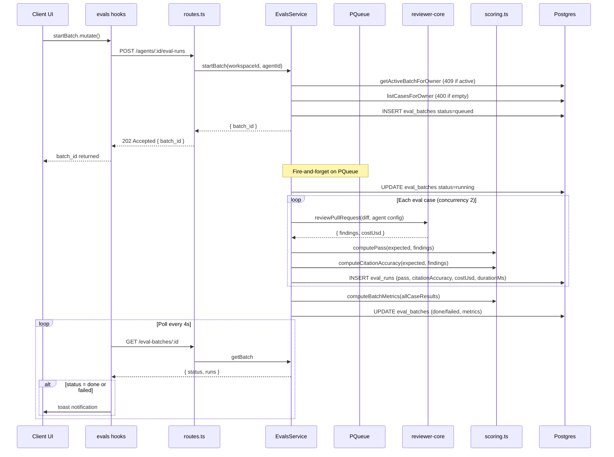
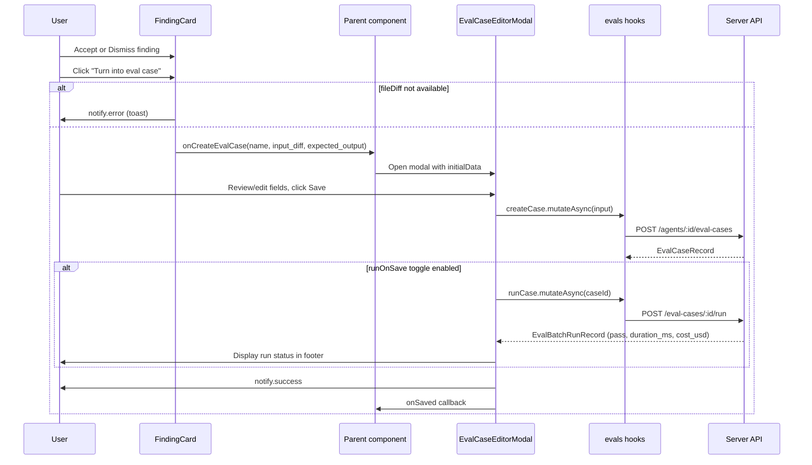

# Eval Pipeline

## Overview

The Eval Pipeline gives agent authors a regression-testing harness for review agents. Authors capture real findings as eval cases with expected outcomes, execute those cases against the agent, and track recall, precision, and citation accuracy metrics over time. This enables confident iteration on agent configuration — prompts, models, skills — with quantitative feedback instead of manual eyeballing.

The feature spans two packages: the server (`@devdigest/api`) owns execution, scoring, and persistence; the client (`@devdigest/web`) owns the dashboard, editor modal, and in-context entry point on FindingCard.

## Architecture

## Key Components

### Server Module: `evals/`

**Files:** `server/src/modules/evals/`

The module follows the project's onion pattern: routes delegate to service, service delegates to repository. There is no direct coupling between routes and the database.

#### `routes.ts`

**File:** `server/src/modules/evals/routes.ts`

A Fastify plugin registered at the module level. Every handler calls `getContext(container, req)` for workspace scoping. The plugin exposes 13 routes covering eval case CRUD, batch initiation, single-case execution, batch queries, dashboard data, batch comparison, and version promotion.

#### `service.ts` — EvalsService

**File:** `server/src/modules/evals/service.ts`

Orchestrates the full eval lifecycle. Key design decisions made in this class:

- **Own PQueue** (concurrency 2, constant `EVAL_BATCH_CONCURRENCY`): Eval LLM calls run on an isolated queue separate from review/indexing work. This prevents eval batches from starving normal reviews and avoids the `jobs` table overhead.
- **Dual-layer concurrency guard**: An in-memory `Map<ownerId, Promise>` provides a fast-path check for the same process instance. A secondary DB check (`getActiveBatchForOwner`) handles post-restart or multi-instance scenarios. Together they enforce one active batch per agent (AC-UB5).
- **Fire-and-forget batch execution**: `startBatch()` creates the batch row, sets `status: 'queued'`, enqueues execution on the PQueue, and returns immediately (202 Accepted). Transitions to `'running'` then `'done'` or `'failed'` happen asynchronously.
- **Direct reviewer-core integration**: `_executeSingleCase()` calls `reviewPullRequest()` from reviewer-core directly, bypassing the `ReviewRunExecutor`. This avoids SSE infrastructure, git clones, and `agent_runs` table overhead — all unnecessary for eval execution.
- **Version promotion via `AgentsService.update()`**: `promoteVersion()` reads the target version's `AgentVersionConfig` snapshot and passes it through the existing update path, which creates a new version N+1 with the promoted config. No special promotion logic is needed.

#### `scoring.ts`

**File:** `server/src/modules/evals/scoring.ts`

Pure functions with no I/O or LLM calls. Takes explicit inputs, returns deterministic outputs.

| Function | What it computes |
|----------|-----------------|
| `lineRangeOverlaps(a, b)` | Whether two line ranges intersect (inclusive) |
| `jaccardLineRange(a, b)` | Jaccard similarity: intersection / union of two line ranges |
| `computePass(expected, actual)` | True if all expectations satisfied: `must_find` has an overlapping actual finding (same file, intersecting lines); `must_not_flag` has none |
| `computeCitationAccuracy(expected, actual)` | Average Jaccard similarity of line ranges for matched `must_find` items; null if no `must_find` items |
| `computeBatchMetrics(cases)` | Aggregate recall, precision, citation accuracy, and pass counts across all cases |

Division-by-zero guards in `computeBatchMetrics`: `recall = null` when there are no `must_find` expectations; `precision = 1.0` when zero findings are produced and all expectations are `must_not_flag`; `precision = null` when zero findings are produced but `must_find` expectations exist.

#### `repository.ts` — EvalRepository

**File:** `server/src/modules/evals/repository.ts`

All methods are workspace-scoped. Because `eval_batches` has no `workspace_id` column, workspace scoping for batch queries uses a JOIN to `agents` on `owner_id`. Key methods:

- `getBatchScoped(workspaceId, batchId)` — scoped batch lookup via agent join
- `getActiveBatchForOwner(ownerId)` — finds any queued or running batch
- `reapStaleBatches()` — sets `running` or `queued` batches to `failed` (called on server boot)
- `getWorkspaceDashboardAgents(workspaceId)` — returns agents with latest batch stats and case counts
- `getRecentBatchesForWorkspace(workspaceId, limit)` — returns recent batches across all agents with agent name denormalized via JOIN
- `getRunsForBatches(batchIdA, batchIdB)` — retrieves runs for two batches grouped by batch ID for comparison

#### `helpers.ts`

**File:** `server/src/modules/evals/helpers.ts`

Contains two concerns:

1. `parseDiffToUnifiedDiff(diffText)` — converts a unified diff text string into the `UnifiedDiff` shape expected by `reviewPullRequest()`. Parses `diff --git`, `+++`, and `@@` headers to extract file paths, hunk metadata, and new-side line numbers. Handles renames (picks the `b/` path from `+++` line). Filters out files with no path (binary or incomplete headers).

2. DTO mappers (`toEvalCaseDto`, `toEvalRunDto`, `toEvalBatchDto`) — convert Drizzle row types to snake_case API response shapes.

#### `constants.ts`

**File:** `server/src/modules/evals/constants.ts`

| Constant | Value | Purpose |
|----------|-------|---------|
| `EVAL_BATCH_CONCURRENCY` | 2 | PQueue concurrency for eval LLM calls |
| `EVAL_MAX_DIFF_BYTES` | 512,000 | Max characters for `input_diff` (~500KB) |
| `EVAL_CASE_NAME_MAX` | 255 | Max name length |
| `EVAL_NOTES_MAX` | 5,000 | Max notes length |

### Shared Contracts

**File:** `server/src/vendor/shared/contracts/eval-pipeline.ts` (copied to client)

New schemas added without modifying existing contract files. Imports `EvalOwnerKind` and `EvalCase` from `knowledge.ts`, and `EvalRunRecord` from `eval-ci.ts`, extending rather than duplicating them.

Key types:

| Type | Description |
|------|-------------|
| `ExpectedOutputItem` | One assertion in `expected_output`: `{ type: 'must_find' \| 'must_not_flag', file, start_line, end_line, severity?, category?, title? }` |
| `EvalBatchStatus` | `'queued' \| 'running' \| 'done' \| 'failed'` |
| `EvalBatchRecord` | Persisted `eval_batches` row returned by API |
| `EvalBatchRunRecord` | `EvalRunRecord` extended with `batch_id` and `error` |
| `EvalCaseRecord` | `EvalCase` extended with `workspace_id` and `source_finding_id` |
| `CreateEvalCaseInput` | POST body: name (max 255), input_diff (max 512,000 chars), expected_output array, optional notes/source_finding_id |
| `UpdateEvalCaseInput` | Partial version of `CreateEvalCaseInput` |
| `EvalBatchComparison` | Compare response: metric deltas, system prompt strings, case flips |
| `EvalAgentSummary` | Per-agent card data for workspace dashboard |
| `TimeRangeFilter` | `'7d' \| '30d' \| '90d' \| 'all'` (default `'30d'`) |

### Database Schema

**File:** `server/src/db/schema/eval.ts`

Three tables form the eval data model:

Notes on cascade chain: deleting an agent cascades to `eval_batches` (via `owner_id` FK), which cascades to `eval_runs` (via `batch_id` FK). Agent deletion also cascades to `eval_cases` (via workspace), which cascades to `eval_runs` (via `case_id` FK). The `source_finding_id` is set to NULL on finding deletion rather than cascading.

### Client Hooks

**File:** `client/src/lib/hooks/evals.ts`

All server-state management lives here. Components never call `api.ts` directly.

| Hook | Method | Endpoint | Notes |
|------|--------|----------|-------|
| `useEvalCases(agentId)` | GET | `/agents/:id/eval-cases` | Disabled when no agentId |
| `useEvalCase(caseId)` | GET | `/eval-cases/:id` | |
| `useCreateEvalCase(agentId)` | POST | `/agents/:id/eval-cases` | Invalidates `["eval-cases", agentId]` |
| `useUpdateEvalCase()` | PUT | `/eval-cases/:id` | Updates query cache directly |
| `useDeleteEvalCase()` | DELETE | `/eval-cases/:id` | Removes from query cache |
| `useRunEvalCase()` | POST | `/eval-cases/:id/run` | Invalidates eval-batches |
| `useStartEvalBatch(agentId)` | POST | `/agents/:id/eval-runs` | Returns `{ batch_id }` |
| `useEvalBatches(agentId, range)` | GET | `/agents/:id/eval-batches?range=` | |
| `useEvalBatch(batchId)` | GET | `/eval-batches/:id` | Polls every 4s while status is queued/running; fires toast on status transitions to done/failed |
| `useEvalDashboard()` | GET | `/eval-dashboard` | Polls every 4s unconditionally |
| `useAgentEvalDashboard(agentId, range)` | GET | `/agents/:id/eval-dashboard?range=` | |
| `useCompareBatches(batchIdA, batchIdB)` | GET | `/eval-batches/:a/compare/:b` | Disabled until both IDs provided |
| `usePromoteAgentVersion(agentId)` | POST | `/agents/:id/promote` | Invalidates agent, agents, eval-batches, agent-eval-dashboard queries; success toast |

The polling strategy in `useEvalBatch` uses `refetchInterval` as a callback that reads the current query state: it returns 4000ms when status is `'queued'` or `'running'`, and `false` otherwise. Toast notifications fire from a `useEffect` watching `data.status`, comparing to a ref to detect transitions (not initial load).

### Client UI Components

#### `EvalDashboardView`

**File:** `client/src/app/eval-dashboard/_components/EvalDashboardView/EvalDashboardView.tsx`

Workspace-wide overview rendered at `/eval-dashboard` when no `?agent=` query param is present. Shows an agent card grid and a recent runs table. Pass/fail indicators use icon plus text (never color alone) to satisfy accessibility requirements.

#### `AgentEvalCard`

**File:** `client/src/app/eval-dashboard/_components/AgentEvalCard/AgentEvalCard.tsx`

Clickable card per agent showing version, last run timestamp, case count, and recall/precision/citation accuracy percentages. Click navigates to `/eval-dashboard?agent={id}`.

#### `AgentEvalDetail`

**File:** `client/src/app/eval-dashboard/_components/AgentEvalDetail/AgentEvalDetail.tsx`

Per-agent drilldown rendered when `?agent={id}` is present. Contains:
- Time range selector (7d/30d/90d/all) that feeds `useAgentEvalDashboard` and `useEvalBatches`
- "Run eval" button disabled and showing "Running..." while a batch is queued or running
- Alert banner shown when precision or recall dipped more than 2 percentage points versus the previous batch
- Three metric cards (Recall, Precision, Citation Accuracy) with current value and delta from previous batch
- `MetricTrendChart` for batch-level metric history
- Runs table with checkbox column for selecting exactly two batches to compare
- "Compare" button enabled only when exactly 2 batches are selected

#### `MetricTrendChart`

**File:** `client/src/app/eval-dashboard/_components/MetricTrendChart/MetricTrendChart.tsx`

Recharts `LineChart` with three series (Recall in accent color, Precision in warn color, Citation Accuracy in ok color). Y-axis fixed 0–1. One point per batch; standalone single-case runs are excluded from trend data. Shows a dashed placeholder when no batches exist.

#### `CompareModal`

**File:** `client/src/app/eval-dashboard/_components/CompareModal/CompareModal.tsx`

Focus-trapped modal (Tab cycling, Escape to close). Sections:
- Metric delta cards for recall, precision, citation accuracy, pass fraction, cost
- Line-by-line system prompt diff rendered inline (simple add/remove/context classification, no diff library dependency)
- Collapsible "Case changes" list showing pass/fail flips with regression vs improvement labels
- "Promote v{N}" button calling `usePromoteAgentVersion` which creates a new version N+1

#### `EvalsTab`

**File:** `client/src/app/agents/[id]/_components/AgentEditor/_components/EvalsTab/EvalsTab.tsx`

Tab in the agent editor (after "Stats"). Contains:
- Eval metrics summary (recall, precision, citation accuracy, pass rate) from `useAgentEvalDashboard`
- "View full dashboard" link
- Eval cases list with name, expected output summary ("N must_find, M must_not_flag"), pass/fail indicator, and run/edit/delete actions
- "Run all evals" button — disabled while a batch is running; handles 409 conflict and 400 no-cases errors with distinct toast messages
- "New eval case" button opening `EvalCaseEditorModal` in create mode

#### `EvalCaseEditorModal`

**File:** `client/src/components/eval-case-editor/EvalCaseEditorModal.tsx`

Shared modal used by both "Turn into eval case" (FindingCard) and "New eval case" / "Edit" (EvalsTab). Placed in `components/` (not `_components/`) because it is consumed from multiple pages.

Fields:
- Name (required, text input)
- Input section with three tabs: Diff (monospace textarea for unified diff), Files (JSON textarea), PR meta (JSON textarea)
- Expected output (monospace JSON textarea with live parse validation indicator, "Finding skeleton" button inserts template)
- Notes (optional)

Footer controls:
- "Run on save" toggle (default on) — when enabled, a standalone `POST /eval-cases/:id/run` fires after save
- Last run status display (updates after run)
- Cancel, "Run case" (edit mode only), Save

The modal receives an optional `initialData` prop (`Partial<CreateEvalCaseInput>`) that pre-populates fields when opened from FindingCard.

#### FindingCard integration

**File:** `client/src/app/repos/[repoId]/pulls/[number]/_components/FindingCard/FindingCard.tsx`

Added two props:
- `onCreateEvalCase?: (data: Partial<CreateEvalCaseInput>) => void` — callback invoked with pre-populated eval case data
- `fileDiff?: string` — the unified diff text for the finding's file

The "Turn into eval case" button (icon: FlaskConical) is disabled when the finding has neither `accepted_at` nor `dismissed_at`. On click it checks `fileDiff` availability (error toast if missing), then calls `onCreateEvalCase` with: `name` from finding title, `input_diff` from the file diff, and a single `ExpectedOutputItem` with type `'must_find'` (if accepted) or `'must_not_flag'` (if dismissed), plus file, start_line, end_line, severity, category, and title from the finding.

## Data Flow

### Batch Execution Flow

### Turn into Eval Case Flow

## API Reference

All routes require workspace membership resolved via `getContext`. All IDs are UUIDs.

| Method | Path | Request | Response | Notes |
|--------|------|---------|----------|-------|
| POST | `/agents/:id/eval-cases` | `CreateEvalCaseInput` | `EvalCaseRecord` 201 | |
| GET | `/agents/:id/eval-cases` | — | `EvalCaseRecord[]` | |
| GET | `/eval-cases/:id` | — | `EvalCaseRecord` | 404 if not found |
| PUT | `/eval-cases/:id` | `UpdateEvalCaseInput` | `EvalCaseRecord` | 404 if not found |
| DELETE | `/eval-cases/:id` | — | `{ ok: true }` | Cascades to eval_runs |
| POST | `/agents/:id/eval-runs` | — | `{ batch_id }` 202 | 409 if batch active; 400 if no cases |
| POST | `/eval-cases/:id/run` | — | `EvalBatchRunRecord` | Standalone run (batch_id null) |
| GET | `/agents/:id/eval-batches` | `?range=7d\|30d\|90d\|all` | `EvalBatchRecord[]` | Default range: 30d |
| GET | `/eval-batches/:id` | — | `EvalBatchRecord & { runs: EvalBatchRunRecord[] }` | |
| GET | `/eval-batches/:a/compare/:b` | — | `EvalBatchComparison` | |
| GET | `/eval-dashboard` | — | `EvalWorkspaceDashboard` | |
| GET | `/agents/:id/eval-dashboard` | `?range=...` | Agent dashboard with trend | Alert field when regression detected |
| POST | `/agents/:id/promote` | `{ version: number }` | Updated agent | Creates new version N+1 |

## Metric Definitions

| Metric | Level | Formula | Edge cases |
|--------|-------|---------|------------|
| pass | per eval_run | All expectations satisfied: every `must_find` has an overlapping actual finding; every `must_not_flag` has no overlap | Empty `expected_output` → `true`; overlap = same file AND line ranges intersect |
| citation_accuracy | per eval_run | Average Jaccard similarity of expected vs actual line ranges for matched `must_find` items | `null` if no `must_find` items; unmatched `must_find` contributes 0 |
| recall | per eval_batch | matched_must_find / total_must_find | `null` if no `must_find` expectations |
| precision | per eval_batch | findings_matching_must_find / total_actual_findings | `1.0` if zero findings and only `must_not_flag` expectations; `null` if zero findings with `must_find` expectations |
| citation_accuracy | per eval_batch | Average of non-null per-case citation_accuracy values | `null` if no cases have non-null citation_accuracy |

## Stale Batch Reaping

`EvalsService.reapStaleBatches()` is called on server boot (in `app.ts`) after the existing `ReviewService.reapStaleRuns()` call. It sets any `'running'` or `'queued'` eval batches to `'failed'`. This handles the case where the server crashes mid-batch execution, following the same pattern used for agent runs.

## Configuration

No new secrets or environment variables. The feature inherits the existing LLM provider configuration (provider secrets in `~/.devdigest/secrets.json`).

The concurrency limit for batch execution is the compile-time constant `EVAL_BATCH_CONCURRENCY = 2` in `server/src/modules/evals/constants.ts`.

## Related

- `server/src/modules/evals/` — server module (all backend files)
- `client/src/lib/hooks/evals.ts` — all TanStack Query hooks
- `client/src/app/eval-dashboard/` — dashboard page and components
- `client/src/components/eval-case-editor/` — shared editor modal
- `server/src/vendor/shared/contracts/eval-pipeline.ts` — Zod contracts
- `server/src/db/schema/eval.ts` — Drizzle schema for all three tables
- `specs/eval-pipeline/eval-pipeline.spec.md` — original behavioral spec
- `specs/eval-pipeline/eval-pipeline_plan.md` — implementation plan
