# Export to CI — Client

## Overview

The client side of Export to CI consists of three UI surfaces: the `CiExportWizard`
modal (a shared component), the agent `CiTab` (embedded in the agent editor), and the
`/ci-runs` navigation page. All three consume data exclusively through TanStack Query
hooks in `lib/hooks/ci.ts` — no component calls `api` directly. The CI Runs page
auto-refreshes every 20 seconds. The wizard handles both PR opening and client-side
zip download using `fflate`.

## Architecture

```mermaid
flowchart TD
    subgraph pages["Pages &#40;thin orchestrators&#41;"]
        citab["agents/&#91;id&#93; — CiTab\ninstallations + run history"]
        cipage["ci-runs/page.tsx\nCI Runs page"]
    end

    subgraph components["Shared Components"]
        wizard["CiExportWizard\ncomponents/CiExportWizard/"]
    end

    subgraph hooks["lib/hooks/ci.ts"]
        useRuns["useCiRuns&#40;filters&#41;\nrefetchInterval: 20s"]
        useInst["useCiInstallations&#40;agentId&#41;"]
        useExport["useExportCi&#40;agentId&#41;\nmutation"]
    end

    subgraph api["Server API"]
        apiRuns["GET /ci/runs"]
        apiInst["GET /ci/installations"]
        apiExport["POST /agents/:id/export-ci"]
    end

    citab -->|useCiInstallations| useInst
    citab -->|useCiRuns| useRuns
    citab -->|opens| wizard
    cipage -->|useCiRuns| useRuns
    wizard -->|useExportCi| useExport

    useRuns --> apiRuns
    useInst --> apiInst
    useExport --> apiExport
```



## Key Components

### CiExportWizard

**Files:** `client/src/components/CiExportWizard/`

A shared modal wizard that wraps `@devdigest/ui` `Modal` and `ExportWizardSteps`.
It is placed in `components/` because it is consumed by the `CiTab` and could be
opened from other entry points. The wizard manages all state locally and delegates
the server call to `useExportCi`.

Steps and their responsibilities:

| Step | Name | Key behaviors |
|------|------|---------------|
| 0 | Target | GitHub Actions is the only enabled card; CircleCI, Jenkins, Generic CLI are rendered as disabled |
| 1 | Preview | Loads files via `action:'files'` export call; displays file list and editable workflow textarea |
| 2 | Configure | Repo input, trigger checkboxes, publish mode radio buttons |
| 3 | Install | Open PR or download ZIP; pending state disables buttons; errors surfaced inline |

**`constants.ts`** — `WIZARD_LABELS`, `TARGET_CARDS` (four entries; only `gha` is
`enabled: true`), `AVAILABLE_TRIGGERS`, `PUBLISH_MODES`.

**`helpers.ts`** — three pure functions:
- `buildZip(files)` — uses `fflate` `zipSync` + `strToU8` to produce a `Blob` from `CiFile[]`.
- `triggerDownload(blob, filename)` — creates a temporary object URL and clicks a hidden `<a>`.
- `extractWorkflowYaml(files)` — finds the first `editable: true` file and returns its contents.

The wizard calls `exportMutation.mutate` with `action:'files'` for Preview (to
obtain server-generated files without committing) and with `action:'open_pr'` for the
PR install. The edited `workflowYaml` state is passed as `workflow_override` only when
non-empty, allowing the server to use the author's edits verbatim.

### CiTab

**Files:** `client/src/app/agents/[id]/_components/AgentEditor/_components/CiTab/`

Embedded in the agent editor as the `"ci"` tab. Renders three sections:

1. **Fail CI on** — reads `agent.ci_fail_on` from the agent prop and maps it through `CI_FAIL_ON_LABELS`.
2. **Installations** — calls `useCiInstallations(agent.id)`; each installation card shows the repo, target type, install date, and `agent_version` (the agent version at install time — not the current version).
3. **Run History** — calls `useCiRuns({ agent: agent.id })`; each row shows PR number, status badge, findings, duration, cost, and a job link.

The "Add to CI" button sets `wizardOpen` to `true`, mounting the `CiExportWizard` modal.

The `CiInstallationWithVersion` local type extends `CiInstallation` with
`agent_version?: number | null` because the server returns this extra field but the
vendored contract does not declare it (vendor is read-only).

### CI Runs Page

**Files:** `client/src/app/ci-runs/`

A thin page orchestrator at `/ci-runs`. Reads `repo`, `agent`, `source`, and `status`
from URL search params, passes them to `useCiRuns(filters)`, and delegates rendering
to `FilterBar` and `CiRunsTable`. Filter changes are applied by pushing a new URL (no
full-page reload).

**`CiRunsTable`** renders a nine-column table:

| Column | Data field |
|--------|-----------|
| Repository | `run.ci_installation_id` &#40;proxy for repo in v1&#41; |
| PR | `run.pr_number` |
| Agent | `run.agent` |
| Source | `run.source` |
| Duration | `run.duration_s` &#40;always `null` in v1 — see Known Limitations&#41; |
| Findings | `run.findings_count` |
| Cost | `run.cost_usd` |
| Status | `StatusBadge` component |
| Trace / Job | `run.github_url` |

Skeleton rows (8 by default) are shown during loading.

### Data Hooks

**File:** `client/src/lib/hooks/ci.ts`

| Hook | Query key | Behavior |
|------|-----------|----------|
| `useCiRuns(filters)` | `['ci-runs', filters]` | Auto-refreshes every `CI_RUNS_POLL_MS` (20 000 ms) |
| `useCiInstallations(agentId)` | `['ci-installations', agentId]` | `enabled: !!agentId` |
| `useExportCi(agentId)` | mutation | Invalidates `['ci-installations', agentId]` and `['ci-runs']` on success |

`CI_RUNS_POLL_MS = 20_000` is exported from the hooks file so it can be referenced
in tests and documentation without duplication.

## Data Flow

### Wizard: Preview then Install (PR)

```mermaid
sequenceDiagram
    participant User
    participant Wizard as CiExportWizard
    participant Hook as useExportCi
    participant API as POST /agents/:id/export-ci

    User->>Wizard: Click "Load Preview"
    Wizard->>Hook: mutate&#40;{action:'files', repo, triggers, post_as}&#41;
    Hook->>API: POST /agents/:id/export-ci
    API-->>Hook: CiExport {files, pr_url:null}
    Hook-->>Wizard: onSuccess&#40;data&#41;
    Wizard->>Wizard: setPreviewFiles&#40;data.files&#41;
    Wizard->>Wizard: setWorkflowYaml&#40;extractWorkflowYaml&#40;files&#41;&#41;
    User->>Wizard: Edit workflow YAML in textarea
    User->>Wizard: Click "Open PR"
    Wizard->>Hook: mutate&#40;{action:'open_pr', ..., workflow_override: workflowYaml}&#41;
    Hook->>API: POST /agents/:id/export-ci
    API-->>Hook: CiExport {installation, files, pr_url:'https://...'}
    Hook-->>Wizard: onSuccess&#40;data&#41;
    Wizard->>Wizard: setInstallResult&#40;data&#41;
    Wizard->>User: Show PR link
```



### Wizard: ZIP Download

```mermaid
sequenceDiagram
    participant User
    participant Wizard as CiExportWizard
    participant Hook as useExportCi
    participant API as POST /agents/:id/export-ci
    participant fflate

    User->>Wizard: Click "Download ZIP"
    Wizard->>Hook: mutate&#40;{action:'files', ..., workflow_override?}&#41;
    Hook->>API: POST /agents/:id/export-ci
    API-->>Hook: CiExport {files, pr_url:null}
    Hook-->>Wizard: onSuccess&#40;data&#41;
    Wizard->>fflate: buildZip&#40;data.files&#41; -- zipSync + strToU8
    fflate-->>Wizard: Blob
    Wizard->>Wizard: triggerDownload&#40;blob, 'devdigest-ci.zip'&#41;
    Wizard->>User: Browser downloads file
```



### CI Runs Page: Auto-refresh

```mermaid
sequenceDiagram
    participant Browser
    participant Page as ci-runs/page.tsx
    participant Hook as useCiRuns
    participant API as GET /ci/runs

    Browser->>Page: Navigate to /ci-runs?repo=owner/repo
    Page->>Hook: useCiRuns&#40;{repo:'owner/repo'}&#41;
    Hook->>API: GET /ci/runs?repo=owner%2Frepo
    API-->>Hook: CiRun[]
    Hook-->>Page: {data, isLoading}
    Page->>Browser: Render CiRunsTable
    Note over Hook: Every 20s: refetchInterval fires
    Hook->>API: GET /ci/runs?repo=owner%2Frepo
    API-->>Hook: CiRun&#91;&#93; &#40;updated&#41;
    Hook-->>Page: {data} updated
    Page->>Browser: Re-render table
```



## File Structure

```
client/src/
  components/
    CiExportWizard/
      CiExportWizard.tsx     -- main wizard component (4 step sub-components)
      constants.ts           -- WIZARD_LABELS, TARGET_CARDS, AVAILABLE_TRIGGERS, PUBLISH_MODES
      helpers.ts             -- buildZip, triggerDownload, extractWorkflowYaml
      index.ts               -- barrel export
      CiExportWizard.test.tsx

  app/
    ci-runs/
      page.tsx               -- thin orchestrator
      constants.ts           -- COLUMN_KEYS, COLUMN_LABELS, SKELETON_ROWS
      _components/
        CiRunsTable/
          CiRunsTable.tsx
          index.ts
          CiRunsTable.test.tsx
        FilterBar/
          FilterBar.tsx
          index.ts

    agents/[id]/_components/AgentEditor/_components/
      CiTab/
        CiTab.tsx            -- installations + runs + wizard trigger
        CiTab.test.tsx
        constants.ts         -- WORKFLOW_VERSION_LABEL, CI_FAIL_ON_LABEL, CI_FAIL_ON_LABELS

  lib/
    hooks/
      ci.ts                  -- useCiRuns, useCiInstallations, useExportCi, CI_RUNS_POLL_MS
```

## Known Limitations (v1)

- **Repository column**: `CiRunsTable` renders `run.ci_installation_id` as the repository
  column because the `CiRun` contract from the server maps `ci_installation_id` not the
  repo string. A future server change joining back to `ci_installations.repo` will fix this.
- **`duration_s` always null**: `CiRun.duration_s` is always `null` from the server in v1
  (the `ci_runs` table has no duration column yet). The column renders "—".
- **memory.jsonl in Preview**: The Preview step always shows a "No memory data" row for
  `.devdigest/memory.jsonl` because no memory source is registered in the server. This
  is the intentional v1 omit branch.
- **Base branch hardcoded**: The wizard always sends `base: 'main'` to the server. A
  future Configure step field could make this configurable.

## Related

- `server/docs/ExportToCi/README.md` — server-side documentation
- `client/src/vendor/shared/contracts/eval-ci.ts` — `CiRun`, `CiInstallation`, `CiExport`, `CiFile`, `CiExportInputBody` contracts
- `client/src/vendor/ui/kit/Modal.tsx` — modal primitive used by the wizard
- `client/src/vendor/ui/ExportWizardSteps.tsx` — step indicator primitive
