# Export to CI v2 &#40;Delta&#41; — Client

> **Delta doc.** This documents ONLY what v2 adds/changes on top of the
> `ExportToCi` v1 baseline. Unchanged v1 behavior — the wizard's Target /
> Preview steps, ZIP download via `fflate`, the CI Runs page and its
> 20&#8202;s auto-refresh — is documented in
> [`client/docs/ExportToCi/README.md`](../ExportToCi/README.md) and is not
> re-described here.

## Overview

`ExportToCi_2` adds a new **Agent Performance** dashboard page
(`/agent-performance`), reachable from a new **GLOBAL** navigation group, and
extends two existing surfaces: `CiTab` now supports **multiple repositories
per agent** with per-repo status and a confirm-gated Remove action, and
`CiExportWizard` gained a **Configure** step for the self-hosted runner label
and private studio URL plus an **Install** step that surfaces the server's
`ingest_wiring` provisioning outcome and pre-flight token errors. All three
surfaces consume the server exclusively through TanStack Query hooks in
`lib/hooks/ci.ts` — two of which &#40;`useAgentPerformance`,
`useRemoveInstallation`&#41; are new in v2.

## Architecture

```mermaid
flowchart TD
    subgraph nav["app-shell/patch-nav.ts"]
        globalGroup["GLOBAL NavGroup &#40;new&#41;\nAGENT_PERFORMANCE_ITEM\nhref: /agent-performance"]
    end

    subgraph pages["Pages &#40;thin orchestrators&#41;"]
        perfPage["agent-performance/page.tsx\nresolves ?window= param"]
        citabPage["agents/&#91;id&#93; — CiTab\n&#40;multi-repo, extended&#41;"]
    end

    subgraph perfComp["components/AgentPerformance/ &#40;new&#41;"]
        perfView["AgentPerformanceView.tsx\nWindowSelector, StatCards,\nCostDonuts, AgentPerfTable"]
        perfConst["constants.ts\nWINDOW_OPTIONS, DEFAULT_WINDOW"]
        perfHelp["helpers.ts\nformatUsd, toDonutSegments, ..."]
    end

    subgraph wizard["components/CiExportWizard/ &#40;extended&#41;"]
        stepConfigure["StepConfigure\n+ runner label input\n+ studio URL input"]
        stepInstall["StepInstall\n+ ingest_wiring status\n+ pre-flight token error"]
        wizConst["constants.ts\nDEFAULT_RUNNER_LABEL_INPUT\nDEFAULT_STUDIO_URL_INPUT"]
        wizHelp["helpers.ts\nparseRunnerLabel&#40;&#41;"]
    end

    subgraph hooks["lib/hooks/ci.ts"]
        useInst["useCiInstallations&#40;agentId&#41;\ntyped CiInstallationView&#91;&#93;"]
        useRemove["useRemoveInstallation&#40;&#41;\n&#40;new&#41;"]
        usePerf["useAgentPerformance&#40;window&#41;\n&#40;new&#41;"]
        useExport["useExportCi&#40;agentId&#41;\nbody now includes\nrunner_label + studio_url"]
    end

    subgraph api["Server API"]
        apiPerf["GET /ci/performance"]
        apiInst["GET /ci/installations"]
        apiDelete["DELETE /ci/installations/:id"]
        apiExport["POST /agents/:id/export-ci"]
    end

    globalGroup --> perfPage
    perfPage --> perfView
    perfView --> perfConst
    perfView --> perfHelp
    perfPage -->|useAgentPerformance| usePerf
    citabPage -->|useCiInstallations| useInst
    citabPage -->|useRemoveInstallation| useRemove
    citabPage -->|opens| wizard
    wizard --> stepConfigure
    wizard --> stepInstall
    stepConfigure --> wizConst
    stepConfigure --> wizHelp
    wizard -->|useExportCi| useExport

    usePerf --> apiPerf
    useInst --> apiInst
    useRemove --> apiDelete
    useExport --> apiExport
```



## Key Components

### Agent Performance page &#40;new&#41;

**File:** `client/src/app/agent-performance/page.tsx`

A thin page orchestrator. It reads a `?window=` search param, validates it
against `VALID_WINDOWS` &#40;falls back to `DEFAULT_WINDOW` on any
unrecognized value — never forwards an invalid window to the query&#41;,
calls `useAgentPerformance&#40;window&#41;`, and renders
`AgentPerformanceView` inside `AppShell`.

### AgentPerformanceView &#40;new&#41;

**File:** `client/src/components/AgentPerformance/AgentPerformanceView.tsx`

| Sub-component | Renders |
|----------------|---------|
| `WindowSelector` | 7 / 30 / 90-day toggle; changing it updates the `?window=` URL param |
| `StatCard` / `StatCards` | TOTAL RUNS, TOTAL COST &#40;with color-coded delta vs. previous window&#41;, AVG ACCEPT RATE &#40;via `PercentProgress`&#41;, MOST-ACTIVE AGENT |
| `CostDonutCard` / `CostDonuts` | Two donuts &#40;by agent, by model&#41; built from `CostSlice&#91;&#93;` via `toDonutSegments&#40;&#41;` |
| `TrendIndicator` | Renders the `'up' \| 'down' \| 'flat' \| null` trend arrow per agent row |
| `AgentPerfRow` / `AgentPerfTable` | Per-agent table with a **View** link to `/agents/${agent_id}?tab=ci` |

Renders an `EmptyState` when `total_runs === 0` &#40;server already
collapses this to a zeroed shape via `emptyPerformance&#40;&#41;` — the
component does not need its own zero-state branching logic&#41;, and a
loading skeleton while the query is in flight.

**`constants.ts`** — `WINDOW_OPTIONS`, `DEFAULT_WINDOW = "30"`,
`DONUT_PALETTE`.

**`helpers.ts`** — pure formatters, every one of which returns `"—"` for
`null` rather than `"NaN"` or `"0"`: `formatUsd`, `formatSignedUsd`,
`formatPercent`, `formatDurationMs`, `formatDate`, `toDonutSegments`.

### CiTab &#40;extended — multi-repo&#41;

**File:**
`client/src/app/agents/[id]/_components/AgentEditor/_components/CiTab/CiTab.tsx`

- **`InstallationCard`** — one card per installed repo: repo name,
  `target_type` badge, `last_status` badge &#40;from the extended
  `CiInstallationView` shape&#41;, and a metadata row. Each card has its own
  **Remove** action gated by a local `confirming` state &#40;click once to
  arm, click again to confirm — no shared/global confirm dialog&#41;, wired
  to `useRemoveInstallation`.
- **`RunRow`** — unchanged per-run rendering from v1, now scoped under a
  per-repo section instead of a single flat list.
- A summary line reads **"Active in N repos"**.
- The primary action button's label toggles between **"Add to CI"**
  &#40;`installationCount === 0`&#41; and **"Add repository"**
  &#40;`installationCount > 0`&#41;, both of which open the same
  `CiExportWizard`.

### CiExportWizard &#40;extended&#41;

**Files:** `client/src/components/CiExportWizard/`

- **`StepConfigure`** gained two text inputs: a **runner label** field
  &#40;default `"self-hosted, devdigest"`, parsed into `string&#91;&#93;` via
  the new `parseRunnerLabel&#40;&#41;` helper&#41; and a **studio URL** field
  &#40;default `"http://localhost:3001"`&#41;. Both are sent on every export
  call via `buildExportBody`, matching the server's `runner_label` /
  `studio_url` `.refine&#40;&#41;`-validated fields.
- **`StepInstall`** gained:
  - A **pre-flight token error** display when the server rejects the export
    with `ci_ingest_token_missing` &#40;before any GitHub call is made
    server-side&#41;.
  - Rendering of the response's `ingest_wiring.status` —
    **ok** &#40;secret + variable provisioned&#41; or **incomplete**
    &#40;PR opened, but provisioning failed; shows `ingest_wiring.error`&#41;.
    The PR link is always shown regardless of provisioning outcome, since
    provisioning failure never rolls back the PR server-side.
  - A private-repo advisory note &#40;self-hosted runners are not supported
    against public repos&#41;.
  - A self-hosted runner registration note, reminding the operator that the
    runner label must actually be registered on the target repo/org before
    CI will pick up jobs.

**`constants.ts`** — `DEFAULT_RUNNER_LABEL_INPUT = "self-hosted, devdigest"`,
`DEFAULT_STUDIO_URL_INPUT = "http://localhost:3001"`.

**`helpers.ts`** — new `parseRunnerLabel&#40;input&#41;`, a pure function
splitting/trimming the comma-separated runner-label text input into
`string&#91;&#93;`.

### Data Hooks &#40;lib/hooks/ci.ts&#41;

**File:** `client/src/lib/hooks/ci.ts`

| Hook | Query key / type | Behavior |
|------|-------------------|----------|
| `useAgentPerformance&#40;window&#41;` *&#40;new&#41;* | `['agent-performance', window]` | Fetches `GET /ci/performance?window=...`; returns `AgentPerformance` |
| `useRemoveInstallation&#40;&#41;` *&#40;new&#41;* | mutation | Calls `DELETE /ci/installations/:id`; invalidates `['ci-installations']` on success |
| `useCiInstallations&#40;agentId&#41;` *&#40;extended&#41;* | `['ci-installations', agentId]` | Now typed `CiInstallationView&#91;&#93;` &#40;adds `agent_version`, `last_status`, `last_run_at`&#41; |
| `useExportCi&#40;agentId&#41;` *&#40;extended&#41;* | mutation | Request body &#40;`buildExportBody` in the wizard&#41; now always includes `runner_label` and `studio_url` |
| `useCiRuns&#40;filters&#41;` | `['ci-runs', filters]` | Unchanged from v1 — polls every `CI_RUNS_POLL_MS` &#40;20&#8202;000&#8202;ms&#41; |

Local interfaces `IngestWiring` and `CiExportResult` are declared in this
file &#40;not in `vendor/shared`&#41; because the extended export response
shape has no server-declared response schema — it is an
implementation-level extension, not a shared contract.

### Global navigation &#40;patch-nav.ts&#41;

**File:** `client/src/components/app-shell/patch-nav.ts`

The vendored nav config has no top-level `GLOBAL` group, so `patch-nav.ts`
creates one and pushes an `AGENT_PERFORMANCE_ITEM` entry
&#40;`gKey: "f"`, `icon: "Gauge"`, `href: "/agent-performance"`&#41; into it.
A double-push guard prevents the item from being duplicated if the patch
function runs more than once &#40;e.g. React Strict Mode double-invocation
or hot reload&#41;.

## Data Flow

### Agent Performance page load &#43; window change

```mermaid
sequenceDiagram
    participant Browser
    participant Page as agent-performance/page.tsx
    participant Hook as useAgentPerformance
    participant API as GET /ci/performance

    Browser->>Page: Navigate to /agent-performance?window=30
    Page->>Page: validate window against VALID_WINDOWS
    Page->>Hook: useAgentPerformance&#40;'30'&#41;
    Hook->>API: GET /ci/performance?window=30
    API-->>Hook: AgentPerformance
    Hook-->>Page: &#123;data, isLoading&#125;
    Page->>Browser: Render AgentPerformanceView
    Browser->>Page: User clicks "90" in WindowSelector
    Page->>Page: push URL ?window=90
    Page->>Hook: useAgentPerformance&#40;'90'&#41; &#40;new query key&#41;
    Hook->>API: GET /ci/performance?window=90
    API-->>Hook: AgentPerformance &#40;or emptyPerformance if total_runs===0&#41;
    Hook-->>Page: &#123;data&#125; updated
    Page->>Browser: Re-render StatCards, CostDonuts, AgentPerfTable
```



### Add repository &#43; Remove installation &#40;multi-repo CiTab&#41;

```mermaid
sequenceDiagram
    participant User
    participant Tab as CiTab
    participant Wizard as CiExportWizard
    participant ExportHook as useExportCi
    participant RemoveHook as useRemoveInstallation
    participant API as Server API

    User->>Tab: Click "Add repository" &#40;installationCount &gt; 0&#41;
    Tab->>Wizard: open&#40;&#41;
    User->>Wizard: Configure runner_label, studio_url, repo
    Wizard->>ExportHook: mutate&#40;&#123;action:'open_pr', runner_label, studio_url, ...&#125;&#41;
    ExportHook->>API: POST /agents/:id/export-ci
    API-->>ExportHook: CiExportResult &#123;installation, pr_url, ingest_wiring&#125;
    ExportHook-->>Wizard: onSuccess -- invalidates &#91;'ci-installations', agentId&#93;
    Wizard->>Tab: close&#40;&#41; -- installation list refetches
    Tab->>User: New InstallationCard appears

    User->>Tab: Click "Remove" on a card &#40;1st click -- arms confirm&#41;
    Tab->>Tab: setConfirming&#40;installationId&#41;
    User->>Tab: Click "Remove" again &#40;confirm&#41;
    Tab->>RemoveHook: mutate&#40;installationId&#41;
    RemoveHook->>API: DELETE /ci/installations/:id
    API-->>RemoveHook: 204
    RemoveHook-->>Tab: onSuccess -- invalidates &#91;'ci-installations'&#93;
    Tab->>User: Card removed, "Active in N repos" count decrements
```

## API / Interface

### Hooks &#40;`lib/hooks/ci.ts`&#41;

| Hook | Signature | Server call |
|------|-----------|-------------|
| `useAgentPerformance` | `&#40;window: PerfWindow&#41; =&gt; UseQueryResult&lt;AgentPerformance&gt;` | `GET /ci/performance?window=` |
| `useRemoveInstallation` | `&#40;&#41; =&gt; UseMutationResult&lt;void, Error, string&gt;` | `DELETE /ci/installations/:id` |
| `useCiInstallations` | `&#40;agentId: string&#41; =&gt; UseQueryResult&lt;CiInstallationView&#91;&#93;&gt;` | `GET /ci/installations` |
| `useExportCi` | `&#40;agentId: string&#41; =&gt; UseMutationResult&lt;CiExportResult, Error, ExportBody&gt;` | `POST /agents/:id/export-ci` |

### Component props &#40;new/changed&#41;

- `AgentPerformanceView` — `&#123; data: AgentPerformance, isLoading: boolean &#125;`
- `CiExportWizard` `StepConfigure` — adds controlled `runnerLabel` /
  `studioUrl` string state, surfaced via `buildExportBody&#40;&#41;` on submit.
- `CiExportWizard` `StepInstall` — reads `ingest_wiring` and a pre-flight
  `ci_ingest_token_missing` error off the mutation result/error, in addition
  to the v1 `pr_url` / files display.

## Configuration

| Constant | Value | File |
|----------|-------|------|
| `AGENT_PERFORMANCE_ITEM.href` | `/agent-performance` | `app-shell/patch-nav.ts` |
| `AGENT_PERFORMANCE_ITEM.gKey` | `"f"` | `app-shell/patch-nav.ts` |
| `DEFAULT_WINDOW` | `"30"` | `AgentPerformance/constants.ts` |
| `DEFAULT_RUNNER_LABEL_INPUT` | `"self-hosted, devdigest"` | `CiExportWizard/constants.ts` |
| `DEFAULT_STUDIO_URL_INPUT` | `"http://localhost:3001"` | `CiExportWizard/constants.ts` |

## Related

- [`server/docs/ExportToCi2/README.md`](../../../server/docs/ExportToCi2/README.md) — server-side v2 documentation &#40;`GET /ci/performance`, `DELETE /ci/installations/:id`, extended export body, security validators&#41;
- [`client/docs/ExportToCi/README.md`](../ExportToCi/README.md) — v1 client baseline &#40;wizard Target/Preview steps, ZIP download, CI Runs page&#41;
- `specs/export-to-ci-2/export-to-ci-2.spec.md` — the delta spec this doc implements
- `client/src/vendor/shared/contracts/ci-v2.ts` — `AgentPerformance`, `CiAgentPerfRow`, `CostSlice`, `CiInstallationView` &#40;vendored copy, read-only&#41;
