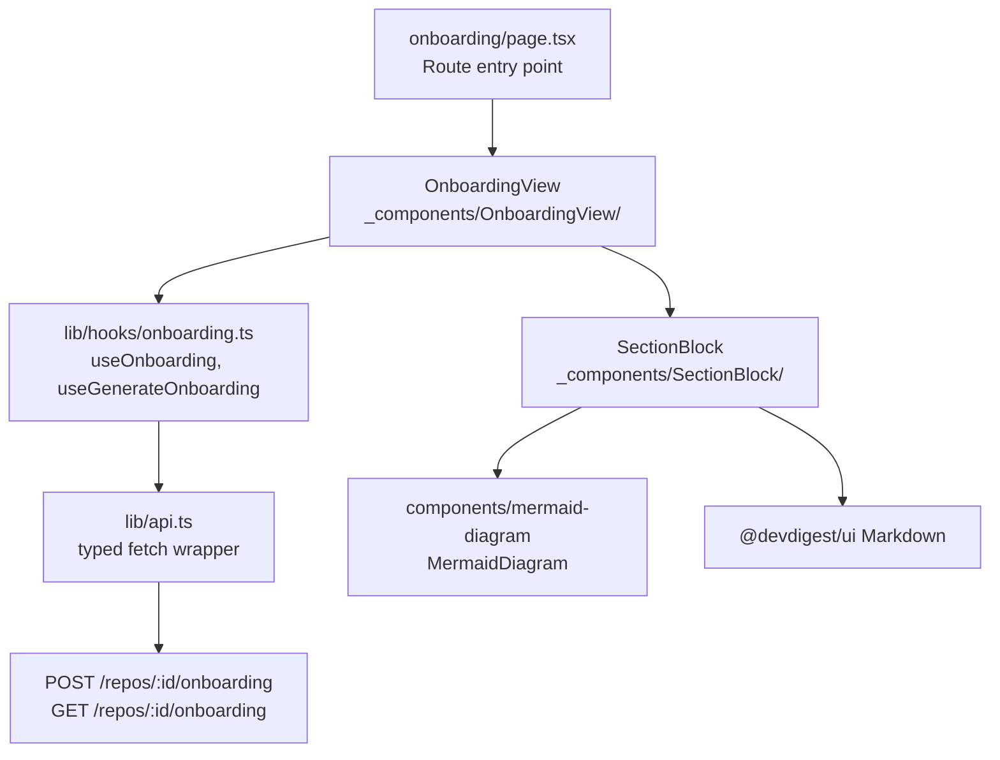

# Onboarding Generation — Client

## Overview

The Onboarding Tour page displays a five-section guided tour for a repository, generated
on demand by the server's LLM pipeline. The client manages three distinct UI states —
empty, generating, and rendered — and handles the asynchronous nature of generation
(which can take up to 60 seconds) through TanStack Query hooks and a server-returned
`{ status: 'generating' }` sentinel value.

## Architecture

## Key Components

### OnboardingPage

**File:** `client/src/app/repos/[repoId]/onboarding/page.tsx`

Thin Next.js App Router page. Reads `repoId` from URL params, checks for a 404 repo via
`useRepoNotFound`, and renders `AppShell` with an `OnboardingView` child. Contains no
business logic.

### OnboardingView

**File:** `client/src/app/repos/[repoId]/onboarding/_components/OnboardingView/OnboardingView.tsx`

The orchestrating component. It calls `useOnboarding` and `useGenerateOnboarding`, then
resolves which of the three UI states to render:

| State | Condition | Rendered output |
|-------|-----------|-----------------|
| Generating | `generate.isPending` OR `data.status === 'generating'` | Spinner with "Generating..." text |
| Empty | Not loading, not generating, tour is `null` | `EmptyState` with "Generate onboarding tour" CTA |
| Tour rendered | Tour data present | Header with Share/Regenerate buttons + five `SectionBlock` components |

During regeneration, old tour content is hidden entirely (the generating spinner replaces it).
This is intentional: the `isGenerating` check fires before the tour-rendered branch.

The Share button copies the current page URL to the clipboard and shows a success toast.
Code block copy is delegated to `SectionBlock` via an `onCopy` prop.

**Supporting files:**

| File | Purpose |
|------|---------|
| `constants.ts` | `SECTION_TITLES` — display names keyed by section kind |
| `helpers.ts` | `buildGitHubUrl()`, `copyToClipboard()` — pure utility functions |
| `styles.ts` | Inline `CSSProperties` objects using CSS variables |

### SectionBlock

**File:** `client/src/app/repos/[repoId]/onboarding/_components/SectionBlock/SectionBlock.tsx`

Renders one onboarding section. Behaviour varies by `section.kind`:

| Kind | Special rendering |
|------|-----------------|
| `architecture` | Renders `MermaidDiagramWithFallback` if `section.diagram` is non-null |
| `run_locally` | Uses `RunLocallyMarkdown` which adds a copy button to every fenced code block |
| `critical_paths`, `reading_path` | Renders a links list; each link gets an "Open on GitHub" button |
| `first_tasks` | Standard Markdown body, no links rendered |

**MermaidDiagramWithFallback** — wraps `MermaidDiagram` and starts a 3-second timer. If the
wrapper div has no children after 3 seconds (indicating the diagram failed to render), it
calls `onFailed()` which surfaces a "Diagram could not be rendered." fallback message.

**RunLocallyMarkdown** — a custom `ReactMarkdown` renderer. It replaces the standard `pre`
element with `CopyableCodeBlock`, which overlays a copy icon button on every fenced code block.

**GitHub link construction** — `buildGitHubUrl(owner, repo, branch, path)` produces
`https://github.com/{owner}/{repo}/blob/{branch}/{path}` from the active repo's metadata,
passed down from `OnboardingView`.

## UI State Machine

```mermaid
stateDiagram-v2
    [*] --> Idle: page loads, no tour
    Idle --> Empty: useOnboarding returns null
    Idle --> Generating: useOnboarding returns status=generating
    Empty --> Generating: user clicks Generate
    Tour --> Generating: user clicks Regenerate
    Generating --> Tour: mutation succeeds, query invalidated
    Generating --> Empty: mutation fails &#40;no tour stored&#41;
    Empty --> Tour: useOnboarding returns tour data
    Tour --> [*]: user navigates away
```

## Hooks

**File:** `client/src/lib/hooks/onboarding.ts`

### `useOnboarding(repoId)`

TanStack Query `useQuery` hook. Returns `OnboardingResponse | OnboardingGeneratingResponse | null`.

- Returns `null` when the server responds 404 (expected empty state — no tour yet).
- Returns `{ status: 'generating' }` when the server reports generation in-progress.
- `retry: false` — API errors are not retried automatically.

### `useGenerateOnboarding()`

TanStack Query `useMutation` hook.

- `mutationFn`: `POST /repos/:id/onboarding` with optional `{ language }` body.
- `onSuccess`: invalidates `["onboarding", repoId]` query key to trigger a re-fetch of the
  newly generated tour.
- `language` defaults to `undefined` (server defaults to `"en"` if absent).

## Data Flow

```mermaid
sequenceDiagram
    participant U as User
    participant V as OnboardingView
    participant Q as useOnboarding
    participant M as useGenerateOnboarding
    participant API as /repos/:id/onboarding

    U->>V: visits page
    V->>Q: useOnboarding&#40;repoId&#41;
    Q->>API: GET /repos/:id/onboarding
    alt 404
        API-->>Q: 404
        Q-->>V: null — isEmpty=true
        V-->>U: EmptyState
        U->>V: clicks Generate
        V->>M: mutate&#40;&#123; repoId &#125;&#41;
        M->>API: POST /repos/:id/onboarding
        API-->>M: OnboardingResult &#40;~60s&#41;
        M->>Q: invalidateQueries
        Q->>API: GET /repos/:id/onboarding
        API-->>Q: OnboardingResult
        Q-->>V: tour data
        V-->>U: Tour rendered
    else generating
        API-->>Q: &#123; status: 'generating' &#125;
        Q-->>V: OnboardingGeneratingResponse
        V-->>U: Spinner
    else tour exists
        API-->>Q: OnboardingResult
        Q-->>V: tour data
        V-->>U: Tour rendered
    end
```

## API Interface

| Method | URL | Body | Response |
|--------|-----|------|----------|
| `GET` | `/repos/:id/onboarding` | — | `OnboardingResponse` or `{ status: 'generating' }` or 404 |
| `POST` | `/repos/:id/onboarding` | `{ language?: string }` (optional) | `OnboardingResponse` |

The `language` field accepts ISO 639-1 codes (2-5 alpha characters). Omitting it defaults
to English on the server.

## Related

- `server/docs/OnboardingGeneration/README.md` — server-side documentation (API, service, DB schema, lock mechanism)
- `client/src/components/mermaid-diagram/` — `MermaidDiagram` component used for architecture diagrams
- `client/src/vendor/shared/contracts/onboarding.ts` — shared Zod types (`OnboardingResponse`, `OnboardingGeneratingResponse`, `OnboardingSectionKind`)
- `server/specs/onboarding-generation/` — behavioral specification
