# Risk Brief (Client)

## Overview

Risk Brief is an AI-generated card on the PR Overview tab that consolidates what
changed, why, the assessed risk level, specific risk areas with file:line links,
and a prioritized review focus list. It appears above the existing IntentCard and
BlastCard and does not replace them. Generation is manual (user-initiated only);
a stale badge appears when the PR's `head_sha` has changed since the last brief.

A mechanically-computed findings/blockers row always reflects the current findings
state passed as a prop — it is never part of the LLM response.

## Component Location

```
client/src/app/repos/[repoId]/pulls/[number]/
  _components/OverviewTab/
    OverviewTab.tsx                        — renders PrBriefCard above IntentCard/BlastCard
    _components/PrBriefCard/
      PrBriefCard.tsx                      — main card component &#40;"use client"&#41;
      constants.ts                         — RISK_LEVEL_COLORS, RISK_LEVEL_LABELS
      helpers.ts                           — countBlockers, type guards, parseFileLine
      styles.ts                            — inline CSSProperties objects
      index.ts                             — barrel export
      PrBriefCard.test.tsx                 — component tests
```

## Component State Machine

The card derives its visible state from two sources: the TanStack Query cache
&#40;`useRiskBrief`&#41; and the mutation state &#40;`useGenerateRiskBrief`&#41;.

```mermaid
stateDiagram-v2
    [*] --> NeverGenerated : GET returns null &#40;404&#41;
    [*] --> Skeleton : GET returns &#123; status: generating &#125;

    NeverGenerated --> Skeleton : user clicks Generate
    Skeleton --> Loaded : GET returns brief data
    Skeleton --> NeverGenerated : POST fails

    Loaded --> Stale : brief.head_sha != prop headSha
    Loaded --> Regenerating : user clicks Regenerate
    Stale --> Regenerating : user clicks Regenerate
    Regenerating --> Loaded : POST succeeds
    Regenerating --> Stale : POST fails &#40;prior brief stale&#41;
    Regenerating --> Loaded : POST fails &#40;prior brief current&#41;
```



State derivation in `PrBriefCard.tsx`:

| Condition | Rendered state |
|-----------|----------------|
| `data === null` and `mutation.isPending === false` | Never-generated empty card |
| `mutation.isPending === true` and no prior brief | Skeleton &#40;first generation&#41; |
| `data.status === 'generating'` | Skeleton &#40;server-side in-progress, EC-10&#41; |
| `data.brief` present | Brief loaded |
| Brief loaded and `data.head_sha !== headSha` prop | Stale badge shown |
| `mutation.isPending === true` and prior brief exists | Overlay spinner on loaded brief |

The server-generating skeleton state handles the navigate-away-and-return case
&#40;EC-10&#41;: if the user leaves during generation, on return the GET response will
contain `{ status: 'generating' }` while the server lock is held. The
`useRiskBrief` hook polls every 3 seconds while this status is active.

## Data Flow

```mermaid
sequenceDiagram
    participant U as User
    participant Card as PrBriefCard
    participant RQ as TanStack Query
    participant API as GET /pulls/:id/brief
    participant PAPI as POST /pulls/:id/brief

    U->>Card: page load
    Card->>RQ: useRiskBrief&#40;prId&#41;
    RQ->>API: GET /pulls/:id/brief
    alt No brief cached
        API-->>RQ: 404
        RQ-->>Card: null
        Card-->>U: Never-generated state
    else Brief cached
        API-->>RQ: 200 RiskBriefResponse
        RQ-->>Card: brief data
        Card-->>U: Loaded state &#40;stale badge if head_sha mismatch&#41;
    else Generation in-flight
        API-->>RQ: 200 &#123; status: generating &#125;
        RQ-->>Card: generating
        Card-->>U: Skeleton state
        Note over RQ: polls every 3s until status changes
    end

    U->>Card: clicks Generate / Regenerate
    Card->>RQ: useGenerateRiskBrief.mutate&#40;&#41;
    RQ->>PAPI: POST /pulls/:id/brief
    Note over Card: Skeleton &#40;new&#41; or overlay &#40;regen&#41;
    alt Success
        PAPI-->>RQ: 200 RiskBriefResponse
        RQ->>RQ: invalidate &#91;risk-brief, prId&#93;
        RQ-->>Card: brief data
        Card-->>U: Loaded state
    else Failure
        PAPI-->>RQ: 4xx / 5xx
        RQ-->>Card: error
        Card-->>U: toast + prior state restored
    end
```



## Hooks

**File:** `client/src/lib/hooks/risk-brief.ts`

### `useRiskBrief(prId)`

TanStack Query `useQuery` fetching `GET /pulls/:id/brief`.

- Returns `null` on 404 &#40;the never-generated state&#41;.
- Returns `{ status: 'generating' }` while the server lock is held.
- Returns `RiskBriefResponse` when a brief exists.
- `refetchInterval` is active &#40;3 000 ms&#41; only while the response is `{ status: 'generating' }`.
- `retry: false` — 404 is an expected empty state, not a transient error.

### `useGenerateRiskBrief(prId)`

TanStack Query `useMutation` calling `POST /pulls/:id/brief`.

| HTTP status | Toast message |
|-------------|---------------|
| 409 | "Generation is already running — it will appear here when ready." |
| 422 | "PR has no files to analyze." |
| Other | "Brief generation failed. Please try again." |

On both success and error the query `["risk-brief", prId]` is invalidated so the
card reflects the current server state immediately.

## Rendered Sections

When a brief is loaded the card shows five sections:

1. **Header row** — title "Risk Brief", color-coded risk level badge &#40;text label
   + background color&#41;, optional Outdated badge, Regenerate button.
2. **What changed** — `brief.what` as a plain `<p>` element &#40;no HTML/markdown&#41;.
3. **Why** — `brief.why` as a plain `<p>` element &#40;no HTML/markdown&#41;.
4. **Risk Areas** — up to 10 items, each with title, description, and
   `<button>` file:line links navigating to `?tab=diff&file=<path>&line=<line>`.
5. **Review Focus** — up to 15 numbered items, each with a `<button>` file:line
   link and a reviewer note.

Below the brief sections, the **Findings/Blockers row** shows counts derived from
the `allFindings` prop — always live, never from the cached brief.

### Risk Level Badge Colors

| Level | Color | Background |
|-------|-------|------------|
| `low` | #22c55e &#40;green&#41; | rgba&#40;34,197,94,0.12&#41; |
| `medium` | #fbbf24 &#40;yellow&#41; | rgba&#40;251,191,36,0.12&#41; |
| `high` | #f97316 &#40;orange&#41; | rgba&#40;249,115,22,0.12&#41; |
| `critical` | #f87171 &#40;red&#41; | rgba&#40;248,113,113,0.12&#41; |

The badge always renders a visible text label &#40;LOW / MEDIUM / HIGH / CRITICAL&#41; in
addition to color, ensuring accessibility for users who cannot distinguish colors.

## Navigation Pattern

File:line links in Risk Areas and Review Focus use the same `handleFileClick`
pattern as BlastCard:

```
router.push(`${pathname}?tab=diff&file=<path>&line=<line>`)
```

The existing query parameters are preserved via `useSearchParams`.

## SmartDiffViewer Annotation

**File:** `client/src/app/repos/.../DiffTab/_components/SmartDiffViewer/SmartDiffViewer.tsx`

When `SmartDiffFile.pseudocode_summary` is non-null, an annotation `<div>` is
rendered immediately below the `FileCard` element, showing a Lucide `Info` icon
and the plain-text summary. When the field is null &#40;the default&#41; nothing is
rendered and the diff viewer behaves exactly as before.

The summary is populated server-side by `enrichSmartDiffSummaries` in the
smart-diff classifier — see the server documentation for details.

## Accessibility

| Element | Implementation |
|---------|----------------|
| Generate / Regenerate buttons | Native `<button>` elements — keyboard-focusable, activated by Enter/Space |
| File:line links | Native `<button>` elements — keyboard-navigable via Tab |
| Risk level badge | Color + text label &#40;never color-only&#41; |
| Regeneration overlay | `role="status"` and `aria-label="Regenerating brief..."` |
| Outdated badge | `aria-label="Brief may be outdated"` |

## API Contract

The client uses the shared Zod contracts from `@devdigest/shared` &#40;mirrored at
`client/src/vendor/shared/contracts/brief-response.ts`&#41;.

See the [server documentation](../../../server/docs/RiskBrief/README.md) for the
full API contract and endpoint definitions.

## Related

- `server/docs/RiskBrief/README.md` — server module internals, API contract, DB schema
- `client/specs/risk-brief/risk-brief.spec.md` — behavioral specification
- `server/src/vendor/shared/contracts/brief-response.ts` — Zod contract definitions
