# Dependency Health Report — DevDigest — 2026-08-19

## 1. Overview

| Package                    | Direct | Dev   | Transitive | node_modules |
|----------------------------|--------|-------|------------|--------------|
| @devdigest/api  (server)   |   21   |   8   |    237     |   249 MB     |
| @devdigest/web  (client)   |   12   |  12   |    287     |   623 MB     |
| @devdigest/reviewer-core   |    2   |   4   |    147     |    80 MB     |
| @devdigest/e2e             |    0   |   3   |     ~8     |   N/A        |
|----------------------------|--------|-------|------------|--------------|
| **TOTAL**                  |   35   |  27   |   ~450*    |  **952 MB**  |

\* Transitive total is approximate; many deps are shared across packages.

---

## 2. Size Breakdown by Package

### @devdigest/api (server) — 249 MB

|  #  | Dependency                 | Installed Size | Flag     |
|-----|----------------------------|----------------|----------|
|  1  | typescript (dev)           |   22.9 MB      | NOTABLE  |
|  2  | js-tiktoken               |   20.4 MB      | NOTABLE  |
|  3  | drizzle-orm                |   12.4 MB      |          |
|  4  | drizzle-kit (dev)          |    7.4 MB      |          |
|  5  | openai                     |    6.7 MB      |          |
|  6  | zod                        |    4.6 MB      |          |
|  7  | fastify                    |    3.5 MB      |          |
|  8  | graphology                 |    2.7 MB      |          |
|  9  | @types/node (dev)          |    2.5 MB      |          |
| 10  | vitest (dev)               |    1.8 MB      |          |

Other notable: dependency-cruiser (1.6 MB), @anthropic-ai/sdk (1.6 MB), simple-git (1.2 MB), testcontainers (1.0 MB)

### @devdigest/web (client) — 623 MB

|  #  | Dependency                 | Installed Size | Flag     |
|-----|----------------------------|----------------|----------|
|  1  | next                       |  149.4 MB      | HEAVY    |
|  2  | mermaid                    |   74.4 MB      | HEAVY    |
|  3  | lucide-react               |   36.0 MB      | NOTABLE  |
|  4  | typescript (dev)           |   22.9 MB      | NOTABLE  |
|  5  | react-dom                  |    7.1 MB      |          |
|  6  | recharts                   |    5.2 MB      |          |
|  7  | zod                        |    4.6 MB      |          |
|  8  | jsdom (dev)                |    4.1 MB      |          |
|  9  | @types/node (dev)          |    2.5 MB      |          |
| 10  | vitest (dev)               |    1.8 MB      |          |

### @devdigest/reviewer-core — 80 MB

|  #  | Dependency                 | Installed Size | Flag     |
|-----|----------------------------|----------------|----------|
|  1  | typescript (dev)           |   22.9 MB      | NOTABLE  |
|  2  | openai                     |    8.6 MB      |          |
|  3  | zod                        |    4.7 MB      |          |
|  4  | @types/node (dev)          |    2.5 MB      |          |
|  5  | vitest (dev)               |    1.8 MB      |          |
|  6  | tsx (dev)                  |    0.6 MB      |          |

### @devdigest/e2e — not installed

Only has 3 devDependencies: @types/node, tsx, typescript. node_modules not present on disk.

---

## 3. Dependency Map

```mermaid
mindmap
  root((DevDigest Deps — 952 MB))
    server &#40;249 MB&#41;
      js-tiktoken &#40;20 MB&#41;
      drizzle-orm &#40;12 MB&#41;
      drizzle-kit &#40;7 MB&#41;
      openai &#40;7 MB&#41;
      zod &#40;5 MB&#41;
      fastify &#40;4 MB&#41;
    client &#40;623 MB&#41;
      next &#40;149 MB&#41;
      mermaid &#40;74 MB&#41;
      lucide-react &#40;36 MB&#41;
      react-dom &#40;7 MB&#41;
      recharts &#40;5 MB&#41;
      zod &#40;5 MB&#41;
    reviewer-core &#40;80 MB&#41;
      openai &#40;9 MB&#41;
      zod &#40;5 MB&#41;
    e2e &#40;N/A&#41;
      tsx
      typescript
```

---

## 4. Cross-Package Analysis

### 4a. Shared Dependencies

| Dependency     | Packages                    | Versions             | Status  |
|----------------|-----------------------------|----------------------|---------|
| zod            | server, client, r-c         | 3.25.76 all          | ALIGNED |
| openai         | server, r-c                 | 4.104.0 both         | ALIGNED |
| typescript     | server, client, r-c, e2e    | 5.9.3 all            | ALIGNED |
| @types/node    | server, client, r-c, e2e    | 22.19.x all          | ALIGNED |
| vitest         | server, client, r-c         | 2.1.9 all            | ALIGNED |
| tsx            | server, r-c, e2e            | 4.22.4 all           | ALIGNED |

### 4b. Version Skew

None detected. All shared dependencies use aligned versions across packages.

### 4c. Duplicate / Unnecessary

- `zod` is duplicated across 3 separate node_modules directories (~14 MB total). Known gotcha: duplicate Zod instances break `instanceof z.ZodError` (already mitigated by shape-matching fallback in error handler).

---

## 5. Outdated Packages

Severity: MAJOR = major version behind, MINOR = minor behind, PATCH = patch behind

| Package | Dependency                  | Current  | Latest   | Severity | Breaking? |
|---------|-----------------------------|----------|----------|----------|-----------|
| server  | openai                      | 4.104.0  | 7.5.0    | MAJOR    | Yes       |
| server  | octokit                     | 4.1.4    | 5.0.5    | MAJOR    | Yes       |
| server  | fastify-type-provider-zod   | 4.0.2    | 7.0.0    | MAJOR    | Yes       |
| server  | dependency-cruiser          | 17.4.3   | 18.2.0   | MAJOR    | Likely    |
| server  | dotenv                      | 16.6.1   | 17.4.2   | MAJOR    | Likely    |
| server  | zod                         | 3.25.76  | 4.4.3    | MAJOR    | Yes       |
| server  | typescript                  | 5.9.3    | 7.0.2    | MAJOR    | Yes       |
| server  | vitest                      | 2.1.9    | 4.1.11   | MAJOR    | Yes       |
| server  | @testcontainers/*           | 10.28.0  | 12.1.0   | MAJOR    | Yes       |
| server  | @types/node                 | 22.19.19 | 26.2.0   | MAJOR    | Unlikely  |
| server  | p-queue                     | 8.1.1    | 9.3.3    | MAJOR    | Likely    |
| server  | @fastify/cors               | 10.1.0   | 11.3.0   | MAJOR    | Likely    |
| client  | next                        | 15.5.19  | 16.3.1   | MAJOR    | Yes       |
| client  | next-intl                   | 3.26.5   | 4.13.7   | MAJOR    | Yes       |
| client  | recharts                    | 2.15.4   | 3.10.1   | MAJOR    | Yes       |
| client  | react-markdown              | 9.1.0    | 10.1.0   | MAJOR    | Likely    |
| client  | jsdom                       | 25.0.1   | 30.0.1   | MAJOR    | Likely    |
| client  | @vitejs/plugin-react        | 4.7.0    | 6.0.5    | MAJOR    | Yes       |
| client  | zod                         | 3.25.76  | 4.4.3    | MAJOR    | Yes       |
| client  | typescript                  | 5.9.3    | 7.0.2    | MAJOR    | Yes       |
| client  | vitest                      | 2.1.9    | 4.1.11   | MAJOR    | Yes       |
| client  | lucide-react                | 0.469.0  | 1.32.0   | MAJOR    | Yes       |
| client  | @testing-library/jest-dom   | 6.9.1    | 7.0.1    | MAJOR    | Likely    |
| r-c     | openai                      | 4.104.0  | 7.5.0    | MAJOR    | Yes       |
| r-c     | zod                         | 3.25.76  | 4.4.3    | MAJOR    | Yes       |
| r-c     | typescript                  | 5.9.3    | 7.0.2    | MAJOR    | Yes       |
| r-c     | vitest                      | 2.1.9    | 4.1.11   | MAJOR    | Yes       |
| server  | fastify                     | 5.8.5    | 5.12.0   | MINOR    | No        |
| server  | @fastify/autoload           | 6.3.1    | 6.5.0    | MINOR    | No        |
| server  | @fastify/helmet             | 13.0.2   | 13.1.0   | MINOR    | No        |
| server  | @fastify/rate-limit         | 11.0.0   | 11.2.0   | MINOR    | No        |
| client  | mermaid                     | 11.15.0  | 11.16.1  | MINOR    | No        |
| r-c     | tsx                         | 4.22.4   | 4.23.12  | MINOR    | No        |
| server  | @fastify/multipart          | 10.1.0   | 10.1.1   | PATCH    | No        |
| client  | (9 patch-level updates)     | various  | various  | PATCH    | No        |

**Total: ~35 outdated (26 major, 5 minor, ~4 patch)**

---

## 6. Security Audit

|           | server | client | reviewer-core |
|-----------|--------|--------|---------------|
| CRITICAL  |    1   |    1   |       1       |
| HIGH      |   17   |   10   |       4       |
| MODERATE  |    3   |   18   |       3       |
| LOW       |    3   |    3   |       0       |
| **TOTAL** | **35** | **32** |     **8**     |

### Key vulnerabilities requiring attention

| Vulnerability | Severity | Package | Affected | Fix |
|---------------|----------|---------|----------|-----|
| Arbitrary file read/exec via UI server | CRITICAL | vitest <3.2.6 | all 3 packages | Upgrade to >=3.2.6 |
| SQL injection via escaped identifiers | HIGH | drizzle-orm <0.45.2 | server | Upgrade to >=0.45.2 |
| WebSocket DoS (multiple vectors) | HIGH | undici <6.27.0 | server (via testcontainers) | Upgrade testcontainers |
| CRLF injection via multipart fields | HIGH | form-data <4.0.6 | all 3 (via @anthropic-ai/sdk, openai) | Upgrade SDKs |
| fs.deny bypass on Windows | HIGH | vite <=6.4.2 | all 3 (via vitest) | Upgrade vitest |
| Prototype pollution + XSS bypass | MODERATE+LOW | mermaid, dompurify | client | Upgrade mermaid to 11.16.1 |

---

## 7. Prioritized Suggestions

### [P0-CRITICAL] Upgrade vitest from 2.1.9 to >=3.2.6 (or 4.x) across all packages

- **What**: Update vitest in server, client, reviewer-core package.json
- **Why**: Fixes GHSA-5xrq-8626-4rwp (arbitrary file read/exec via UI server). Also resolves vite and esbuild transitive vulnerabilities (15+ CVEs total)
- **Risk**: Major version jump (2 to 4). Test runner API changes, config migration needed. Run full test suite after upgrade

### [P0-CRITICAL] Upgrade drizzle-orm from 0.38.4 to >=0.45.2 in server

- **What**: Update drizzle-orm in server/package.json, also update drizzle-kit
- **Why**: Fixes GHSA-gpj5-g38j-94v9 (SQL injection via escaped identifiers). Direct production dependency handling user data
- **Risk**: Breaking changes in 0.38 to 0.45 range. Review migration guide, regenerate migrations, test all queries

### [P1-HIGH] Evaluate mermaid (74 MB) in client — heaviest non-framework dep

- **What**: Consider lazy-loading mermaid only on pages that render diagrams, or switching to server-side rendering via `mmdc` CLI
- **Why**: 74 MB installed (12% of total). Also has prototype pollution + dompurify XSS bypass vulnerabilities. Upgrading to 11.16.1 fixes both
- **Risk**: Lazy loading may flash unstyled content. SSR approach needs server changes

### [P1-HIGH] Evaluate lucide-react (36 MB) in client

- **What**: Switch to individual icon imports or tree-shakeable subset. `lucide-react` 0.469 to 1.32 is a major version behind
- **Why**: 36 MB installed for icon library. With proper tree-shaking, only used icons ship. Major upgrade also needed
- **Risk**: Icon names may have changed between 0.x and 1.x

### [P1-HIGH] Upgrade openai SDK from 4.x to 7.x in server + reviewer-core

- **What**: Update openai in both packages simultaneously (keep versions aligned)
- **Why**: Fixes transitive form-data CRLF injection. Also, 4.x is 3 majors behind. @anthropic-ai/sdk 0.33 to 0.117 should be upgraded alongside
- **Risk**: SDK API changes. Review structured output, streaming, and OpenRouter provider compatibility in reviewer-core

### [P2-MEDIUM] Upgrade testcontainers from 10.x to 12.x in server

- **What**: Update testcontainers and @testcontainers/postgresql in server devDeps
- **Why**: Fixes 7 undici vulnerabilities (transitive via testcontainers). All HIGH/LOW severity WebSocket DoS vectors
- **Risk**: Dev-only dependency. May change container startup API. Run integration tests

### [P2-MEDIUM] Plan zod 3 to 4 migration across all packages

- **What**: Coordinate zod upgrade across server, client, reviewer-core simultaneously
- **Why**: Zod 4 is a significant rewrite. Currently 3 copies of zod exist. Must upgrade all at once to avoid instanceof breakage (known gotcha)
- **Risk**: Schema API changes. All Zod contracts in vendor/shared/ need review. fastify-type-provider-zod 7.x required for zod 4

### [P2-MEDIUM] Plan typescript 5 to 7 migration

- **What**: Upgrade typescript across all 4 packages
- **Why**: 2 major versions behind. TS 7 includes significant performance improvements
- **Risk**: New strict checks may surface type errors. tsconfig changes may be needed

### [P3-LOW] Upgrade Fastify ecosystem minor versions in server

- **What**: fastify 5.8 to 5.12, @fastify/autoload 6.3 to 6.5, helmet 13.0 to 13.1, rate-limit 11.0 to 11.2, multipart 10.1.0 to 10.1.1
- **Why**: Bug fixes, no breaking changes. @fastify/cors 10 to 11 is major (separate task)
- **Risk**: Minimal — all minor/patch within same major

### [P3-LOW] Align tsx version across server, reviewer-core, e2e

- **What**: Update tsx from 4.22.4 to 4.23.12
- **Why**: Minor version behind, bug fixes only
- **Risk**: None — patch-level change
