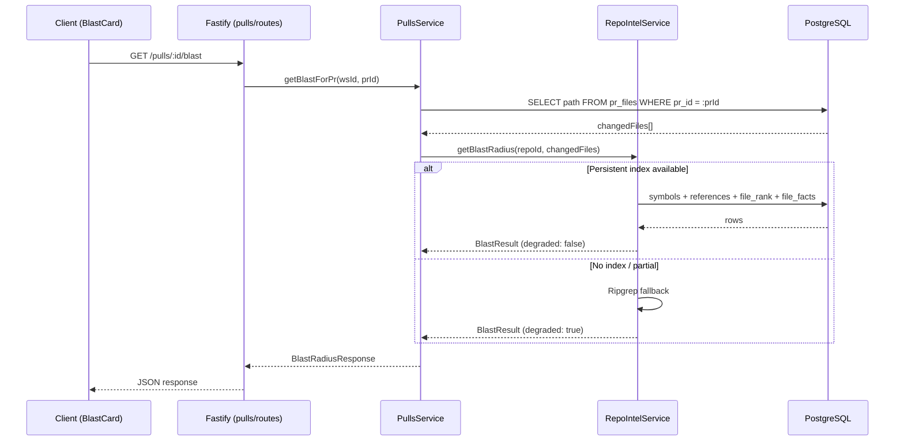
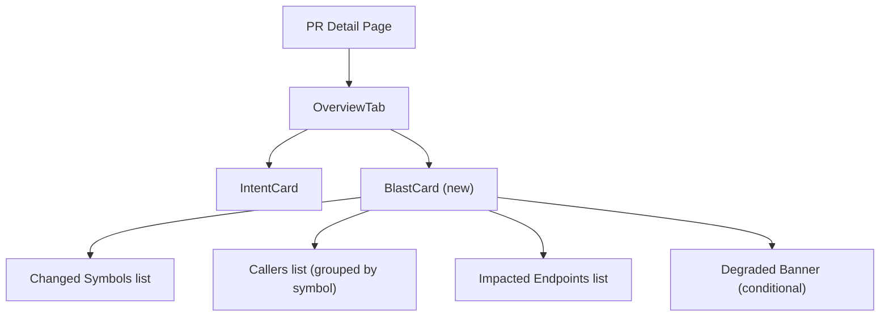

# Implementation Plan: Blast Radius

**Feature:** PR impact map — changed symbols, callers, affected endpoints
**Scope:** server, client, mcp-server
**Complexity:** Medium
**Created:** 2026-08-12

---

## Context

Blast Radius adds a section to the PR Overview tab that answers **"What is affected by this diff?"** by showing:

- Which symbols are declared in changed files
- Who imports/calls those symbols
- Which HTTP endpoints could be affected

**No AI model needed** — all data comes from the existing repo-intel index (symbols, references, file\_edges, file\_facts tables).

## What Already Exists

| Component | Status | Location |
|-----------|--------|----------|
| `RepoIntelService.getBlastRadius()` | Partially implemented (T1 ripgrep + T3 persistent) | `server/src/modules/repo-intel/service.ts:220-391` |
| `BlastResult` type | Defined | `server/src/modules/repo-intel/types.ts:57-87` |
| DB tables (symbols, references, file\_edges, file\_facts, file\_rank) | Exist | `server/src/db/schema/repo-intel.ts`, `context.ts` |
| Repository queries (symbols, callers, facts) | Exist | `server/src/modules/repo-intel/repository.ts` |
| Tuning knobs (BFS\_DEPTH, MAX\_CALLERS\_PER\_SYMBOL) | Exist | `server/src/modules/repo-intel/constants.ts` |
| `BlastRadius` Zod schema in brief.ts | Exists but AI-brief-shaped | `server/src/vendor/shared/contracts/brief.ts` |
| MCP tool stub `get_blast_radius` | Returns "not yet available" | `mcp-server/src/tools.ts:119-127` |
| MCP client stub `getBlastRadius()` | Returns error | `mcp-server/src/api-client.ts` |

## Architecture Decision: No New Module

The blast route belongs in the **pulls** module (`GET /pulls/:id/blast`), not a separate `blast/` module. Rationale:

- It is PR-scoped data, like `/pulls/:id/smart-diff` and `/pulls/:id/comments`
- The route is thin — it resolves PR to files, then delegates to `container.repoIntel`
- Adding a separate module would violate the "routes delegate to services" pattern since all the blast logic already lives in `RepoIntelService`

## Data Flow



## Component Tree



---

## Steps

### Step 1: Create API response contract

**Package:** server + client
**Create:**
- `server/src/vendor/shared/contracts/blast-api.ts`
- `client/src/vendor/shared/contracts/blast-api.ts` (physical copy)

**Modify:**
- `server/src/vendor/shared/index.ts` (add barrel export)
- `client/src/vendor/shared/index.ts` (add barrel export)

**What:** Define a new Zod schema `BlastRadiusResponse` distinct from the existing `BlastRadius` in `brief.ts` (which is AI-summary-shaped). The new schema mirrors the raw `BlastResult` type from repo-intel:

```ts
import { z } from 'zod';

export const BlastChangedSymbolApi = z.object({
  file: z.string(),
  name: z.string(),
  kind: z.string(),
});

export const BlastCallerApi = z.object({
  file: z.string(),
  symbol: z.string(),
  via_symbol: z.string(),
  line: z.number().int(),
  rank: z.number(),
});

export const BlastRadiusResponse = z.object({
  changed_symbols: z.array(BlastChangedSymbolApi),
  callers: z.array(BlastCallerApi),
  impacted_endpoints: z.array(z.string()),
  facts_by_file: z.record(z.object({
    endpoints: z.array(z.string()),
    crons: z.array(z.string()),
  })).optional(),
  degraded: z.boolean().optional(),
  reason: z.string().optional(),
});

export type BlastRadiusResponse = z.infer<typeof BlastRadiusResponse>;
```

Snake\_case keys match existing API conventions. File must be physically copied to both vendor/shared locations.

**Depends on:** nothing

---

### Step 2: Add `getBlastForPr` to PullsService

**Package:** server
**Modify:** `server/src/modules/pulls/service.ts`

**What:** New method following the `getSmartDiff` pattern:

```ts
async getBlastForPr(workspaceId: string, prId: string) {
  const { repo, pr } = await this.resolvePrAndRepo(prId, workspaceId);
  const files = await this.container.db
    .select({ path: prFiles.path })
    .from(prFiles)
    .where(eq(prFiles.pullId, pr.id));

  if (files.length === 0) {
    return { changed_symbols: [], callers: [], impacted_endpoints: [],
             degraded: true, reason: 'no_files' };
  }

  const changedPaths = files.map(f => f.path);
  const result = await this.container.repoIntel.getBlastRadius(repo.id, changedPaths);

  return {
    changed_symbols: result.changedSymbols,
    callers: result.callers,
    impacted_endpoints: result.impactedEndpoints,
    facts_by_file: result.factsByFile,
    degraded: result.degraded,
    reason: result.reason,
  };
}
```

Key behaviors:
- Returns degraded response with `reason: 'no_files'` when PR files not yet populated
- Maps camelCase `BlastResult` to snake\_case API response
- Never throws — delegates error handling to `RepoIntelService`

**Depends on:** Step 1

---

### Step 3: Add `GET /pulls/:id/blast` route

**Package:** server
**Modify:** `server/src/modules/pulls/routes.ts`

**What:** Add route following existing pattern:

```ts
app.get('/pulls/:id/blast', { schema: { params: IdParams } }, async (req) => {
  const { workspaceId } = await getContext(app.container, req);
  return service.getBlastForPr(workspaceId, req.params.id);
});
```

No new module registration needed — this is added to the existing pulls routes plugin.

**Depends on:** Step 2

---

### Step 4: Create `useBlastRadius` query hook

**Package:** client
**Modify:** `client/src/lib/hooks/reviews.ts` (or appropriate hooks file)

**What:** TanStack Query hook following `usePrIntent` pattern:

```ts
export function useBlastRadius(prId: string | null | undefined) {
  return useQuery({
    queryKey: ['blast-radius', prId],
    queryFn: () => api.get<BlastRadiusResponse>(`/pulls/${prId}/blast`),
    enabled: !!prId,
    staleTime: 30_000,
  });
}
```

**Depends on:** Step 1

---

### Step 5: Create `BlastCard` component

**Package:** client
**Create:**
- `client/src/app/repos/[repoId]/pulls/[number]/_components/OverviewTab/_components/BlastCard/BlastCard.tsx`
- `client/src/app/repos/[repoId]/pulls/[number]/_components/OverviewTab/_components/BlastCard/index.ts`

**What:** Component that renders the blast radius data. Takes `prId: string` as prop, calls `useBlastRadius(prId)` internally.

**Three sections** (based on design):

1. **Changed Symbols** — list showing `name` with colored kind badge (function / class / type / variable). File path displayed muted.

2. **Callers** — grouped by `via_symbol`. Each entry: `file:line` clickable link. Sorted by rank (higher rank = more important). Capped at 20 callers per symbol (matching `MAX_CALLERS_PER_SYMBOL`). Skip declaration file.

3. **Impacted Endpoints** — `METHOD /path` with HTTP method badge (GET=green, POST=blue, PUT=orange, DELETE=red).

**Edge cases:**
- `degraded: true` → show info banner: "Index incomplete — results may be approximate"
- `reason: 'no_files'` → show hint: "PR files not loaded yet — open the Files tab first"
- Loading → skeleton
- Error / no data → return `null` (card hidden)

**File:line click behavior:** Navigate to `?tab=diff&file=<path>` — line-level scroll is a follow-up enhancement.

**Depends on:** Step 4

---

### Step 6: Wire BlastCard into OverviewTab

**Package:** client
**Modify:** `client/src/app/repos/[repoId]/pulls/[number]/_components/OverviewTab/OverviewTab.tsx`

**What:** Render `BlastCard` below `IntentCard`:

```tsx
{prId && <IntentCard prId={prId} />}
{prId && <BlastCard prId={prId} />}
```

**Depends on:** Step 5

---

### Step 7: Wire MCP server tool

**Package:** mcp-server
**Modify:**
- `mcp-server/src/api-client.ts` — replace stub with real HTTP call
- `mcp-server/src/tools.ts` — replace stub handler with formatted output
- `mcp-server/src/types.ts` — add `BlastRadiusResult` interface

**api-client.ts:**
```ts
async getBlastRadius(prId: string): Promise<BlastRadiusResult> {
  return this.request<BlastRadiusResult>('GET', `/pulls/${prId}/blast`);
}
```

**tools.ts:** Format result as readable text:
```
Changed Symbols (3):
  - fetchUsers (function) in src/api/users.ts
  - UserSchema (type) in src/models/user.ts
  ...

Callers (5):
  Via fetchUsers:
    - src/routes/admin.ts:42
    - src/routes/dashboard.ts:18
  ...

Potentially Affected Endpoints:
  - GET /api/users
  - POST /api/admin/sync
```

**Depends on:** Step 3

---

## Testing Strategy

| What | Type | File |
|------|------|------|
| PullsService.getBlastForPr | Unit | `server/src/modules/pulls/service.test.ts` — mock `container.repoIntel.getBlastRadius()` and DB |
| GET /pulls/:id/blast route | Integration | `server/src/modules/pulls/blast.it.test.ts` — Fastify inject with seeded PR |
| BlastCard component | Component | `BlastCard.test.tsx` — mock `useBlastRadius`, verify renders symbols/callers/endpoints/degraded |
| MCP tool | Manual | Verify via MCP client |

---

## Risks

| Risk | Impact | Mitigation |
|------|--------|------------|
| `pr_files` empty when blast route called before PR detail loaded | Empty results shown | Return `degraded: true, reason: 'no_files'` with helpful UI message |
| Name collision with `BlastRadius` in `brief.ts` | Import confusion | New schema named `BlastRadiusResponse` in separate file `blast-api.ts` |
| Client vendor/shared copy drift | Client typecheck failure | Step 1 explicitly creates both copies |
| File:line deep-linking | Diff tab may not support `?file=` param | Start with tab switch only; line scroll is follow-up |

## Out of Scope

- AI-generated blast summary (the existing `BlastRadius` in `brief.ts` has `summary` — this feature shows raw index data only)
- Graph visualization (nodes + edges) — flat lists per the design
- Blast radius caching / per-PR invalidation
- Line-level scroll in diff tab from blast card links