# Implementation Plan: Blast Radius

**Feature:** PR impact map — changed symbols, callers, affected endpoints
**Scope:** server, client, mcp-server
**Complexity:** Medium
**Created:** 2026-08-12
**Status:** ✅ Implemented

---

## Context

Blast Radius adds a section to the PR Overview tab that answers **"What is affected by this diff?"** by showing:

- Which symbols are declared in changed files
- Who imports/calls those symbols
- Which HTTP endpoints could be affected

**No AI model needed** — all data comes from the existing repo-intel index (symbols, references, file\_edges, file\_facts tables).

## What Already Exists

| Component | Status | Location |
|-----------|--------|----------|
| `RepoIntelService.getBlastRadius()` | Partially implemented (T1 ripgrep + T3 persistent) | `server/src/modules/repo-intel/service.ts:220-391` |
| `BlastResult` type | Defined | `server/src/modules/repo-intel/types.ts:57-87` |
| DB tables (symbols, references, file\_edges, file\_facts, file\_rank) | Exist | `server/src/db/schema/repo-intel.ts`, `context.ts` |
| Repository queries (symbols, callers, facts) | Exist | `server/src/modules/repo-intel/repository.ts` |
| Tuning knobs (BFS\_DEPTH, MAX\_CALLERS\_PER\_SYMBOL) | Exist | `server/src/modules/repo-intel/constants.ts` |
| `BlastRadius` Zod schema in brief.ts | Exists but AI-brief-shaped | `server/src/vendor/shared/contracts/brief.ts` |
| MCP tool stub `get_blast_radius` | Returns "not yet available" | `mcp-server/src/tools.ts:119-127` |
| MCP client stub `getBlastRadius()` | Returns error | `mcp-server/src/api-client.ts` |

## Architecture Decision: No New Module

The blast route belongs in the **pulls** module (`GET /pulls/:id/blast`), not a separate `blast/` module. Rationale:

- It is PR-scoped data, like `/pulls/:id/smart-diff` and `/pulls/:id/comments`
- The route is thin — it resolves PR to files, then delegates to `container.repoIntel`
- Adding a separate module would violate the "routes delegate to services" pattern since all the blast logic already lives in `RepoIntelService`

## Data Flow

```mermaid
sequenceDiagram
    participant Client as Client BlastCard
    participant API as Fastify pulls/routes
    participant Service as PullsService
    participant Intel as RepoIntelService
    participant DB as PostgreSQL

    Client->>API: GET /pulls/:id/blast
    API->>Service: getBlastForPr&#40;wsId, prId&#41;
    Service->>DB: SELECT path FROM pr_files WHERE pr_id = :prId
    DB-->>Service: changedFiles[]
    Service->>Intel: getBlastRadius&#40;repoId, changedFiles&#41;
    alt Persistent index available
        Intel->>DB: symbols + references + file_rank + file_facts
        DB-->>Intel: rows
        Intel-->>Service: BlastResult &#40;degraded: false&#41;
    else Fallback via getCachedReferencesTo
        Intel->>DB: references table only &#40;no file_rank join&#41;
        DB-->>Intel: rows with rank: 0
        Intel-->>Service: BlastResult &#40;degraded: true, reason: unranked_callers&#41;
    else No index / partial
        Intel->>Intel: Ripgrep fallback
        Intel-->>Service: BlastResult &#40;degraded: true&#41;
    end
    Service-->>API: BlastRadiusResponse &#40;snake_case&#41;
    API-->>Client: JSON response
```

## Component Tree

```mermaid
flowchart TD
    Page["PR Detail Page"] --> OT["OverviewTab"]
    OT --> CardsRow["Side-by-side grid &#40;1fr 1fr&#41;"]
    CardsRow --> IC["IntentCard"]
    CardsRow --> BC["BlastCard"]
    BC --> Counters["Counters Row &#40;symbols, callers, endpoints, crons&#41;"]
    BC --> Toggle["Tree / Graph toggle"]
    BC --> TV["TreeView"]
    BC --> GV["GraphView"]
    TV --> SN["SymbolNode &#40;collapsible, expanded by default&#41;"]
    SN --> CL["Caller links &#40;file:line, clickable&#41;"]
    TV --> EP["Endpoint list &#40;method badges&#41;"]
    GV --> SG["SymbolGraph &#40;one per symbol&#41;"]
    SG --> SymNode["Symbol node"]
    SG --> CalNode["Caller file nodes"]
    SG --> EpNode["Endpoint nodes"]
    SG --> DegNode["Degraded placeholder &#40;if no factsByFile&#41;"]
    BC --> DG["Degraded Banner &#40;conditional&#41;"]
```

---

## Steps

### Step 1: Create API response contract ✅

**Package:** server + client
**Created:**
- `server/src/vendor/shared/contracts/blast-api.ts`
- `client/src/vendor/shared/contracts/blast-api.ts` (physical copy)

**Modified:**
- `server/src/vendor/shared/index.ts` (barrel export)
- `client/src/vendor/shared/index.ts` (barrel export)

Snake\_case keys match existing API conventions. File physically copied to both vendor/shared locations.

---

### Step 2: Add `getBlastForPr` to PullsService ✅

**Package:** server
**Modified:** `server/src/modules/pulls/service.ts`

Key behaviors:
- Returns degraded response with `reason: 'no_files'` when PR files not yet populated
- Maps camelCase `BlastResult` to snake\_case API response
- Never throws — delegates error handling to `RepoIntelService`

---

### Step 3: Add `GET /pulls/:id/blast` route ✅

**Package:** server
**Modified:** `server/src/modules/pulls/routes.ts`

---

### Step 4: Create `useBlastRadius` query hook ✅

**Package:** client
**Modified:** `client/src/lib/hooks/reviews.ts`

---

### Step 5: Create `BlastCard` component ✅

**Package:** client
**Created:**
- `client/src/app/repos/[repoId]/pulls/[number]/_components/OverviewTab/_components/BlastCard/BlastCard.tsx`
- `client/src/app/repos/[repoId]/pulls/[number]/_components/OverviewTab/_components/BlastCard/index.ts`

**Features implemented:**

1. **Tree View** (default):
   - Collapsible `SymbolNode` components, expanded by default
   - Each symbol shows `[kind badge] symbolName` with "N callers" label
   - Child list of clickable `file:line` links (navigate to diff tab)
   - Only symbols with callers are shown
   - Declaration files filtered from caller list
   - Endpoint list with HTTP method color badges

2. **Graph View** (toggle):
   - Per-symbol isolated graphs (no overlap between symbols)
   - Three columns per symbol: changed symbol → caller files → endpoints
   - SVG overlay draws connecting lines between DOM nodes
   - Caller→endpoint edges via `factsByFile` lookup
   - Degraded placeholder: "DEGRADED — need indexing" (amber node) when `factsByFile` has no attribution but `impacted_endpoints` exist
   - Even vertical distribution via `justifyContent: space-around`

3. **Summary counters row**: symbols, callers, endpoints, crons (if any)
4. **Degraded banners**: "PR files not loaded yet" / "Index incomplete"
5. **Tree/Graph toggle** button group

---

### Step 6: Wire BlastCard into OverviewTab ✅

**Package:** client
**Modified:**
- `client/src/app/repos/[repoId]/pulls/[number]/_components/OverviewTab/OverviewTab.tsx` — side-by-side grid with IntentCard
- `client/src/app/repos/[repoId]/pulls/[number]/_components/OverviewTab/styles.ts` — added `cardsRow` grid style

---

### Step 7: Wire MCP server tool ✅

**Package:** mcp-server
**Modified:**
- `mcp-server/src/api-client.ts` — real HTTP call to `/pulls/:id/blast`
- `mcp-server/src/tools.ts` — formatted text output
- `mcp-server/src/types.ts` — `BlastChangedSymbol`, `BlastCaller`, `BlastRadiusResult` interfaces

---

### Step 8: Backend fallback for empty callers ✅

**Package:** server
**Modified:**
- `server/src/modules/repo-intel/service.ts` — `tryPersistentBlast` fallback: when `getResolvedCallers` returns empty (due to `INNER JOIN file_rank`), falls back to `getCachedReferencesTo` with `rank: 0` and `degraded: true, reason: 'unranked_callers'`
- `server/src/modules/repo-intel/types.ts` — added `'unranked_callers'` to `DegradedReason` union

---

## Testing Strategy

| What | Type | File |
|------|------|------|
| PullsService.getBlastForPr | Unit | `server/src/modules/pulls/service.test.ts` — mock `container.repoIntel.getBlastRadius()` and DB |
| GET /pulls/:id/blast route | Integration | `server/src/modules/pulls/blast.it.test.ts` — Fastify inject with seeded PR |
| BlastCard component | Component | `BlastCard.test.tsx` — mock `useBlastRadius`, verify renders symbols/callers/endpoints/degraded |
| MCP tool | Manual | Verify via MCP client |

---

## Risks

| Risk | Impact | Mitigation |
|------|--------|------------|
| `pr_files` empty when blast route called before PR detail loaded | Empty results shown | Return `degraded: true, reason: 'no_files'` with helpful UI message |
| Name collision with `BlastRadius` in `brief.ts` | Import confusion | New schema named `BlastRadiusResponse` in separate file `blast-api.ts` |
| Client vendor/shared copy drift | Client typecheck failure | Step 1 explicitly creates both copies |
| `getResolvedCallers` returns empty due to `file_rank` INNER JOIN | No callers shown | Fallback to `getCachedReferencesTo` with degraded flag |
| `factsByFile` keys don't match caller file paths | Endpoints missing in graph | Graph shows "DEGRADED — need indexing" placeholder |

## Out of Scope

- AI-generated blast summary (the existing `BlastRadius` in `brief.ts` has `summary` — this feature shows raw index data only)
- Blast radius caching / per-PR invalidation
- Line-level scroll in diff tab from blast card links
