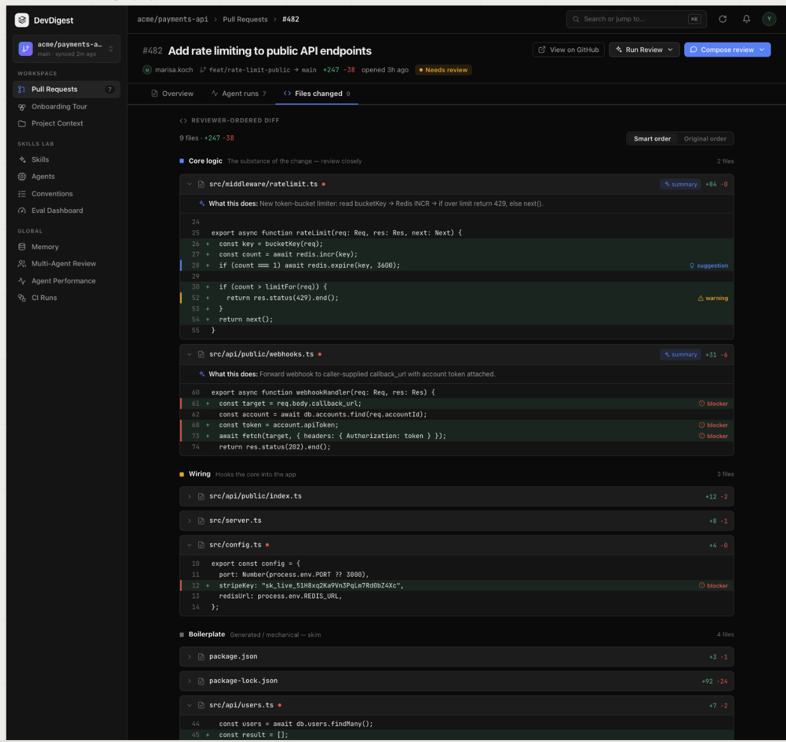
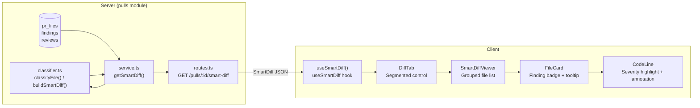
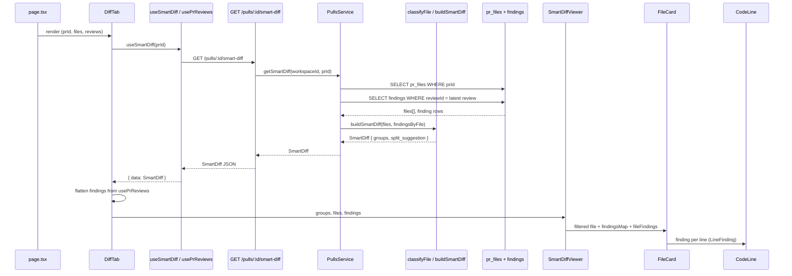
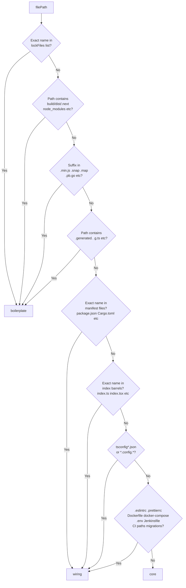

# Smart Diff

## Overview

Smart Diff is the grouped file-review mode in the PR "Files changed" tab. It classifies every changed file into one of three roles — core, wiring, or boilerplate — so reviewers see business-logic files first and can ignore generated or config noise. Files are further filtered to show only those with findings, and each finding line is highlighted with a severity-specific color.



---

## Architecture



---

## Key Components

### classifier.ts

**File:** `server/src/modules/pulls/classifier.ts`

Pure, dependency-free domain module. Exposes two functions:

- `classifyFile(filePath)` — maps one path to `'core' | 'wiring' | 'boilerplate'` using a priority-ordered set of pattern lists (exact names, path segments, file suffixes, substrings). Default is `core`.
- `buildSmartDiff(files, findingsByFile)` — assembles a `SmartDiff` from a list of `{path, additions, deletions}` records and a `Map<filePath, startLine[]>`. Within each role group, files are sorted by finding count descending, then by total changed lines descending. Sets `too_big: true` when total changed lines exceed 500.

The `PATTERNS` constant is exported for testability and future tuning without touching the classification logic.

### PullsService.getSmartDiff()

**File:** `server/src/modules/pulls/service.ts`

Application-layer orchestrator. Reads from two existing DB tables — `pr_files` (all changed files for the PR) and `findings` (from the latest `kind = 'review'` run) — and passes the results directly to `buildSmartDiff()`. No new tables are involved.

### GET /pulls/:id/smart-diff

**File:** `server/src/modules/pulls/routes.ts`

Thin Fastify route. Resolves workspace from context, delegates to `getSmartDiff()`, and returns the `SmartDiff` contract shape. Returns 404 when `pr_files` is empty (PR files not yet fetched).

### useSmartDiff()

**File:** `client/src/lib/hooks/reviews.ts`

TanStack Query hook. Fetches `GET /pulls/:id/smart-diff` with 30-second stale time (avoids re-classifying on every tab switch). The query is invalidated from `page.tsx`'s `onRunDone` callback so finding lines refresh immediately after a review completes.

### DiffTab

**File:** `client/src/app/repos/[repoId]/pulls/[number]/_components/DiffTab/DiffTab.tsx`

Renders the "Files changed" section header with a segmented control ("Flat" / "Smart Diff"). The Smart Diff button is disabled while `useSmartDiff` is loading or returned no data. When Smart Diff is active, it passes `smartDiff.groups`, the full `PrFile[]` list (for diff patches), and all review findings (flattened from `usePrReviews`) to `SmartDiffViewer`.

### SmartDiffViewer

**File:** `client/src/app/repos/[repoId]/pulls/[number]/_components/DiffTab/_components/SmartDiffViewer/SmartDiffViewer.tsx`

Renders role-ordered groups (Core → Wiring → Boilerplate). For each group it filters out files with no findings (`finding_lines.length === 0`), so clean files are never shown. Boilerplate sections start collapsed; Core and Wiring are open by default.

Before rendering it builds two memos:

- `findingsByFile` — `Map<filePath, Map<lineNo, LineFinding>>`. When multiple findings land on the same line, the highest severity wins.
- `findingRecordsByFile` — `Map<filePath, FindingRecord[]>` for the tooltip badge.

### FileCard

**File:** `client/src/components/diff-viewer/FileCard/FileCard.tsx`

Collapsible file card. When `findingsMap` and `fileFindings` are provided (as they are from SmartDiffViewer), it:

- Computes the highest severity across the file for the badge color.
- Renders a `⚠ N` badge using the severity CSS variables (`--crit`/`--crit-bg`, `--warn`/`--warn-bg`, `--sugg`/`--sugg-bg`).
- Wraps the badge in a `Tooltip` that shows the top finding's severity label, title, `file:line`, confidence percentage, and truncated rationale (≤120 chars).

### CodeLine

**File:** `client/src/components/diff-viewer/CodeLine/CodeLine.tsx`

Renders one diff line. When a `LineFinding` is passed, `lineRowFor()` replaces the normal add/del background with the severity background color and adds a 3px left border in the severity foreground color. A right-side annotation shows a colored dot and the label "Blocker", "Warning", or "Suggestion".

---

## Data Flow



---

## File Classification Logic



Classification order is fixed: boilerplate patterns are tested before wiring; anything not matched falls through to `core`.

---

## API

### GET /pulls/:id/smart-diff

Returns a `SmartDiff` object.

```
SmartDiff {
  groups: SmartDiffGroup[]          // ordered: core → wiring → boilerplate
  split_suggestion: {
    too_big: boolean                // true when total changed lines > 500
    total_lines: number
    proposed_splits: ProposedSplit[]
  }
}

SmartDiffGroup {
  role: 'core' | 'wiring' | 'boilerplate'
  files: SmartDiffFile[]            // sorted by finding count desc, then size desc
}

SmartDiffFile {
  path: string
  additions: number
  deletions: number
  finding_lines: number[]           // start_line values from the latest review
  pseudocode_summary?: string | null
}
```

Contracts are defined in `server/src/vendor/shared/contracts/brief.ts` lines 80-113.

---

## Configuration

| Constant | Location | Value | Purpose |
|----------|----------|-------|---------|
| `TOO_BIG_THRESHOLD` | `classifier.ts` | `500` | Line count above which `too_big` is set |
| `ROLE_ORDER` | `classifier.ts` + `constants.ts` | `['core', 'wiring', 'boilerplate']` | Canonical render order |
| `DEFAULT_COLLAPSED` | `SmartDiffViewer/constants.ts` | boilerplate=true, others=false | Which role sections start collapsed |
| `FILE_DEFAULT_EXPANDED` | `SmartDiffViewer/constants.ts` | core=true, wiring=true, boilerplate=false | Whether individual file cards start open |
| `staleTime` | `useSmartDiff` hook | `30_000` ms | How long before the query is considered stale |

---

## Related

- `server/src/modules/pulls/classifier.test.ts` — unit tests for `classifyFile` and `buildSmartDiff`
- `server/src/modules/pulls/smart-diff.it.test.ts` — integration test for the API endpoint
- `server/src/vendor/shared/contracts/brief.ts` — Zod contracts for SmartDiff types
- `client/src/components/diff-viewer/` — shared DiffViewer, FileCard, CodeLine used by both Flat and Smart Diff modes
