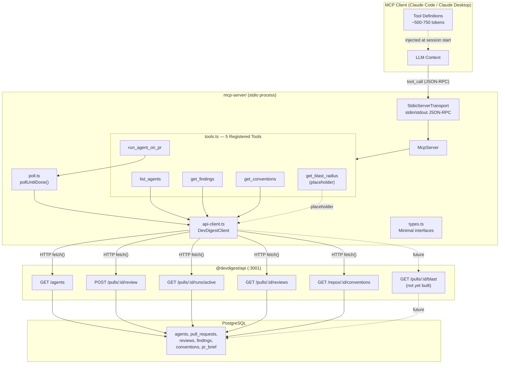
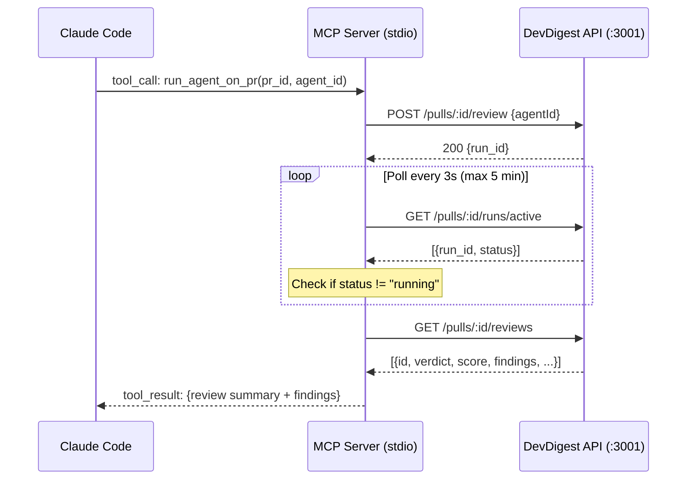

# Implementation Plan: MCP Server Package

**Scope:** new `mcp-server/` package only. No server-side changes.
**Created:** 2026-08-10

## Context

DevDigest needs an MCP (Model Context Protocol) server so Claude Code and other MCP clients can interact with DevDigest programmatically. The MCP server is a stdio-based process that acts as an HTTP client, calling the existing DevDigest API on :3001. It exposes 5 tools: `list_agents`, `run_agent_on_pr`, `get_findings`, `get_conventions`, `get_blast_radius`.

## Architecture Diagram



### Sequence: `run_agent_on_pr` (polling flow)



## Resolved Decisions

- **Large response truncation:** Truncate to top 20 most valuable findings sorted by severity
- **Package manager:** npm
- **`get_conventions`:** Keep as Tool, not Resource
- **Types:** Local minimal interfaces in `types.ts`, no tsconfig alias to `vendor/shared`
- **Auth:** None in MVP (LocalNoAuthProvider)
- **Transport:** stdio (local single-client)
- **Blast radius:** Placeholder implementation. The `GET /pulls/:id/blast` server endpoint will be implemented separately as a server feature and linked later.

## Architecture Constraints

- `vendor/shared/` -- extend with new files only, never edit existing contracts
- ESM throughout, Node 22
- `reviewer-core` consumed as raw TS source. The MCP server does NOT import reviewer-core.

## Steps

### Step 1: Initialize the `mcp-server/` package

**Files:**
- `mcp-server/package.json`
- `mcp-server/tsconfig.json`
- `mcp-server/.gitignore`

```json
// package.json essentials
{
  "name": "@devdigest/mcp-server",
  "type": "module",
  "bin": { "devdigest-mcp": "./dist/index.js" },
  "dependencies": {
    "@modelcontextprotocol/sdk": "^1.x",
    "zod": "^3.x"
  },
  "devDependencies": {
    "typescript": "^5.x",
    "tsx": "^4.x",
    "vitest": "^3.x",
    "@types/node": "^22.x"
  },
  "scripts": {
    "build": "tsc",
    "dev": "tsx src/index.ts",
    "test": "vitest run"
  }
}
```

tsconfig: ES2022 target, NodeNext module/moduleResolution, strict. ESM requires `.js` extensions in imports.

### Step 2: Create local type definitions

**File:** `mcp-server/src/types.ts`

Minimal interfaces matching DevDigest API response shapes. Only fields the MCP tools need:

- `Agent` -- `{ id, name, description, provider, model, enabled }`
- `ReviewRecord` -- `{ id, agent_name, verdict, summary, score, findings }`
- `FindingRecord` -- `{ id, severity, category, title, file, start_line, end_line, rationale }`
- `ConventionCandidate` -- `{ id, rule, evidence_path, confidence, accepted }`
- `BlastRadius` -- `{ changed_symbols, downstream, summary }` (placeholder type for future use)
- `RunSummary` -- `{ run_id, agent_name, status, score, findings_count }`
- `Repo` -- `{ id, owner, name, full_name }`
- `PrMeta` -- `{ id, number, title, author, status }`

### Step 3: Create the API client

**File:** `mcp-server/src/api-client.ts`

`DevDigestClient` class wrapping `fetch()` calls to the DevDigest API.

Methods:
- `listAgents()` -- `GET /agents`
- `runReview(prId, agentId)` -- `POST /pulls/:id/review`
- `getActiveRuns(prId)` -- `GET /pulls/:id/runs/active`
- `getReviews(prId)` -- `GET /pulls/:id/reviews`
- `getConventions(repoId)` -- `GET /repos/:id/conventions`
- `getBlastRadius(prId)` -- **placeholder**, returns `{ error: "not implemented" }` until server endpoint exists

Constructor takes `baseUrl: string` (default `http://localhost:3001`). Optional `headers` param for future auth.

**Tests:** `api-client.test.ts` -- mock `fetch`, verify URLs, methods, error handling.

### Step 4: Create polling helper

**File:** `mcp-server/src/poll.ts`

`pollUntilDone(check, intervalMs = 3000, timeoutMs = 300_000)`:
- Calls `check()` every `intervalMs`
- Returns when `check()` returns a done result
- Throws after `timeoutMs`
- Uses `setTimeout`-based polling

**Tests:** `poll.test.ts` -- verify timeout and success with fake timers.

### Step 5: Implement the 5 MCP tools

**File:** `mcp-server/src/tools.ts`

`registerTools(server: McpServer, client: DevDigestClient)` registers all 5 tools.

#### Token Efficiency Rules Applied
- Descriptions: 1-3 sentences, under 200 chars
- No `.describe()` on schema fields
- No `outputSchema`
- Names: `verb_noun`, under 20 chars
- Flat schemas, no nesting
- Deterministic registration order (for prompt cache hits)
- Use `annotations` instead of prose for behavior hints

#### Tool Definitions

**`list_agents`**
- Description: `"List configured review agents"`
- Schema: `z.object({})`
- Annotations: `{ readOnlyHint: true }`
- Returns: enabled agents' name, id, model, description

**`run_agent_on_pr`**
- Description: `"Run a review agent on a PR, returns when done"`
- Schema: `z.object({ pr_id: z.string(), agent_id: z.string() })`
- Annotations: `{ destructiveHint: false, idempotentHint: false }`
- Handler: fires review, polls until done, returns latest review
- Timeout: 5 minutes

**`get_findings`**
- Description: `"Get findings from finished reviews for a PR"`
- Schema: `z.object({ pr_id: z.string() })`
- Annotations: `{ readOnlyHint: true }`
- **Truncates to top 20 findings sorted by severity**

**`get_conventions`**
- Description: `"Get repository coding conventions"`
- Schema: `z.object({ repo_id: z.string() })`
- Annotations: `{ readOnlyHint: true }`

**`get_blast_radius`**
- Description: `"Get PR influence map (changed symbols and callers)"`
- Schema: `z.object({ pr_id: z.string() })`
- Annotations: `{ readOnlyHint: true }`
- **Placeholder: returns "not yet available" message until server endpoint is linked**

#### Error Handling Pattern
- All handlers: try/catch
- Success: `{ content: [{ type: "text", text: JSON.stringify(result, null, 2) }] }`
- Failure: `{ content: [{ type: "text", text: error.message }], isError: true }`

**Tests:** `tools.test.ts` -- mock `DevDigestClient`, verify shapes and `isError` handling.

### Step 6: Create the entrypoint

**File:** `mcp-server/src/index.ts`

1. Read `DEVDIGEST_API_URL` from env (default `http://localhost:3001`)
2. Create `DevDigestClient`
3. Create `McpServer` with `{ name: "devdigest", version: "0.1.0" }`
4. Call `registerTools(server, client)`
5. Create `StdioServerTransport` and connect
6. Handle SIGINT/SIGTERM for clean shutdown

```typescript
import { McpServer } from "@modelcontextprotocol/sdk/server/mcp.js";
import { StdioServerTransport } from "@modelcontextprotocol/sdk/server/stdio.js";
```

### Step 7: README with registration instructions

**File:** `mcp-server/README.md`

Include:
1. What the MCP server does
2. Build: `npm install && npm run build`
3. Dev: `npm run dev`
4. Claude Code registration (`.claude/settings.json`):
```json
{
  "mcpServers": {
    "devdigest": {
      "command": "node",
      "args": ["<path>/mcp-server/dist/index.js"],
      "env": { "DEVDIGEST_API_URL": "http://localhost:3001" }
    }
  }
}
```
5. Available tools and their parameters

## API Route Mapping

| MCP Tool | HTTP Method | Endpoint | Exists? |
|----------|-------------|----------|---------|
| `list_agents` | GET | `/agents` | Yes |
| `run_agent_on_pr` | POST | `/pulls/:id/review` | Yes |
| `run_agent_on_pr` (poll) | GET | `/pulls/:id/runs/active` | Yes |
| `run_agent_on_pr` (result) | GET | `/pulls/:id/reviews` | Yes |
| `get_findings` | GET | `/pulls/:id/reviews` | Yes |
| `get_conventions` | GET | `/repos/:id/conventions` | Yes |
| `get_blast_radius` | GET | `/pulls/:id/blast` | **No -- placeholder until server feature is built** |

## Package Structure

```
mcp-server/
  package.json
  tsconfig.json
  .gitignore
  README.md
  src/
    index.ts          # entrypoint: McpServer + StdioServerTransport
    tools.ts          # registerTools() -- all 5 tool definitions
    api-client.ts     # DevDigestClient -- fetch wrapper for :3001
    types.ts          # minimal response type interfaces
    poll.ts           # pollUntilDone() helper
  tests/
    api-client.test.ts
    tools.test.ts
    poll.test.ts
```

## Risk Assessment

1. **`run_agent_on_pr` polling** -- Cannot use SSE over stdio. Poll `runs/active` every 3s with 5-min timeout.
2. **No auth in MVP** -- Fine for local-first. `DevDigestClient` constructor accepts optional `headers` for future auth.
3. **ESM import paths** -- Must use `.js` extensions consistently.
4. **Large tool responses** -- Findings truncated to top 20 by severity.
5. **Blast radius not available** -- Placeholder returns clear message. Will be linked when server endpoint is built.

## Best Practices Applied

### From MCP Research (token efficiency)
| Practice | Source | How Applied |
|----------|--------|-------------|
| Schema is #1 token driver (97% of tokens) | [mcp-token-benchmark](https://github.com/zhang-liz/mcp-token-benchmark) | Flat schemas, no nesting, no field descriptions |
| Descriptions ≤200 chars | [Context optimization study](https://scottspence.com/posts/optimising-mcp-server-context-usage-in-claude-code) | All 5 tool descriptions are 1 short sentence |
| No `outputSchema` | [Token optimization guide](https://www.stackone.com/blog/mcp-token-optimization/) | Omitted entirely — halves per-tool token cost |
| Deterministic tool order | [MCP Tools Spec](https://modelcontextprotocol.io/docs/concepts/tools) | Tools registered in fixed order for prompt cache hits |
| Use annotations over prose | [MCP Tool Annotations](https://mcpblog.dev/blog/2026-03-13-mcp-tool-annotations) | `readOnlyHint`, `destructiveHint` instead of describing behavior in text |
| Short `verb_noun` names ≤20 chars | [Schema Design Guide](https://kansei-link.com/en/insights/mcp-tool-schema-design-guide-2026.html) | `list_agents` (11), `get_findings` (12), etc. |
| `isError: true` for tool failures | [Anthropic MCP Server Guide](https://github.com/anthropics/skills/blob/main/skills/mcp-builder/reference/node_mcp_server.md) | Protocol errors invisible to LLM; tool-level errors are visible |
| stdio transport for local client | [MCP Architecture](https://modelcontextprotocol.io/docs/concepts/architecture) | Single-client, zero network overhead |

### From Project Conventions
| Practice | Source | How Applied |
|----------|--------|-------------|
| Never edit existing `vendor/shared/` | Root `CLAUDE.md` | Local `types.ts` with minimal interfaces instead |
| Separate lockfiles per package | Root `CLAUDE.md` | Own `package.json` with npm |
| ESM throughout | Root `CLAUDE.md` | `"type": "module"`, `.js` import extensions |
| Integration tests use `*.it.test.ts` | Root `CLAUDE.md` | Test files follow this suffix convention |

### Architecture Decision: No Onion Layers
The DevDigest server uses implicit clean architecture (routes → service → repository + injected adapters). The MCP server intentionally does NOT apply Onion Architecture because:
- It has no domain logic, no database, no business rules
- It is a **protocol adapter** — translating MCP tool calls into HTTP requests
- Adding onion layers (domain, application, infrastructure) would introduce abstraction without value
- The natural layering is flat: `tools.ts` (handlers) → `api-client.ts` (HTTP) → `types.ts` (contracts)

## Out of Scope

- Blast radius server endpoint (separate feature, linked later)
- Authentication/authorization
- SSE streaming for run progress
- Client-side changes
- CI pipeline for mcp-server
- npm publishing
- MCP Resource for conventions
- Editing existing `vendor/shared/` contracts
