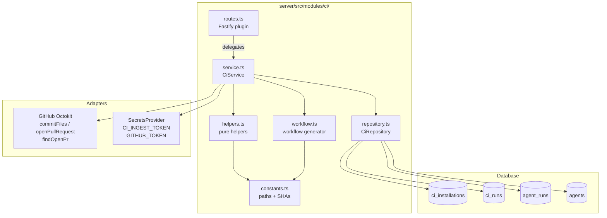
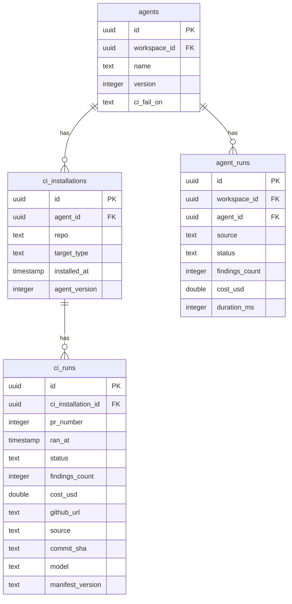

# Export to CI — Server

## Overview

The `ci` module lets agent authors deploy a tuned review agent into a target
repository's GitHub Actions pipeline without hand-writing YAML. It serializes the
agent configuration into a portable `AgentManifest` YAML, bundles the pre-built
`agent-runner`, generates a least-privilege GitHub Actions workflow, and either opens
a `devdigest/ci` pull request or returns the files for client-side zip download.
When GitHub Actions runs the workflow it uploads a result artifact; the studio receives
that artifact at `POST /ci/ingest` and records the run in `ci_runs` and `agent_runs`.

## Architecture



## Key Components

### routes.ts

**File:** `server/src/modules/ci/routes.ts`

Fastify plugin registered in `server/src/modules/index.ts`. Exposes four routes:

| Method | Path | Auth | Description |
|--------|------|------|-------------|
| `POST` | `/ci/ingest` | `CI_INGEST_TOKEN` bearer | Receive and persist a CI run artifact |
| `GET` | `/ci/runs` | workspace context | List CI runs with optional filters |
| `GET` | `/ci/installations` | workspace context | List installations for an agent |
| `POST` | `/agents/:id/export-ci` | workspace context | Build the file bundle and open/return it |

`POST /ci/ingest` is the only route that does not call `getContext` — it
authenticates via a constant-time bearer token comparison using `node:crypto`
`timingSafeEqual`.

The `ExportBody` schema extends `CiExportInput` with a `workflow_override` nullable
string that carries the wizard's edited YAML through to the commit step unchanged.

### service.ts

**File:** `server/src/modules/ci/service.ts`

`CiService` orchestrates the two main operations:

**`exportCi(workspaceId, agentId, input)`**

1. Loads the agent and its linked skills from `agentsRepo`.
2. Slugifies skill names and checks for collisions (`assertNoDuplicateSlugs`).
3. Builds and validates the `AgentManifest` via `AgentManifest.parse` — aborts on failure before any GitHub call.
4. Serializes the manifest YAML and reads the runner bundle from `agent-runner/dist/index.js`.
5. Uses `input.workflow_override` verbatim when set; otherwise calls `generateWorkflow`.
6. For `action='open_pr'`: calls `commitFiles` then `findOpenPr`/`openPullRequest` (reuses existing PR if one is already open).
7. Inserts `ci_installations` row **only** after a successful commit/PR, or immediately for `action='files'`.

**`ingest(params)`**

1. Derives the workspace from the matched installation's agent (multi-tenant safety — never trusts artifact fields for scoping).
2. Inserts one `agent_runs` row with `source='ci'`.
3. Upserts one `ci_runs` row keyed on `(ci_installation_id, pr_number, commit_sha)` inside a transaction.

### repository.ts

**File:** `server/src/modules/ci/repository.ts`

`CiRepository` owns Drizzle queries against `ci_installations`, `ci_runs`, and `agent_runs`. Notable methods:

- `insertInstallation` — creates a `ci_installations` row, storing `agentVersion` at export time.
- `findInstallationByRepo` — used by ingest to match an artifact to a known installation.
- `getWorkspaceIdForAgent` — resolves workspace from the agent table for ingest (which has no workspace context).
- `listRuns` — left-joins `ci_runs → ci_installations → agents` for the CI Runs page.
- `upsertCiRun` — transactional find-then-insert-or-update on the dedup key `(ci_installation_id, pr_number, commit_sha)`.

### helpers.ts

**File:** `server/src/modules/ci/helpers.ts`

Pure, stateless functions (except `readRunnerBundle` which reads the filesystem):

- `slugify(name)` — converts a skill or agent name to a URL-safe slug.
- `assertNoDuplicateSlugs(slugs)` — throws on collision before any GitHub API call.
- `manifestFromAgent(agent, skillSlugs)` — shapes an `AgentManifest` object; never includes secrets.
- `readRunnerBundle()` — reads `agent-runner/dist/index.js`; throws loudly if the bundle is absent.
- `bundleFiles(input)` — assembles the full `CiFile[]` set with correct `editable` flags (workflow `true`; manifest, skills, runner `false`). Contains a clearly-commented seam for the future `memory.jsonl` file.
- `serializeManifest(manifest)` — serializes a validated manifest to YAML using the `yaml` package.
- `parseRepoRef(repo)` — splits `"owner/name"` into `{ owner, name }`.

### workflow.ts

**File:** `server/src/modules/ci/workflow.ts`

`generateWorkflow({ triggers, postAs, base })` builds the `.github/workflows/devdigest-review.yml`
string as a plain JS object serialized via the `yaml` package — never by string-concatenating
untrusted input. Security invariants enforced:

- `permissions:` is exactly `contents: read` and `pull-requests: write`.
- External actions (`actions/checkout`, `actions/setup-node`, `actions/upload-artifact`)
  are pinned to full 40-character commit SHAs stored in `constants.ts`.
- A job-level `if` guard blocks the job on fork PRs: `${{ github.event.pull_request.head.repo.fork == false }}`.
- `OPENROUTER_API_KEY` appears only as `${{ secrets.OPENROUTER_API_KEY }}`.
- `pull_request_target` is not used; the workflow uses the default `pull_request` event.
- Triggers are intersected with a fixed allow-list (`opened`, `synchronize`, `reopened`) — raw user strings are never interpolated.
- The `POST /ci/ingest` curl call is present as a documented comment; live network wiring is deferred to a future iteration.

### constants.ts

**File:** `server/src/modules/ci/constants.ts`

Single source of truth for:
- Path constants (`CI_BRANCH`, `WORKFLOW_PATH`, `MANIFEST_DIR`, `SKILLS_DIR`, `RUNNER_PATH`, `MEMORY_PATH`, `RESULT_FILE`).
- Pinned action SHAs (resolved 2026-08-25): `CHECKOUT_SHA`, `SETUP_NODE_SHA`, `UPLOAD_ARTIFACT_SHA`.
- Secret key name `CI_INGEST_TOKEN_KEY`.

## Data Flow

### Export Flow (open_pr)

```mermaid
sequenceDiagram
    participant Wizard as Export Wizard
    participant API as POST /agents/:id/export-ci
    participant Svc as CiService
    participant GH as GitHub Octokit
    participant DB as Database

    Wizard->>API: ExportBody {repo, action:'open_pr', triggers, post_as, workflow_override?}
    API->>Svc: exportCi(workspaceId, agentId, input)
    Svc->>DB: agentsRepo.getById + linkedSkills
    DB-->>Svc: agent row + skill rows
    Note over Svc: slugify + assertNoDuplicateSlugs
    Note over Svc: AgentManifest.parse&#40;&#41; -- abort on failure
    Note over Svc: serializeManifest, readRunnerBundle, generateWorkflow
    Svc->>GH: commitFiles&#40;repo, branch:'devdigest/ci', files&#41;
    GH-->>Svc: ok
    Svc->>GH: findOpenPr&#40;repo, 'devdigest/ci'&#41;
    alt PR already open
        GH-->>Svc: existing PR url
    else No PR
        Svc->>GH: openPullRequest&#40;repo, {head:'devdigest/ci'}&#41;
        GH-->>Svc: new PR url
    end
    Svc->>DB: insertInstallation&#40;agentId, repo, 'gha', agentVersion&#41;
    DB-->>Svc: installation row
    Svc-->>API: CiExport {installation, files, pr_url}
    API-->>Wizard: 201 CiExport
```



### Ingest Flow

```mermaid
sequenceDiagram
    participant Runner as agent-runner &#40;CI job&#41;
    participant API as POST /ci/ingest
    participant Svc as CiService
    participant Repo as CiRepository
    participant DB as Database

    Runner->>API: Authorization: Bearer CI_INGEST_TOKEN
    Note over API: timingSafeEqual comparison via SecretsProvider
    Runner->>API: body: {repository, commit_sha, ...CiResultArtifact}
    alt Token invalid
        API-->>Runner: 401 -- nothing written
    end
    alt Schema invalid
        API-->>Runner: 422 -- nothing written
    end
    API->>Repo: findInstallationByRepo&#40;repository&#41;
    alt No installation found
        API-->>Runner: 422 -- nothing written
    end
    API->>Svc: ingest&#40;{artifact, repository, commitSha, installation}&#41;
    Svc->>Repo: getWorkspaceIdForAgent&#40;agentId&#41;
    Svc->>DB: INSERT agent_runs &#40;source='ci'&#41;
    Svc->>Repo: upsertCiRun&#40;&#41; -- transaction FOR UPDATE
    alt Row exists &#40;same installation+pr+sha&#41;
        Repo->>DB: UPDATE ci_runs SET ...
    else New run
        Repo->>DB: INSERT ci_runs
    end
    API-->>Runner: {ok: true}
```



## Database Schema



The `commit_sha`, `model`, and `manifest_version` columns on `ci_runs` were added by
migration `0018` alongside `agent_version` on `ci_installations`. All four are nullable
so existing rows remain valid.

## API

### POST /agents/:id/export-ci

**Request body** (`ExportBody`):

```
CiExportInput +
  workflow_override?: string | null   -- edited workflow YAML from the wizard
```

The `repo` field is validated against `/^[^/\s]+\/[^/\s]+$/` (owner/name format).

**Response** `201 CiExport`:

```
{
  installation: CiInstallation,
  files: CiFile[],
  pr_url: string | null        -- null when action='files'
}
```

### POST /ci/ingest

**Authentication:** `Authorization: Bearer <CI_INGEST_TOKEN>`

**Request body** (`IngestBody`):

```
{
  repository: string,           -- owner/name
  commit_sha: string,           -- 7-40 hex chars
  ...CiResultArtifact           -- artifact fields
}
```

**Responses:** `200 {ok: true}` | `401` | `422`

### GET /ci/runs

**Query params:** `repo?`, `agent?` (UUID), `source?`, `status?`

**Response:** `CiRun[]`

### GET /ci/installations

**Query params:** `agent_id?` (UUID) — required in practice; returns `[]` when absent.

**Response:** `Array<CiInstallation & { agent_version: number | null }>`

## Security Model

| Concern | Mechanism |
|---------|-----------|
| Ingest authentication | `CI_INGEST_TOKEN` bearer, constant-time comparison via `crypto.timingSafeEqual` |
| Secret never in artifacts | `OPENROUTER_API_KEY` only as `${{ secrets.* }}` — asserted by unit test |
| Fork PR isolation | Job-level `if: ${{ github.event.pull_request.head.repo.fork == false }}` — no `pull_request_target` |
| Pinned actions | Full 40-char SHAs in `constants.ts` |
| Branch isolation | All commits go to `devdigest/ci`; `main` is never touched |
| Multi-tenant ingest | Workspace derived from installation's agent; artifact fields never used for scoping |
| Duplicate replay | Transactional find-then-update in `upsertCiRun`; follow-up: DB unique index |

## Configuration

| Secret key | Provider | Description |
|------------|----------|-------------|
| `CI_INGEST_TOKEN` | `SecretsProvider` (`~/.devdigest/secrets.json`, fallback `process.env`) | Bearer token for authenticating ingest POSTs |
| `GITHUB_TOKEN` | `SecretsProvider` | Token for `commitFiles` / `openPullRequest` |

## Known Limitations (v1)

- **Ingest reachability**: The generated workflow contains the `POST /ci/ingest` curl
  step as a documented comment. Live end-to-end ingest from GitHub-hosted runners to
  the local-first studio requires a tunnel or self-hosted runner and is deferred.
- **memory.jsonl**: The `CiFile` slot and Preview row are wired, but no memory source
  is registered in v1. The omit branch of `AC-O1` is satisfied; the present branch is
  a commented seam in `bundleFiles`.
- **`duration_s` on `CiRun`**: Always `null` in v1. The `ci_runs` table has no
  `duration_ms` column; `agent_runs.durationMs` holds it but lacks a FK to `ci_runs`.
  A future migration adding `duration_ms` to `ci_runs` (or an `agent_run_id` FK) will
  populate this field.
- **Dedup TOCTOU**: The transactional find-then-update guards against concurrent replays,
  but a DB-level partial unique index on `(ci_installation_id, pr_number, commit_sha)`
  is the more robust option and is noted as a hardening follow-up.

## Related

- `server/src/vendor/shared/contracts/eval-ci.ts` — `AgentManifest`, `CiExportInput`, `CiExport`, `CiFile`, `CiRun`, `CiInstallation`, `CiResultArtifact` contracts
- `server/src/db/schema/ci.ts` — `ciInstallations` and `ciRuns` table definitions
- `server/src/adapters/github/octokit.ts` — `commitFiles`, `openPullRequest`, `findOpenPr`
- `agent-runner/` — the bundled runner; must be built (`npm run build`) before exporting
- `client/docs/ExportToCi/README.md` — client-side documentation
