# Export to CI v2 &#40;Delta&#41; — Server

> **Delta doc.** This documents ONLY what v2 adds/changes on top of the
> `ExportToCi_1` baseline. Unchanged v1 behavior — the manifest/skill/runner
> bundling, `POST /agents/:id/export-ci` core flow, `POST /ci/ingest` token
> auth, the pinned-SHA GitHub Actions steps, `GET /ci/runs` — is documented in
> [`server/docs/ExportToCi/README.md`](../ExportToCi/README.md) and is not
> re-described here.

## Overview

`ExportToCi_2` closes three gaps left open by v1: an aggregate **Agent
Performance dashboard** (`GET /ci/performance`), first-class **multi-repo
installation management** (`GET /ci/installations` now returns `last_status`
/ `last_run_at` per repo and is workspace-scoped; `DELETE
/ci/installations/:id` removes one repo), and a **live CI → studio ingest
round-trip** that is reachable exclusively via a GitHub **self-hosted**
Actions runner on the operator's private network — never a public tunnel or
hosted relay. All new reads are SQL joins/aggregates over existing tables; no
migration was needed. Three new pure validators
&#40;`isPrivateNetworkStudioUrl`, `isSelfHostedRunnerLabel`,
`validateWorkflowOverride`&#41; were added specifically to close bypasses a
security review found in the caller-controlled `studio_url`, `runner_label`,
and `workflow_override` inputs.

## Architecture

```mermaid
flowchart TD
    subgraph ci["server/src/modules/ci/ &#40;v2 additions&#41;"]
        routes["routes.ts\nGET /ci/performance\nDELETE /ci/installations/:id\nextended ExportBody"]
        service["service.ts\nCiService\ngetPerformance&#40;&#41;\nlistInstallations&#40;&#41; extended\nremoveInstallation&#40;&#41;\nexportCi&#40;&#41; + provisioning"]
        repo["repository.ts\nCiRepository\naggregateAgentRuns / totalsForWindow\ncostByModel / acceptCountsByAgent\nlistInstallationsWithLatestRun\ndeleteInstallation"]
        helpers["helpers.ts\nisPrivateNetworkStudioUrl\nisSelfHostedRunnerLabel\nvalidateWorkflowOverride\nacceptRate / costDelta / trendArrow\ntoCostSlices / emptyPerformance"]
        workflow["workflow.ts\ngenerateWorkflow&#40;runnerLabel, studioUrl&#41;"]
        provisionerIface["provisioner.ts\nCiProvisioner interface\n&#40;module-local, NOT vendor/shared&#41;"]
        constants["constants.ts\nDEFAULT_RUNNER_LABEL\nDEFAULT_STUDIO_URL\nDEVDIGEST_STUDIO_URL_VAR"]
    end

    subgraph contracts["vendor/shared/contracts/ci-v2.ts\n&#40;new file — extends barrel&#41;"]
        perfWindow["PerfWindow"]
        agentPerf["AgentPerformance\nCiAgentPerfRow / CostSlice"]
        instView["CiInstallationView\n&#40;extends CiInstallation&#41;"]
    end

    subgraph adapters["server/src/adapters/github/"]
        provisionerImpl["ci-provisioner.ts\nOctokitCiProvisioner\nsealed-box secret + variable"]
    end

    subgraph platform["platform/container.ts"]
        containerGetter["ciProvisioner&#40;&#41;\nlazy, GITHUB_TOKEN-backed"]
    end

    subgraph db["Database &#40;joins only — no new tables/columns&#41;"]
        agentRuns[("agent_runs")]
        findingsRev[("findings + reviews")]
        ciInst[("ci_installations")]
        ciRunsT[("ci_runs")]
        agentsT[("agents")]
    end

    routes -->|delegates| service
    routes --> contracts
    service --> repo
    service --> helpers
    service --> workflow
    service -->|await| containerGetter
    containerGetter --> provisionerIface
    provisionerIface -.implemented by.-> provisionerImpl
    repo --> agentRuns
    repo --> findingsRev
    repo --> ciInst
    repo --> ciRunsT
    repo --> agentsT
    service --> contracts
```



## Key Components

### routes.ts &#40;extended&#41;

**File:** `server/src/modules/ci/routes.ts`

Two new routes, one extended body:

| Method | Path | Auth | v2 change |
|--------|------|------|-----------|
| `GET` | `/ci/performance` | workspace context | New. `CiPerformanceQuery` &#40;`window` defaults to `'30'`, hard-rejects any value outside `{7,30,90}` with `422` via Zod&#41;. |
| `DELETE` | `/ci/installations/:id` | workspace context | New. Delegates to `CiService.removeInstallation`, returns `204`. |
| `POST` | `/agents/:id/export-ci` | workspace context | `ExportBody` extended with `runner_label?: string[]` and `studio_url?: string`, both **Zod `.refine()`-validated** before the handler runs &#40;see Security Model&#41;. |

`GET /ci/installations` itself is unchanged at the route level — it now
returns the extended `CiInstallationView[]` shape because `CiService.listInstallations`
was rewired to the new repository join.

### service.ts &#40;extended&#41;

**File:** `server/src/modules/ci/service.ts`

- **`getPerformance&#40;workspaceId, window&#41;`** — computes the selected window
  and the immediately preceding equal-length window, runs the repository
  aggregates for both in parallel &#40;`Promise.all`&#41;, and composes the result
  via the pure `helpers.ts` functions. Returns `emptyPerformance&#40;window&#41;`
  when `totals.totalRuns === 0` &#40;empty state, no error&#41;.
- **`listInstallations&#40;workspaceId, agentId&#41;`** — now calls
  `listInstallationsWithLatestRun` instead of a plain `ci_installations`
  select, returning `last_status` / `last_run_at` from a `LEFT JOIN LATERAL`
  and enforcing workspace ownership via a join to `agents`.
- **`removeInstallation&#40;id, workspaceId&#41;`** — deletes only the
  `ci_installations` row; `ci_runs` rows are preserved via the existing
  `ON DELETE SET NULL` FK. Throws `NotFoundError` when the row doesn't
  belong to the caller's workspace.
- **`exportCi`** — for `action='open_pr'`: after the PR is committed/opened,
  it resolves `container.ciProvisioner&#40;&#41;` and provisions the target repo's
  `CI_INGEST_TOKEN` Actions secret and `DEVDIGEST_STUDIO_URL` Actions
  variable. A pre-flight check &#40;`secrets.get&#40;CI_INGEST_TOKEN_KEY&#41;`&#41; aborts
  *before any GitHub call* if the studio has no ingest token configured
  &#40;`ci_ingest_token_missing`, `422`&#41;. Provisioning failure after the PR is
  open does **not** roll back the PR — it is reported via a structured
  `IngestWiring` result &#40;`status: 'ok' | 'skipped' | 'incomplete'`&#41; appended
  to the response as `ingest_wiring`. It also validates a caller-supplied
  `workflow_override` with `validateWorkflowOverride&#40;&#41;` before using it
  verbatim, throwing `unsafe_workflow_override` &#40;`422`&#41; on any violation.

### repository.ts &#40;new methods&#41;

**File:** `server/src/modules/ci/repository.ts`

All new queries are parameterized, window-bounded `GROUP BY` aggregates —
never per-row app-side loops &#40;perf NFR&#41;:

| Method | Purpose |
|--------|---------|
| `aggregateAgentRuns&#40;workspaceId, since, until&#41;` | Per-agent `runs`, `total_cost_usd`, `avg_cost_usd`, `avg_duration_ms`, `last_ran_at` over `agent_runs` &#40;both `source` values&#41;. |
| `totalsForWindow&#40;workspaceId, since, until&#41;` | Workspace-wide `total_runs` / `total_cost_usd`. |
| `costByModel&#40;workspaceId, since, until&#41;` | Cost grouped by `coalesce&#40;model, 'unknown'&#41;` — feeds the by-model donut. |
| `acceptCountsByAgent&#40;workspaceId, since, until&#41;` | Per-agent `accepted` / `dismissed` counts from `findings` INNER JOIN `reviews`, windowed by `reviews.created_at` &#40;`findings` itself has no timestamp&#41;. |
| `listInstallationsWithLatestRun&#40;workspaceId, agentId&#41;` | `ci_installations` INNER JOIN `agents` &#40;workspace ownership&#41; LEFT JOIN LATERAL latest `ci_runs` row per installation for `last_status` / `last_run_at`. |
| `deleteInstallation&#40;id, workspaceId&#41;` | Verifies ownership via join to `agents` before deleting; returns `false` &#40;no-op&#41; if not owned. |

Both `listInstallationsWithLatestRun` and `deleteInstallation` join through
`agents` to enforce workspace ownership — `ci_installations` has no direct
`workspace_id` column, so `agent_id` alone was previously the only scoping
key on the read path &#40;see Security Model — cross-workspace IDOR fix&#41;.

### helpers.ts &#40;security validators + pure shaping&#41;

**File:** `server/src/modules/ci/helpers.ts`

Three new **security-critical validators** &#40;see Security Model below for the
full rationale&#41;, plus DB-free dashboard shaping helpers:

| Function | Role |
|----------|------|
| `isPrivateNetworkStudioUrl&#40;url&#41;` | Rejects any `studio_url` that doesn't resolve to `localhost` / `127.0.0.1` / `::1` / RFC 1918 &#40;`10.0.0.0/8`, `172.16.0.0/12`, `192.168.0.0/16`&#41;. |
| `isSelfHostedRunnerLabel&#40;labels&#41;` | Requires the literal `'self-hosted'` label to be present. |
| `validateWorkflowOverride&#40;yamlText&#41;` | Parses an author-edited workflow YAML and returns an array of violation messages &#40;empty = safe&#41;. |
| `acceptRate&#40;accepted, dismissed&#41;` | `accepted / &#40;accepted + dismissed&#41;`, `null` when both are `0` &#40;no divide-by-zero&#41;. |
| `costDelta&#40;current, previous&#41;` | Signed delta; returns `current` &#40;not `Infinity`&#41; when `previous === 0`. |
| `trendArrow&#40;current, previous&#41;` | `'up' \| 'down' \| 'flat' \| null`; `null` when either side is `null`. |
| `toCostSlices&#40;rows&#41;` | Shapes `{key, costUsd}[]` into sorted-descending `CostSlice[]` for the donuts. |
| `emptyPerformance&#40;window&#41;` | Zeroed `AgentPerformance` shape for the empty state. |

### workflow.ts &#40;extended&#41;

**File:** `server/src/modules/ci/workflow.ts`

`generateWorkflow&#40;input&#41;` gained `runnerLabel?: string[]` and `studioUrl?:
string` on `GenerateWorkflowInput`:

- `'runs-on'` is now `input.runnerLabel ?? DEFAULT_RUNNER_LABEL` &#40;defaults to
  `['self-hosted', 'devdigest']`&#41; instead of a GitHub-hosted runner.
- The **"Ingest result into DevDigest Studio"** step — a documented comment
  in v1 — is now an **active** step, `if: always&#40;&#41;`:
  - Reads the studio URL only from `${{ vars.DEVDIGEST_STUDIO_URL }}` &#40;never
    a raw literal baked into the YAML&#41; and the token only from
    `${{ secrets.CI_INGEST_TOKEN }}`.
  - Shell-guards on an empty `DEVDIGEST_STUDIO_URL`: `exit 0` before any
    network call &#40;no-op — AC-ST2&#41;.
  - Ends its `curl` with `|| true` so a failed/unreachable studio never fails
    the job &#40;best-effort — AC-UN4&#41;.
- `permissions:` is unchanged — exactly `contents: read` +
  `pull-requests: write`.
- The fork-PR job-level `if` guard is unchanged, so the entire job &#40;including
  the new ingest step&#41; is skipped on fork PRs — the token is never exposed
  to fork code.
- `studioUrl` is accepted on the input type for interface completeness &#40;used
  by the `CiProvisioner` call site in `service.ts`&#41; but is **never**
  interpolated into the generated YAML itself.

### provisioner.ts + adapters/github/ci-provisioner.ts

**Files:** `server/src/modules/ci/provisioner.ts` &#40;interface&#41;,
`server/src/adapters/github/ci-provisioner.ts` &#40;Octokit implementation&#41;

`CiProvisioner` is a **module-local** interface — intentionally *not* added
to the shared `GitHubClient` in `vendor/shared/adapters.ts`, because that
contract and its `MockGitHubClient` test double are extend-only /
off-limits. `OctokitCiProvisioner`:

- `createOrUpdateActionsSecret&#40;owner, repo, name, value&#41;` — fetches the
  repo's Actions public key, sealed-box encrypts &#40;`libsodium-wrappers`
  `crypto_box_seal`&#41;, then `PUT`s via `actions.createOrUpdateRepoSecret`
  &#40;idempotent create-or-overwrite&#41;. The plaintext value is never logged.
- `setActionsVariable&#40;owner, repo, name, value&#41;` — tries
  `actions.createRepoVariable`; on a `409` &#40;already exists&#41; falls back to
  `actions.updateRepoVariable` &#40;idempotent&#41;.

`platform/container.ts` exposes a lazy `ciProvisioner&#40;&#41;` getter that
resolves the same `GITHUB_TOKEN` used by `github&#40;&#41;`, cached separately, with
a `ContainerOverrides.ciProvisioner` slot for tests.

### contracts/ci-v2.ts &#40;new shared contract file&#41;

**File:** `server/src/vendor/shared/contracts/ci-v2.ts`

New file, re-exported via the barrel &#40;`export * from './contracts/ci-v2.js'`
in `vendor/shared/index.ts`&#41; — `eval-ci.ts` and every other existing
contract file is untouched:

- `PerfWindow = z.enum(['7', '30', '90'])`
- `CiAgentPerfRow` — one per-agent dashboard table row &#40;`accept_rate` and
  `trend` both nullable&#41;. Named `CiAgentPerfRow`, not `AgentPerfRow`, to
  avoid an export collision with an unrelated `AgentPerfRow` already defined
  in `productionize.ts` — both files are re-exported via the same barrel
  `export *`, so an identical name would make the barrel ambiguous &#40;`TS2308`&#41;.
- `CostSlice` — `{key, cost_usd}`, reused for both cost donuts.
- `AgentPerformance` — the full `GET /ci/performance` response shape.
- `CiInstallationView = CiInstallation.extend&#40;{agent_version, last_status,
  last_run_at}&#41;` — reuses `CiInstallation` from `eval-ci.ts` by
  **composition**, never edits it.

## Data Flow

### Export + Provisioning &#40;open_pr, with live ingest wiring&#41;

```mermaid
sequenceDiagram
    participant Wizard as Export Wizard &#40;Configure step&#41;
    participant API as POST /agents/:id/export-ci
    participant Svc as CiService
    participant Helpers as helpers.ts validators
    participant GH as GitHub Octokit
    participant Prov as CiProvisioner
    participant DB as Database

    Wizard->>API: ExportBody &#123;repo, runner_label, studio_url, workflow_override?&#125;
    Note over API: Zod .refine&#40;isSelfHostedRunnerLabel&#41;
    Note over API: Zod .refine&#40;isPrivateNetworkStudioUrl&#41;
    API->>Svc: exportCi&#40;workspaceId, agentId, input&#41;
    Svc->>Svc: pre-flight secrets.get&#40;CI_INGEST_TOKEN_KEY&#41;
    alt token missing
        Svc-->>API: 422 ci_ingest_token_missing
    end
    alt workflow_override present
        Svc->>Helpers: validateWorkflowOverride&#40;yaml&#41;
        Helpers-->>Svc: violations&#91;&#93;
        alt violations found
            Svc-->>API: 422 unsafe_workflow_override
        end
    else no override
        Svc->>Svc: generateWorkflow&#40;&#123;runnerLabel, studioUrl&#125;&#41;
    end
    Svc->>GH: commitFiles + findOpenPr / openPullRequest
    GH-->>Svc: pr_url
    Svc->>Prov: createOrUpdateActionsSecret&#40;CI_INGEST_TOKEN&#41;
    Svc->>Prov: setActionsVariable&#40;DEVDIGEST_STUDIO_URL&#41;
    alt provisioning succeeds
        Prov-->>Svc: ok
        Svc->>Svc: ingest_wiring = &#123;status:'ok'&#125;
    else provisioning fails
        Prov-->>Svc: error &#40;no scope, API error, ...&#41;
        Svc->>Svc: ingest_wiring = &#123;status:'incomplete', error&#125;
    end
    Svc->>DB: upsertInstallation&#40;agentId, repo&#41;
    Svc-->>API: CiExportResult &#123;installation, files, pr_url, ingest_wiring&#125;
    API-->>Wizard: 201
```



### Live CI → Studio Ingest Round-Trip &#40;self-hosted runner only&#41;

```mermaid
sequenceDiagram
    participant Runner as Self-hosted GHA runner
    participant Studio as Local studio &#40;POST /ci/ingest&#41;
    participant Svc as CiService
    participant DB as Database

    Note over Runner: 'runs-on' includes 'self-hosted' -- job skipped entirely on fork PRs
    Runner->>Runner: node .devdigest/runner/index.js -- writes devdigest-result.json
    Runner->>Runner: upload-artifact &#40;if: always&#40;&#41;&#41;
    alt DEVDIGEST_STUDIO_URL empty
        Runner->>Runner: echo "not set; skipping ingest" -- exit 0
    else DEVDIGEST_STUDIO_URL set
        Runner->>Studio: POST $DEVDIGEST_STUDIO_URL/ci/ingest\nAuthorization: Bearer $CI_INGEST_TOKEN
        alt studio unreachable / non-2xx
            Studio--xRunner: failure
            Note over Runner: curl ... || true -- job does not fail &#40;best-effort&#41;
        else 2xx
            Studio->>Studio: timingSafeEqual&#40;token, expected&#41;
            Studio->>Svc: ingest&#40;&#123;artifact, repository, commitSha, installation&#125;&#41;
            Svc->>DB: INSERT agent_runs &#40;source='ci'&#41;
            Svc->>DB: upsertCiRun&#40;&#41;
            Studio-->>Runner: 200 &#123;ok: true&#125;
        end
    end
    Note over Studio: Next GET /ci/performance load picks up the new run
```

## API

### GET /ci/performance

**Query params:** `window?: '7' | '30' | '90'` &#40;default `'30'`; any other
value is rejected `422` by Zod schema validation — no unbounded scan&#41;.

**Response** `200 AgentPerformance`:

```
{
  window: PerfWindow,
  total_runs: number,
  total_cost_usd: number,
  cost_delta_usd: number | null,        -- vs immediately preceding equal window
  avg_accept_rate: number | null,
  most_active_agent: {agent_id, agent_name, runs} | null,
  agents: CiAgentPerfRow[],
  cost_by_agent: CostSlice[],
  cost_by_model: CostSlice[]
}
```

### DELETE /ci/installations/:id

Deletes one `ci_installations` row, workspace-scoped via join to `agents`.
`ci_runs` rows are preserved &#40;`ON DELETE SET NULL`&#41;. **Responses:** `204` |
`404` &#40;not found / not owned by workspace&#41;.

### GET /ci/installations &#40;extended response shape&#41;

**Response:** `CiInstallationView[]` — adds `agent_version`, `last_status`,
`last_run_at` to the v1 `CiInstallation` shape, derived by join at read
time.

### POST /agents/:id/export-ci &#40;extended body&#41;

`ExportBody` adds, on top of v1's `CiExportInput`:

```
runner_label?: string[]     -- must include 'self-hosted' (Zod .refine)
studio_url?: string         -- must resolve to localhost/RFC1918 (Zod .refine)
workflow_override?: string  -- unchanged from v1, now additionally checked by
                                validateWorkflowOverride() server-side
```

**Response** `201` adds `ingest_wiring: {status: 'ok'|'skipped'|'incomplete', error?}`
to the v1 `CiExport` shape &#40;not part of the vendor/shared contract — the
route has no declared response schema, so this passes through as an
implementation-level extension&#41;.

## Security Model

Carries forward every v1 invariant &#40;`server/docs/ExportToCi/README.md`
Security Model&#41; and adds four checks, three of which are **new validator
functions added specifically because a security review found and confirmed
&#40;across two rounds of re-verification&#41; real bypasses** in the new
caller-controlled inputs this delta introduces:

| # | Check | Why it exists |
|---|-------|----------------|
| 1 | `isPrivateNetworkStudioUrl&#40;studio_url&#41;` | `CI_INGEST_TOKEN` is provisioned to whatever `studio_url` the caller supplies. Without this check, a caller could point `studio_url` at a public, attacker-controlled host — the workflow's ingest step would then exfiltrate the bearer token &#40;and review artifact data&#41; on every subsequent CI run &#40;SSRF-style token exfiltration&#41;. Allowed: `localhost`, `127.0.0.1`, `::1`, and RFC 1918 ranges only. |
| 2 | `isSelfHostedRunnerLabel&#40;runner_label&#41;` | GitHub Actions requires the literal `'self-hosted'` label in `runs-on:` to route to a self-hosted runner. Without this check, a caller could submit `runner_label: ['ubuntu-latest']` and the generated workflow would silently execute on GitHub-hosted compute instead — defeating the "studio never internet-exposed" guarantee the rest of the wiring depends on. |
| 3 | `validateWorkflowOverride&#40;workflow_override&#41;` | The wizard lets an author edit the generated workflow YAML verbatim before install. Without validation, an edited override could silently strip the fork guard, widen `permissions:`, add `pull_request_target`, or target a GitHub-hosted runner. Checks &#40;all must pass, both top-level **and** job-level `permissions:`&#41;: no `pull_request_target` across all three YAML `on:` shapes &#40;string / array / mapping&#41;; explicit least-privilege `permissions:` &#40;only `contents`/`pull-requests`, `contents: read`, never `write-all`/`read-all`/null&#41;; every job's `runs-on:` includes `'self-hosted'`; every job's `if:` matches the fork guard by **exact normalized equality** &#40;not substring — an earlier version accepted tautologies like `"true \|\| ...head.repo.fork == false"` via `.includes&#40;&#41;`, which run unconditionally, including on forked PRs, while still containing the substring&#41;. |
| 4 | Workspace-scoped joins on `listInstallationsWithLatestRun` / `deleteInstallation` | `ci_installations` has no direct `workspace_id` column; `agent_id` alone was the only scoping key on these read/delete paths, letting a caller enumerate or delete another workspace's installations by guessing/observing a UUID &#40;cross-workspace IDOR&#41;. Both methods now `INNER JOIN agents` and filter on `agents.workspace_id`. |

Unchanged v1 invariants that remain in force for the newly-activated ingest
call: `permissions:` exactly `contents: read` + `pull-requests: write`;
`CI_INGEST_TOKEN`/`OPENROUTER_API_KEY`/`GITHUB_TOKEN` never written to any
file, artifact, log, or trace; `CI_INGEST_TOKEN` read server-side only via
`SecretsProvider`; fork PRs get no secrets &#40;job-level `if` guard skips the
whole job, including the ingest step&#41;; ingest stays token-authenticated with
constant-time comparison, schema + repository + commit-SHA + installation
match, and dedupe; external actions pinned to full commit SHAs.

## Configuration

| Constant / key | Value | Purpose |
|-----------------|-------|---------|
| `DEFAULT_RUNNER_LABEL` | `['self-hosted', 'devdigest']` | Default `runs-on:` when the wizard doesn't override it. |
| `DEFAULT_STUDIO_URL` | `http://localhost:3001` | Default studio URL for local/dev provisioning. Never interpolated into the generated YAML — the workflow always reads `${{ vars.DEVDIGEST_STUDIO_URL }}` at run time. |
| `DEVDIGEST_STUDIO_URL_VAR` | `'DEVDIGEST_STUDIO_URL'` | Name of the GitHub Actions repo **variable** &#40;non-secret&#41; provisioned by `CiProvisioner.setActionsVariable`. |
| `CI_INGEST_TOKEN_KEY` | `'CI_INGEST_TOKEN'` | Unchanged from v1 — `SecretsProvider` key for the bearer token, also the name of the GitHub Actions **secret** provisioned by `CiProvisioner.createOrUpdateActionsSecret`. |

## Known Limitations / Follow-ups &#40;v2&#41;

- **Per-finding CI accept state is out of scope.** `avg_accept_rate` and each
  agent's `accept_rate` are derived from **local review `findings` only**;
  CI-only agents render `null` &#40;client shows "—"&#41;, never a misleading `0%`.
  Ingesting per-finding accept state from CI would require a new
  `CiResultArtifact` field and schema — deferred.
- **`ci_runs` dedupe TOCTOU** — inherited from v1: the transactional
  find-then-update in `upsertCiRun` guards against concurrent replays, but a
  DB-level partial unique index on `(ci_installation_id, pr_number,
  commit_sha)` is the more robust option and remains a noted hardening
  follow-up.
- **No retention/cleanup** for `ci_runs` / `agent_runs` — unbounded, inherited
  from v1; the dashboard aggregate is time-window-bounded but the underlying
  tables are not pruned.
- **Public-repo self-hosted CI is not supported** by design — self-hosted
  runners executing untrusted fork-PR code are unsafe on public repos; v2
  targets private repos and the fork guard is not relaxed.

## Related

- [`server/docs/ExportToCi/README.md`](../ExportToCi/README.md) — v1 baseline (module structure, ingest auth, DB schema ERD)
- [`client/docs/ExportToCi2/README.md`](../../../client/docs/ExportToCi2/README.md) — client-side v2 documentation
- `specs/export-to-ci-2/export-to-ci-2.spec.md` — the delta spec this doc implements
- `server/src/vendor/shared/contracts/eval-ci.ts` — v1 `CiInstallation`, `CiExportInput`, `CiResultArtifact` (reused by composition, not edited)
- `server/src/db/schema/ci.ts` — `ci_installations` / `ci_runs` table definitions (unchanged)
