# Onboarding Generation

## Overview

Onboarding Generation produces a five-section guided developer tour for any indexed repository.
A single `POST /repos/:id/onboarding` call gathers codebase facts from the repo-intel layer,
sends them to an LLM with a structured-output schema, and stores the result as one row per
repository. Subsequent `GET` requests return the cached tour instantly; a new `POST` replaces it.
An in-memory lock prevents concurrent generation for the same repository.

## Architecture

```mermaid
flowchart TD
    subgraph server["Server — @devdigest/api"]
        routes["onboarding/routes.ts\nFastify plugin"]
        service["onboarding/service.ts\nOnboardingService"]
        repo["onboarding/repository.ts\nOnboardingRepository"]
        llm["container.llm&#40;provider&#41;\ncompleteStructured"]
        repoIntel["container.repoIntel\nrepo-intel facade"]
        lock["generationLocks\nMap&lt;repoId, Promise&gt;"]
        db[("PostgreSQL\nonboarding table")]

        routes --> service
        service --> repo
        service --> llm
        service --> repoIntel
        service --> lock
        repo --> db
    end

    subgraph contracts["@devdigest/shared"]
        StrictOnboardingOutput["StrictOnboardingOutput\nZod schema &#40;5 sections&#41;"]
        OnboardingResponse["OnboardingResponse"]
        GenerateOnboardingBody["GenerateOnboardingBody"]
    end

    routes --> contracts
    service --> contracts
```



## Key Components

### OnboardingService

**File:** `server/src/modules/onboarding/service.ts`

The central business logic layer. Responsibilities:

- **Workspace validation** — every public method calls `validateWorkspace()` first, which
  queries `repos` via the repository and throws `NotFoundError` if the repo does not belong
  to the requesting workspace.
- **In-memory lock** — a module-level `Map<string, Promise<OnboardingResult>>` keyed by
  `repoId` prevents concurrent generation. `getOnboarding()` returns `{ status: 'generating' }`
  when a lock entry exists; `generateOnboarding()` throws `AppError(409)`.
- **Input gathering** — `gatherLlmInput()` checks index state and takes one of two paths:
  - **Full path** (index available): repo map text, top-15 files by PageRank with first
    100 lines each, critical paths, per-file endpoint/cron facts, and root config files.
  - **Fallback path** (index unavailable or degraded): file tree from `walkClone()` plus
    available root config files. Logs a warning and continues.
- **LLM call** — uses `completeStructured` with `StrictOnboardingOutput` Zod schema,
  `temperature: 0.3`, `maxTokens: 8192`, `maxRetries: 1` (two parse attempts total), and
  a 60-second timeout.
- **Post-parse normalization** — enforces `diagram = null` on every section whose `kind` is
  not `architecture`. This is done after a successful parse to avoid burning a retry on a
  recoverable LLM deviation.
- **Upsert** — DB write happens only after a successful parse. Error paths produce no DB side
  effects.
- **Security** — all file reads go through `resolveAndValidatePath()` to prevent path traversal.
  All LLM user-message content gathered from the repository is wrapped with `wrapUntrusted()`
  from `@devdigest/reviewer-core`, and the system prompt is hardened with `hardenSystemPrompt()`.

### OnboardingRepository

**File:** `server/src/modules/onboarding/repository.ts`

Thin Drizzle layer with four methods:

| Method | Purpose |
|--------|---------|
| `getByRepoId(repoId)` | Fetch the current onboarding row, or `null` |
| `upsert(repoId, data)` | Insert or replace the onboarding row (`ON CONFLICT DO UPDATE`) |
| `getRepoForWorkspace(workspaceId, repoId)` | Workspace ownership check; returns repo metadata |
| `getFileFacts(repoId, files)` | Query `file_facts` for endpoint/cron annotations on top files |

`getFileFacts` is declared on this repository rather than accessed through the repo-intel
facade because the `file_facts` table is managed by the repo-intel module but `getFileFacts()`
is not exposed on the `RepoIntel` facade interface.

### Onboarding Routes

**File:** `server/src/modules/onboarding/routes.ts`

Two routes registered as a Fastify plugin:

| Method | Path | Description |
|--------|------|-------------|
| `GET` | `/repos/:id/onboarding` | Returns the current tour, `{ status: 'generating' }`, or 404 |
| `POST` | `/repos/:id/onboarding` | Triggers generation; body is optional |

The POST handler sets a 65-second socket timeout via `req.raw.setTimeout(65_000)` as a
safety net around the 60-second LLM deadline. The `body` schema accepts `GenerateOnboardingBody`
or no body at all (wrapping it as an optional union prevents Fastify from rejecting
body-less POST requests).

### Shared Contracts

**File:** `server/src/vendor/shared/contracts/onboarding.ts`

| Export | Purpose |
|--------|---------|
| `OnboardingSectionKind` | Zod enum: `architecture`, `critical_paths`, `run_locally`, `reading_path`, `first_tasks` |
| `SECTION_ORDER` | Canonical ordering array of all five kinds |
| `OnboardingSectionStrict` | Section schema used for LLM output validation; `diagram` is `z.string().nullish()` to allow post-parse normalization |
| `StrictOnboardingOutput` | Wraps exactly 5 `OnboardingSectionStrict` entries |
| `OnboardingResponse` | API response shape for the GET route |
| `OnboardingGeneratingResponse` | `{ status: 'generating' }` — in-progress indicator |
| `GenerateOnboardingBody` | POST body; `language` field validated as 2-5 alpha chars |

## Data Flow

### Generation flow

```mermaid
sequenceDiagram
    participant C as Client
    participant R as routes.ts
    participant S as OnboardingService
    participant RI as repo-intel facade
    participant LLM as LLM adapter
    participant DB as PostgreSQL

    C->>R: POST /repos/:id/onboarding
    R->>S: generateOnboarding&#40;workspaceId, repoId, language&#41;
    S->>DB: getRepoForWorkspace&#40;&#41; — ownership check
    S->>S: check generationLocks — 409 if locked
    S->>S: set generationLocks entry
    S->>RI: getIndexState&#40;repoId&#41;
    alt index available
        S->>RI: getRepoMap, getTopFilesByRank, getCriticalPaths
        S->>DB: getFileFacts for top files
        S->>S: read top-file content and config files from clone
    else index unavailable
        S->>S: walkClone + read config files &#40;fallback&#41;
    end
    S->>LLM: completeStructured&#40;schema, messages, 60s timeout&#41;
    LLM-->>S: StrictOnboardingOutput &#40;or error&#41;
    S->>S: normalize: diagram=null for non-architecture sections
    S->>DB: upsert onboarding row
    DB-->>S: OnboardingRow
    S->>S: delete generationLocks entry
    S-->>R: OnboardingResult
    R-->>C: 200 OnboardingResult
```



### Retrieval flow

```mermaid
sequenceDiagram
    participant C as Client
    participant R as routes.ts
    participant S as OnboardingService
    participant DB as PostgreSQL

    C->>R: GET /repos/:id/onboarding
    R->>S: getOnboarding&#40;workspaceId, repoId&#41;
    S->>DB: getRepoForWorkspace&#40;&#41; — ownership check
    alt lock present
        S-->>R: &#123; status: 'generating' &#125;
    else no lock
        S->>DB: getByRepoId&#40;&#41;
        alt row found
            S-->>R: OnboardingResult
        else no row
            S-->>R: null
            R-->>C: 404
        end
    end
    R-->>C: 200 &#40;OnboardingResult or generating&#41;
```



## DB Schema

```
onboarding
  repo_id        uuid        PK, FK → repos.id ON DELETE CASCADE
  json           jsonb       { sections: OnboardingSection[] }
  model          text        model identifier used for generation
  input_sha      text        nullable — lastIndexedSha at generation time; null on fallback path
  generated_at   timestamptz defaults to now(), updated on upsert
```

One row per repository. The `repo_id` is both the primary key and the upsert conflict target,
so regeneration replaces the row in place. Cascading delete removes the onboarding tour when
a repository is deleted.

## Error Handling

| Condition | Error | HTTP status |
|-----------|-------|-------------|
| Repo not in workspace | `NotFoundError` | 404 |
| Generation already in-progress | `AppError('conflict')` | 409 |
| LLM parse exhaustion (2 attempts) | `AppError('parse_failure')` | 500 |
| LLM timeout (60s) | `AppError('llm_timeout')` | 504 |
| LLM network / provider error | `ExternalServiceError` propagates | 502 |
| Socket timeout safety net (65s) | Route-level handler | 504 |
| Path traversal in file reads | `AppError('path_traversal')` | 400 |

## LLM Input Assembly

The system prompt is rendered from `server/src/prompts/onboarding.system.md` with a
`{{ language }}` template variable (ISO 639-1 code, default `en`). It instructs the model
to produce exactly five sections in canonical order, follow strict grounding rules (no invented
paths or commands), and emit a Mermaid flowchart only in the `architecture` section.

User message sections assembled (all wrapped with `wrapUntrusted()`):

| Source | Condition |
|--------|-----------|
| Repo map text | Index available |
| Top-15 files by PageRank (first 100 lines each) | Index available and clone present |
| Critical paths | Index available (warns and continues if empty) |
| File facts (endpoints, crons) | Index available, top files non-empty |
| Root config files (`package.json`, `Makefile`, `docker-compose.yml`, `README.md`) | Clone present |
| File tree from `walkClone()` | Index unavailable, clone present |

## Configuration

| Setting | Source | Default |
|---------|--------|---------|
| LLM provider and model | `settings` table, feature `onboarding` | resolved by `resolveFeatureModel()` |
| LLM timeout | Hardcoded in service | 60 000 ms |
| LLM max retries | Hardcoded in service | 1 (= 2 parse attempts) |
| LLM temperature | Hardcoded in service | 0.3 |
| LLM max tokens | Hardcoded in service | 8 192 |
| Socket timeout | Hardcoded in route | 65 000 ms |
| Top files count | Hardcoded in service (`TOP_FILES_COUNT`) | 15 |
| Top file line limit | Hardcoded in service (`TOP_FILE_LINES`) | 100 |
| Config files read | Hardcoded in service (`CONFIG_FILES`) | `package.json`, `Makefile`, `docker-compose.yml`, `README.md` |

## Related

- `server/src/modules/repo-intel/` — provides index state, repo map, PageRank, critical paths
- `server/src/modules/settings/feature-models.ts` — resolves provider/model per feature
- `server/src/vendor/shared/contracts/knowledge.ts` — base `OnboardingSection` type
- `client/docs/OnboardingGeneration/README.md` — client-side documentation
- `server/specs/onboarding-generation/` — behavioral specification
