# ProjectContext

## Overview

ProjectContext grounds PR reviews in project-specific knowledge. Markdown files in the
cloned repository (specs, docs, INSIGHTS.md) are discovered by a file scanner and stored
as `context_docs` records. Administrators attach those documents to agents and skills via
the UI. At review time, `ProjectContextService.resolveContextForAgent` merges the effective
set, reads content from disk, and passes it to the review engine as the `specs` parameter
(injected under a `## Project context` heading). Each run trace records which files were
injected along with their token costs in the `specs_read` array.

The feature adds a Fastify module (`project-context`), three new DB tables, a context-scan
job that fires automatically on clone/refresh, and four client-side UI surfaces.

## Architecture

```mermaid
flowchart TD
    subgraph server["Server — @devdigest/api"]
        container["container.projectContext\nlazy getter"]
        routes["project-context/routes.ts\nFastify plugin\n13 routes + job handler"]
        service["project-context/service.ts\nProjectContextService"]
        scanner["project-context/scanner.ts\nscanDirectory&#40;&#41;, countTokens&#40;&#41;"]
        repo["project-context/repository.ts\nProjectContextRepository"]
        executor["reviews/run-executor.ts"]
        reposService["repos/service.ts\nrunCloneJob&#40;&#41;"]

        container --> service
        routes --> service
        service --> scanner
        service --> repo
        executor --> container
        reposService -->|"enqueue context-scan\n&#40;AC-E1&#41;"| jobs["JobRunner"]
        jobs --> service
    end

    subgraph db["PostgreSQL — migration 0012_absent_wolfpack.sql"]
        context_docs[("context_docs")]
        agent_context_docs[("agent_context_docs")]
        skill_context_docs[("skill_context_docs")]
    end

    subgraph fs["Filesystem — server/clones/"]
        clone[("Repo clone\n*.md files")]
    end

    subgraph client["Client — @devdigest/web"]
        pc_page["project-context/page.tsx\n+ ProjectContextView"]
        agent_tab["AgentContextTab"]
        skill_section["SkillContextSection"]
        trace_body["TraceBody.tsx"]
        hooks["lib/hooks/project-context.ts"]
    end

    repo --> context_docs
    repo --> agent_context_docs
    repo --> skill_context_docs
    scanner --> clone
    service --> clone

    hooks --> routes
    pc_page --> hooks
    agent_tab --> hooks
    skill_section --> hooks
    trace_body -->|"renders specs_read"| executor
```



## Key Components

### scanner.ts

**File:** `server/src/modules/project-context/scanner.ts`

Pure, side-effect-free scanning logic. Uses `fast-glob` (dynamically imported) to find
`.md` files matching the configured patterns inside the repo clone directory. Categories
are assigned by the matched glob pattern: globs containing `specs` produce category
`specs`, globs containing `docs` produce `docs`, files named `INSIGHTS.md` at any depth
produce `insights`, all others produce `other`. Token counting uses the heuristic
`Math.trunc(words.length * 1.3)` — no external tokenizer. File-level errors (unreadable
files) are silently skipped so the scan continues. The module also exports `countTokens`,
`validateFilename`, and `validateContent` used by the service layer.

### service.ts

**File:** `server/src/modules/project-context/service.ts`

`ProjectContextService` owns all business logic. Constructed with the `Container` and
exposed as `container.projectContext` via a lazy getter in `platform/container.ts`.

Key public methods:

| Method | Called by | Purpose |
|--------|-----------|---------|
| `scan(workspaceId, repoId)` | Job runner | Scan clone dir, upsert docs, remove stale rows |
| `listDocs`, `getDoc` | Routes | Doc metadata queries |
| `readContent`, `writeContent` | Routes | Disk I/O with path-traversal guard |
| `createDoc`, `deleteDoc` | Routes | File + DB lifecycle |
| `createFolder` | Routes | `mkdir -p` inside allowed dirs |
| `getAgentContext`, `setAgentContext` | Routes | Agent attachment CRUD |
| `getSkillContext`, `setSkillContext` | Routes | Skill attachment CRUD |
| `resolveContextForAgent(agentId, repoId, onWarning?)` | run-executor.ts | Context merge at review time |

The `resolveContextForAgent` signature accepts an optional `onWarning` callback used by
the run executor to forward warnings into the run log.

### repository.ts

**File:** `server/src/modules/project-context/repository.ts`

All Drizzle queries for the three new tables. The `setAgentDocs` and `setSkillDocs`
methods each wrap their work in a transaction that first verifies every supplied
`contextDocId` belongs to the requesting workspace before deleting existing rows and
re-inserting — FK constraints alone do not prevent cross-workspace attachment.

The scan-guard query (`isScanRunning`) checks the `jobs` table for a `context-scan` job
with `status IN ('queued', 'running')` for the given `repoId` using a JSONB path
expression on `payload`.

Separate query methods are provided for the context-merge path (`getAgentDocsForMerge`,
`getSkillDocsForMerge`, `getEnabledSkillsForAgent`) to keep the attachment display path
(`getAgentDocs` returning `ContextDocWithEntry[]`) separate from the merge path (which
returns bare `ContextDocRow[]`).

### routes.ts

**File:** `server/src/modules/project-context/routes.ts`

Fastify plugin registered in `server/src/modules/index.ts` as `projectContext`. Registers
all 13 HTTP routes and the `context-scan` job handler. Registers `@fastify/multipart`
locally with a 500 KB file size limit — this does not affect other modules.

### helpers.ts

**File:** `server/src/modules/project-context/helpers.ts`

Zod schemas for route validation and shared constants:
- `MAX_ATTACHED_DOCS = 10`
- `MAX_FILE_SIZE = 500 * 1024` (500 KB)
- `DEFAULT_GLOBS = ['**/specs/**/*.md', '**/docs/**/*.md', '**/INSIGHTS.md']`

## Data Model

```mermaid
erDiagram
    workspaces ||--o{ context_docs : "workspace_id"
    repos ||--o{ context_docs : "repo_id"
    context_docs {
        uuid id PK "gen_random_uuid&#40;&#41;"
        uuid workspace_id FK
        uuid repo_id FK
        text path "relative to repo root"
        text category "specs|docs|insights|other"
        int tokens "word count * 1.3"
        timestamptz scanned_at
        timestamptz created_at "default now&#40;&#41;"
    }
    agents ||--o{ agent_context_docs : "agent_id"
    context_docs ||--o{ agent_context_docs : "context_doc_id"
    agent_context_docs {
        uuid agent_id PK
        uuid context_doc_id PK
        int order "default 0"
    }
    skills ||--o{ skill_context_docs : "skill_id"
    context_docs ||--o{ skill_context_docs : "context_doc_id"
    skill_context_docs {
        uuid skill_id PK
        uuid context_doc_id PK
        int order "default 0"
    }
```



Both join tables use composite PKs and cascade-delete on both sides, so deleting a
`context_docs` row automatically removes all corresponding attachment rows.

The `context_docs` table has a unique index on `(repo_id, path)` — scan uses this as the
upsert conflict target (`ON CONFLICT DO UPDATE`), and a regular index on `(repo_id)` for
list queries.

**Migration file:** `server/src/db/migrations/0012_absent_wolfpack.sql`

## Context Merge Algorithm

`resolveContextForAgent(agentId, repoId, onWarning?)` runs at review time inside the run
executor, before `reviewPullRequest()` is called.

```mermaid
flowchart TD
    A["Start: agentId, repoId"] --> B["1. getAgentDocsForMerge&#40;agentId&#41;\nORDER BY order ASC → agentDocs"]
    B --> C["2. getEnabledSkillsForAgent&#40;agentId&#41;\nWHERE enabled=true\nORDER BY agent_skills.order → skills"]
    C --> D["3. For each skill:\ngetSkillDocsForMerge&#40;skillId&#41;\nORDER BY order ASC → append skillDocs"]
    D --> E["4. Merge: agentDocs ++ skillDocs"]
    E --> F["5. Deduplicate by path\n&#40;first occurrence wins&#41;"]
    F --> G["6. getRepoRowById&#40;repoId&#41;\n→ clonePath"]
    G --> H["7. For each unique doc:\nreadFile&#40;clonePath + doc.path&#41;"]
    H --> I{File exists?}
    I -->|yes| J["Include: content + record\npath, category, tokens\nin specsReadEntries"]
    I -->|ENOENT| K["onWarning&#40;...&#41;\nRecord with tokens=0\ncontent=&#39;&#39;"]
    I -->|other error| L["onWarning&#40;...&#41;\nskip entirely"]
    J --> M["Return Array&lt;SpecReadEntry & &#123;content&#125;&gt;"]
    K --> M
    L --> M
```



Key rules:
- Agent-level docs are always ordered before skill-level docs.
- Only enabled skills (`skills.enabled = true`) contribute their context docs.
- If the same file appears at both agent and skill level, the agent-level occurrence wins.
- A missing file on disk does not abort the review; it is recorded in the trace with
  `tokens: 0` so the administrator can see what was expected but unavailable.
- Docs with a traversal-rejected path are silently skipped via `onWarning`.

## Auto-Scan on Clone/Refresh (AC-E1)

The `repos/service.ts::runCloneJob()` method enqueues a `context-scan` job after every
successful clone or refresh. The enqueue is wrapped in a try/catch so a missing job
handler (e.g. during tests) does not fail the clone job.

```mermaid
sequenceDiagram
    participant RepoSvc as repos/service.ts
    participant Jobs as JobRunner
    participant CtxSvc as project-context/service.ts
    participant Scanner as scanner.ts
    participant FS as Filesystem
    participant DB as PostgreSQL

    RepoSvc->>RepoSvc: git clone / refresh succeeds
    RepoSvc->>Jobs: enqueue&#40;&#39;context-scan&#39;, &#123;workspaceId, repoId&#125;&#41;
    Jobs-->>RepoSvc: &#123;jobId&#125;
    Jobs->>CtxSvc: scan&#40;workspaceId, repoId&#41;
    CtxSvc->>DB: repos WHERE id=repoId → clonePath
    CtxSvc->>Scanner: scanDirectory&#40;clonePath, DEFAULT_GLOBS&#41;
    Scanner->>FS: fast-glob match per pattern
    FS-->>Scanner: matching paths
    Scanner->>FS: readFile each path
    FS-->>Scanner: content
    Scanner-->>CtxSvc: ScannedFile&#91;&#93;
    CtxSvc->>DB: upsertDocs&#40;ON CONFLICT DO UPDATE&#41;
    CtxSvc->>DB: removeStale&#40;repoId, activePaths&#41;
```



A concurrent-scan guard is implemented using a jobs table query. When a second scan
request arrives while a job with `kind='context-scan'` and `status IN ('queued', 'running')`
exists for the same `repoId`, the route returns `409 Conflict`.

## Data Flow — Review Run Context Injection

```mermaid
sequenceDiagram
    participant RE as run-executor.ts
    participant CS as container.projectContext
    participant DB as PostgreSQL
    participant FS as Filesystem
    participant RC as reviewer-core

    RE->>CS: resolveContextForAgent&#40;agentId, repoId, onWarning&#41;
    CS->>DB: getAgentDocsForMerge&#40;agentId&#41;
    CS->>DB: getEnabledSkillsForAgent&#40;agentId&#41;
    loop each enabled skill
        CS->>DB: getSkillDocsForMerge&#40;skillId&#41;
    end
    CS->>CS: merge + deduplicate by path
    loop each unique doc
        CS->>FS: readFile&#40;clonePath + path&#41;
    end
    CS-->>RE: Array&lt;SpecReadEntry & &#123;content&#125;&gt;
    RE->>RE: specsReadEntries = resolved.map&#40;path/category/tokens&#41;
    RE->>RE: contextSpecs = resolved.filter&#40;content.length &gt; 0&#41;.map&#40;content&#41;
    RE->>RC: reviewPullRequest&#40;&#123; specs: contextSpecs, ... &#125;&#41;
    RC-->>RE: outcome
    RE->>DB: persist RunTrace with specs_read: specsReadEntries
```

## Shared Contract — `RunTrace.specs_read`

**File:** `server/src/vendor/shared/contracts/context-doc.ts` (new)

```ts
export const ContextDocCategory = z.enum(['specs', 'docs', 'insights', 'other']);
export const SpecReadEntry = z.object({
  path: z.string(),
  category: ContextDocCategory,
  tokens: z.number(),
});
```

**Modified:** `server/src/vendor/shared/contracts/trace.ts`

```ts
specs_read: z.array(z.union([z.string(), SpecReadEntry]))
```

The union allows old traces (empty arrays or flat string arrays from early development) to
parse without a migration. `TraceBody.tsx` normalises at render time:
`typeof sp === 'string' ? { path: sp, category: 'other', tokens: 0 } : sp`.

The contract file is mirrored to `client/src/vendor/shared/contracts/context-doc.ts`.

## API Surface

All routes are workspace-scoped via `getContext()`. The module is registered in
`server/src/modules/index.ts` as `projectContext`.

### Context document discovery and management

| Method | Path | Status | Description |
|--------|------|--------|-------------|
| POST | `/repos/:repoId/context/scan` | 202 / 409 | Trigger async scan. Returns `{ jobId }` or 409 if scan in progress. |
| GET | `/repos/:repoId/context/docs` | 200 | List docs. Supports `?search=` for ILIKE on path. |
| GET | `/repos/:repoId/context/docs/:docId` | 200 | Single doc metadata. |
| GET | `/repos/:repoId/context/docs/:docId/content` | 200 | Raw markdown text (`text/plain`). |
| PUT | `/repos/:repoId/context/docs/:docId/content` | 200 | Write markdown to disk, recalculate tokens. Returns updated doc. |
| POST | `/repos/:repoId/context/docs` | 201 | Create file. Body: `{ directory, filename, content? }`. |
| DELETE | `/repos/:repoId/context/docs/:docId` | 204 | Delete from disk and DB. |
| POST | `/repos/:repoId/context/docs/upload` | 201 | Multipart upload (`.md` only, `specs` or `docs` directories). |

### Folder management

| Method | Path | Status | Description |
|--------|------|--------|-------------|
| POST | `/repos/:repoId/context/folders` | 201 | Create directory. Body: `{ directory, name }`. |

### Context document attachments

| Method | Path | Status | Description |
|--------|------|--------|-------------|
| GET | `/agents/:agentId/context` | 200 | Returns `{ attached: AgentContextDoc[], totalAvailable: number }`. |
| PUT | `/agents/:agentId/context` | 204 | Replace attachment set. Body: `{ docs: [{ contextDocId, order }] }`. |
| GET | `/skills/:skillId/context` | 200 | Returns `{ attached: SkillContextDoc[], totalAvailable: number }`. |
| PUT | `/skills/:skillId/context` | 204 | Replace attachment set for skill. |

Note: For skills, `totalAvailable` is always `0` in the current implementation — the skill
context section uses a separate `useContextDocs(repoId)` query for the "All documents" view.

## Client-Side Hooks

**File:** `client/src/lib/hooks/project-context.ts`

All data-fetching and mutation is encapsulated in TanStack Query hooks:

| Hook | Purpose |
|------|---------|
| `useContextDocs(repoId, search?)` | List docs with optional search filter |
| `useContextDoc(repoId, docId)` | Single doc metadata |
| `useContextDocContent(repoId, docId)` | Raw markdown content via `apiText()` helper |
| `useScanContextDocs(repoId)` | Mutation: trigger scan, invalidates doc list |
| `useUpdateContextDocContent(repoId, docId)` | Mutation: save content, invalidates doc + list |
| `useCreateContextDoc(repoId)` | Mutation: create file |
| `useDeleteContextDoc(repoId)` | Mutation: delete file |
| `useUploadContextDoc(repoId)` | Mutation: multipart upload via `apiUpload()` |
| `useCreateContextFolder(repoId)` | Mutation: create directory |
| `useAgentContext(agentId)` | Agent attachment list: `AgentContextResponse` |
| `useSetAgentContext(agentId)` | Mutation: replace agent attachment set |
| `useSkillContext(skillId)` | Skill attachment list: `SkillContextResponse` |
| `useSetSkillContext(skillId)` | Mutation: replace skill attachment set |

`useContextDocContent` uses `apiText()` (not raw fetch) because the endpoint returns
`text/plain` rather than JSON.

Both `useAgentContext` and `useSkillContext` return `{ attached: [...], totalAvailable: number }`.

## UI Screens

### Project Context page

**Route:** `/repos/[repoId]/project-context`

**Component:** `ProjectContextView` in `client/src/app/repos/[repoId]/project-context/_components/ProjectContextView/`

Two-panel layout:
- **Left panel**: file list with search input, toolbar (new file / new folder / upload /
  re-scan buttons), footer showing indexed file count and last-scanned time.
- **Right panel**: preview/edit toggle. Preview renders markdown via `<Markdown>`. Edit
  mode shows a `<textarea>` with autofocus and a Save button. An unsaved-changes dot
  indicator is shown when `editorContent !== docContent`.
- **Empty state**: `EmptyState` component with "+ Add a spec file" button.
- **Modals**: `CreateDocModal`, `UploadDocModal`, `CreateFolderModal`.

`formatRelativeTime` is extracted to `ProjectContextView/helpers.ts` — a pure function
returning "just now", "Xm ago", "Xh ago", or "Xd ago".

### Agent Context tab

**Component:** `AgentContextTab` in `client/src/app/agents/[id]/_components/AgentContextTab/`

Shows attached docs (draggable, ordered) and unattached docs in a combined list. Drag-and-
drop reorders attached docs via HTML5 drag events; the new order is persisted immediately
via `useSetAgentContext`. Checkbox toggles attach or detach a document. The footer displays
combined token count and a note about prompt injection. The header badge shows "N of M
attached" using `agentCtx.totalAvailable`.

### Skill Context section

**Component:** `SkillContextSection` in `client/src/app/skills/_components/SkillContextSection/`

Checkbox-based attach/detach with an "Attached / All documents" view toggle. The `showAll`
flag switches between displaying only attached docs and all docs from `useContextDocs`. The
`totalAvailable` count is derived locally from `allDocs?.length` rather than from the
server response.

### Run trace context section

**Component:** `TraceBody` in
`client/src/app/repos/[repoId]/pulls/[number]/_components/RunTraceDrawer/_components/TraceBody/`

Renders `trace.specs_read` — a `z.union([z.string(), SpecReadEntry])` array. Old string
entries are normalised to `{ path, category: 'other', tokens: 0 }` at render time. Each
entry shows the file path, a category badge, and token count.

## Security

- **Path traversal prevention**: `resolveAndValidatePath()` uses `path.resolve()` then
  checks that the result starts with `path.resolve(clonePath) + sep`.
- **Filename validation**: `validateFilename()` in scanner.ts enforces `^[a-zA-Z0-9_-]+\.md$`
  and rejects `..` sequences.
- **Content size limit**: `validateContent()` enforces 500 KB (`Buffer.byteLength`).
- **Cross-workspace attachment guard**: `setAgentDocs` / `setSkillDocs` verify every
  `contextDocId` belongs to the requesting workspace inside a transaction before inserting.
- **Upload restricted to `specs` or `docs`**: the upload route explicitly rejects any
  `directory` value other than `'specs'` or `'docs'`.
- **IDOR guards**: `getAgentContext` and `getSkillContext` call `getAgentForWorkspace` /
  `getSkillForWorkspace` to verify resource ownership before returning data.

## Configuration

| Constant | Value | Location |
|----------|-------|----------|
| Default glob patterns | `**/specs/**/*.md`, `**/docs/**/*.md`, `**/INSIGHTS.md` | `helpers.ts::DEFAULT_GLOBS` |
| Max attached docs per agent/skill | 10 | `helpers.ts::MAX_ATTACHED_DOCS` |
| Max file size | 500 KB | `helpers.ts::MAX_FILE_SIZE` |

## New Dependencies

| Package | Location | Purpose |
|---------|----------|---------|
| `@fastify/multipart` | `server/package.json` | File upload endpoint |
| `fast-glob` | `server/package.json` | Glob pattern matching in scanner (dynamic import) |

## Related

- Spec: `server/specs/project-context/project-context.spec.md`
- Plan: `server/specs/project-context/project-context_plan.md`
- Migration: `server/src/db/migrations/0012_absent_wolfpack.sql`
- Shared contract (new): `server/src/vendor/shared/contracts/context-doc.ts`
- Shared contract (modified): `server/src/vendor/shared/contracts/trace.ts`
- DI container: `server/src/platform/container.ts` — `container.projectContext` lazy getter
- Review pipeline: `server/src/modules/reviews/run-executor.ts`
- Repos service: `server/src/modules/repos/service.ts` — enqueues `context-scan` on clone/refresh
- Prompt injection point: `reviewer-core/src/prompt.ts` — `PromptAssembly.specs` slot
