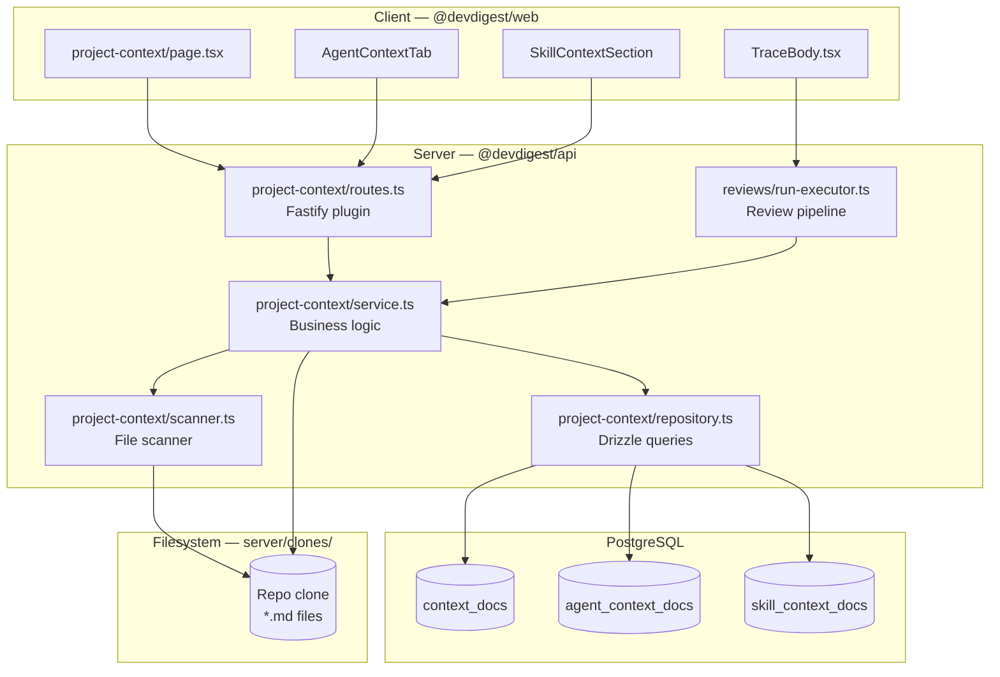
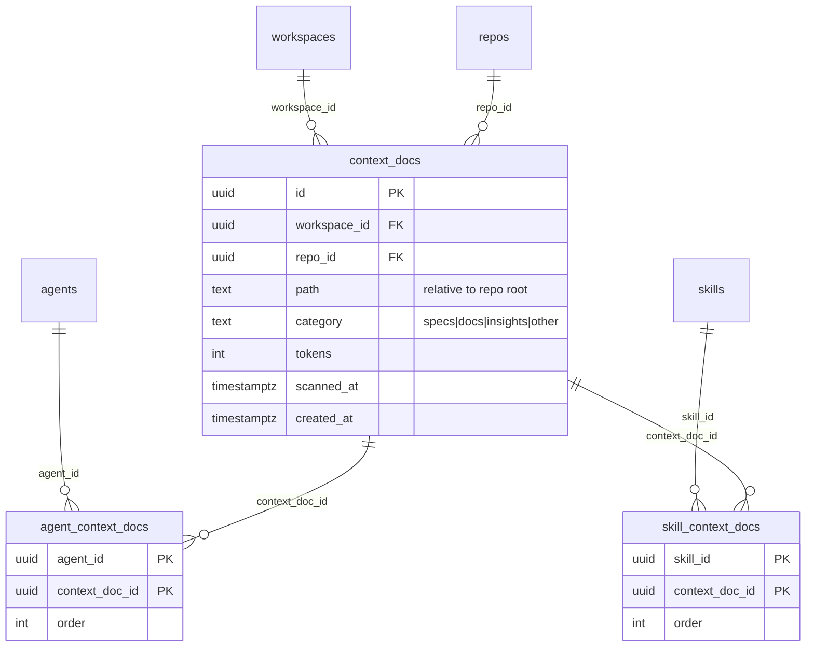
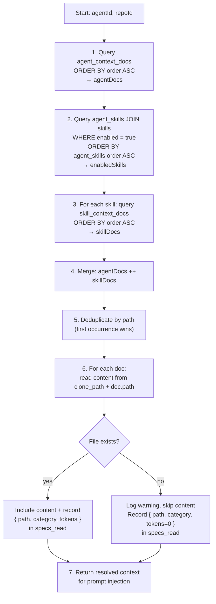
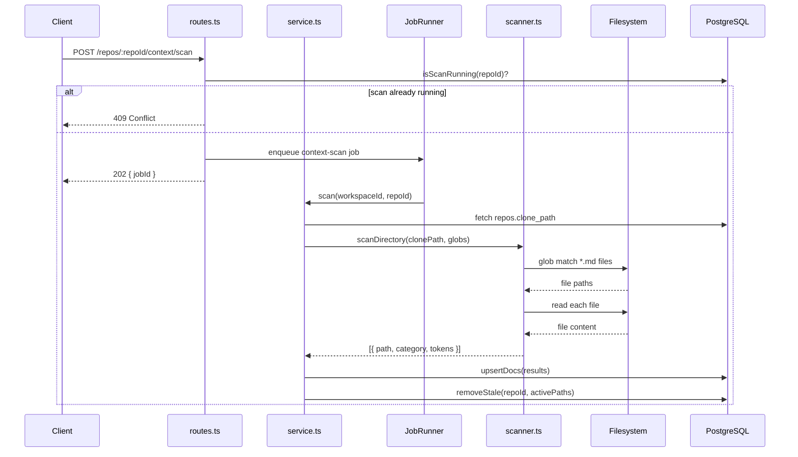
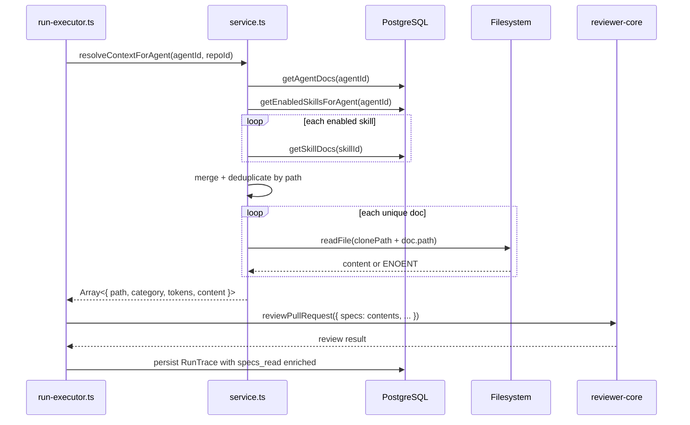

# ProjectContext

> **Status: Draft — implementation has not started. This document is based on the spec and plan only. It will need revision once implementation is complete.**

## Overview

ProjectContext gives agent administrators a way to ground PR reviews in project-specific
knowledge. Markdown files already present in the cloned repository (specs, docs, INSIGHTS.md)
are discovered by a file scanner and stored as `context_docs` records. Administrators attach
those documents to agents and skills. At review time the system resolves the effective set of
documents, injects their content into the prompt under a `## Project context` block, and
records which files were injected (with token costs) in the run trace.

The feature touches the server DB schema, a new Fastify module, the review execution
pipeline, the shared `RunTrace` contract, and four new or modified UI surfaces in the client.

## Architecture



## Key Components

### scanner.ts

**File:** `server/src/modules/project-context/scanner.ts`

Pure, side-effect-free scanning logic. Uses `fast-glob` to find `.md` files matching
the configured glob patterns inside the repo clone directory. Categorises each file
by the glob it matched (`specs`, `docs`, `insights`, `other`). Counts tokens with the
heuristic `content.split(/\s+/).length * 1.3 | 0` — no external tokenizer. Validates
filenames and content size. Separated from the service specifically for unit-testability.

### service.ts

**File:** `server/src/modules/project-context/service.ts`

Orchestrates all use cases: scanning, CRUD on context docs (read/write/create/delete/upload),
folder creation, agent/skill attachment management, and `resolveContextForAgent()`.

`resolveContextForAgent(agentId, repoId)` implements the merge algorithm described below.
It is called by the review pipeline (run-executor) before each review run.

### repository.ts

**File:** `server/src/modules/project-context/repository.ts`

All Drizzle queries for `context_docs`, `agent_context_docs`, and `skill_context_docs`.
The `setAgentDocs` and `setSkillDocs` methods perform a workspace ownership check
before inserting — they verify every supplied `contextDocId` belongs to the same
workspace as the agent/skill. FK constraints alone do not catch cross-workspace
attachment, so this is an explicit guard.

### routes.ts

**File:** `server/src/modules/project-context/routes.ts`

Fastify plugin. Registers all 13 HTTP routes (see API section below) and the
`context-scan` job handler. Registers `@fastify/multipart` locally (not globally)
to handle file uploads without affecting other routes.

### helpers.ts

**File:** `server/src/modules/project-context/helpers.ts`

Zod schemas for route validation, shared constants (`MAX_ATTACHED_DOCS = 10`,
`MAX_FILE_SIZE = 500 * 1024`, `DEFAULT_GLOBS`).

## Data Model



Both join tables use composite PKs and cascade-delete on both sides, so deleting a
context doc (via re-scan or manual delete) automatically removes all attachment rows.

Unique index on `(repo_id, path)` in `context_docs` — scan uses upsert by this key.

## Context Merge Algorithm

The merge runs at review time inside `resolveContextForAgent()`.



Key rules:
- Agent-level docs are always ordered before skill-level docs.
- Only enabled skills contribute their context docs.
- If the same file appears at agent level and skill level, the agent-level occurrence wins (first-occurrence dedup).
- A missing file on disk does not abort the review run; it logs a warning and the doc appears in the trace with `tokens: 0`.

## Data Flow — Scan Trigger



The concurrent-scan guard uses either a transaction wrapping check+enqueue, or a
partial unique index on the jobs table to make the second insert fail with a
constraint violation (mapped to 409).

## Data Flow — Review Run Context Injection



## Shared Contract Change — `RunTrace.specs_read`

The `specs_read` field in `vendor/shared/contracts/trace.ts` changes from:

```ts
specs_read: z.array(z.string())
```

to a backward-compatible union:

```ts
specs_read: z.array(z.union([z.string(), SpecReadEntry]))
```

`SpecReadEntry` is defined in a new contract file `vendor/shared/contracts/context-doc.ts`:

```ts
export const ContextDocCategory = z.enum(['specs', 'docs', 'insights', 'other']);
export const SpecReadEntry = z.object({
  path: z.string(),
  category: ContextDocCategory,
  tokens: z.number(),
});
```

The same file is mirrored to `client/src/vendor/shared/contracts/context-doc.ts`.

The union allows old traces (which have string arrays or empty arrays) to continue
parsing without a backfill migration. `TraceBody.tsx` normalises at render time:
`typeof sp === 'string' ? { path: sp, category: 'other', tokens: 0 } : sp`.

## API Surface

All routes are workspace-scoped via `getContext()`. The module is registered in
`server/src/modules/index.ts` as `projectContext`.

### Context document discovery and management

| Method | Path | Description |
|--------|------|-------------|
| POST | `/repos/:repoId/context/scan` | Trigger file scan. Returns 202 with `{ jobId }` or 409 if scan in progress. |
| GET | `/repos/:repoId/context/docs` | List context docs. Supports `?search=` for filename substring filtering. |
| GET | `/repos/:repoId/context/docs/:docId` | Single doc metadata. |
| GET | `/repos/:repoId/context/docs/:docId/content` | Read raw markdown from disk. |
| PUT | `/repos/:repoId/context/docs/:docId/content` | Write markdown to disk, recalculate tokens. |
| POST | `/repos/:repoId/context/docs` | Create new file. Body: `{ directory, filename, content? }`. |
| DELETE | `/repos/:repoId/context/docs/:docId` | Delete file from disk and DB. |
| POST | `/repos/:repoId/context/docs/upload` | Upload `.md` file via multipart form. Body: file + `directory` field. |

### Context document attachments

| Method | Path | Description |
|--------|------|-------------|
| GET | `/agents/:agentId/context` | List docs attached to agent (ordered). Includes total available count. |
| PUT | `/agents/:agentId/context` | Replace full attachment set. Body: `{ docs: [{ contextDocId, order }] }`. |
| GET | `/skills/:skillId/context` | List docs attached to skill (ordered). |
| PUT | `/skills/:skillId/context` | Replace full attachment set for skill. |

### Folder management

| Method | Path | Description |
|--------|------|-------------|
| POST | `/repos/:repoId/context/folders` | Create directory. Body: `{ directory, name }`. |

## Configuration

Glob patterns are configurable per-repo in settings. Defaults:

| Pattern | Category |
|---------|----------|
| `**/specs/**/*.md` | `specs` |
| `**/docs/**/*.md` | `docs` |
| `**/INSIGHTS.md` | `insights` |

All other matching files are categorised as `other`.

## Security

- **Path traversal prevention**: All file operations resolve to an absolute path via
  `path.resolve(clonePath, relativePath)` and verify the result starts with `clonePath`.
- **Filename validation**: Created/uploaded files must match `^[a-zA-Z0-9_-]+\.md$` and
  must not contain `../` sequences.
- **Content size limit**: 500 KB maximum per file on write/upload.
- **Cross-workspace attachment guard**: `setAgentDocs`/`setSkillDocs` explicitly verify
  every `contextDocId` belongs to the requesting workspace before inserting — FK constraints
  alone do not prevent cross-workspace attachment.
- **File creation restricted** to `specs/`, `docs/`, and `insights/` directories only.
- **Max 10 attached docs** per agent or skill (enforced server-side via Zod and service layer).

## UI Screens

| Screen | Route | Description |
|--------|-------|-------------|
| Project Context page | `/repos/[repoId]/project-context` | Two-panel: file list (left) + preview/edit (right). Toolbar with scan/create/upload. |
| Agent Context tab | `/agents/[agentId]` → "Context" tab | Drag-to-reorder attached docs, toggle attach/detach, combined token total. |
| Skill Context section | `/skills/[skillId]` → "Content" tab | Checkbox-based attach/detach, "Attached / All documents" toggle. |
| Run trace context section | PR detail → Agent Runs → run trace panel | Enriched `specs_read` list showing path, category label, and token count per doc. |

## New Dependencies

| Package | Location | Purpose |
|---------|----------|---------|
| `@fastify/multipart` | `server/package.json` | File upload endpoint (multipart/form-data) |
| `fast-glob` | `server/package.json` | Glob pattern matching in scanner |

## Constraints and Limits

| Constraint | Value |
|------------|-------|
| Max context docs attached per agent or skill | 10 |
| Max file size for write/upload | 500 KB |
| Scan target: repos with up to | 500 matching `.md` files |
| Expected scan time | under 10 seconds |
| File list API response time | under 200 ms |
| Token counting method | `content.split(/\s+/).length * 1.3 \| 0` |

## Related

- Spec: `server/specs/project-context/project-context.spec.md`
- Plan: `server/specs/project-context/project-context_plan.md`
- Shared contract: `server/src/vendor/shared/contracts/trace.ts` (modified)
- New contract: `server/src/vendor/shared/contracts/context-doc.ts` (new)
- Review pipeline: `server/src/modules/reviews/run-executor.ts` (modified)
- Prompt injection point: `reviewer-core/src/prompt.ts` — `PromptAssembly.specs` slot
