# Risk Brief (Server)

## Overview

The risk-brief module provides two HTTP endpoints that generate and cache an
AI-produced risk assessment for a pull request. The brief summarizes what
changed, why, the risk level, specific risk areas with file references, and a
prioritized review focus list. Generation is user-initiated; the result is cached
by `(pr_id, head_sha)` in the `pr_risk_brief` table so the same brief is not
regenerated for unchanged code.

The module also provides `enrichSmartDiffSummaries` in the pulls classifier,
which populates a per-file plain-English annotation &#40;`pseudocode_summary`&#41;
in the SmartDiff response.

## Module Location

```
server/src/modules/risk-brief/
  repository.ts    — DB access layer &#40;RiskBriefRepository&#41;
  service.ts       — business logic &#40;RiskBriefService&#41;
  routes.ts        — Fastify plugin, GET + POST /pulls/:id/brief

server/src/prompts/
  risk-brief.system.md  — system prompt template

server/src/vendor/shared/contracts/
  brief-response.ts     — Zod schemas and inferred types &#40;mirrored to client&#41;

server/src/modules/pulls/
  classifier.ts         — enrichSmartDiffSummaries function
  service.ts            — getSmartDiff wires enrichment after buildSmartDiff
```

## Architecture

```mermaid
flowchart TD
    subgraph Client
        RQ&#91;TanStack Query&#93;
    end

    subgraph Server
        Routes&#91;routes.ts&#93;
        Service&#91;service.ts&#93;
        Repo&#91;repository.ts&#93;
        LLM&#91;LLMProvider&#93;
        GH&#91;GitHub adapter&#93;
        PC&#91;ProjectContext&#93;
    end

    subgraph DB
        prRiskBrief&#91;&#91;pr_risk_brief&#93;&#93;
        prIntent&#91;&#91;pr_intent&#93;&#93;
        prBrief&#91;&#91;pr_brief&#93;&#93;
        prFiles&#91;&#91;pr_files&#93;&#93;
    end

    RQ -->|GET or POST /pulls/:id/brief| Routes
    Routes --> Service
    Service --> Repo
    Repo --> prRiskBrief
    Repo --> prIntent
    Repo --> prBrief
    Repo --> prFiles
    Service --> LLM
    Service --> GH
    Service --> PC
```

## API Contract

Both endpoints are registered under the `/pulls` prefix. Authentication is
enforced via `getContext(container, req)` which validates workspace membership.

### GET /pulls/:id/brief

Returns the current risk brief for the PR.

| Condition | HTTP status | Body |
|-----------|-------------|------|
| Brief cached | 200 | `RiskBriefResponse` |
| Generation in-progress &#40;lock held&#41; | 200 | `&#123; "status": "generating" &#125;` |
| No brief exists | 404 | error envelope |

The polymorphic 200 response intentionally omits a Fastify response schema so
neither shape is stripped by the serializer. Clients must discriminate using the
presence of `brief` vs `status` fields.

### POST /pulls/:id/brief

Generates or regenerates the risk brief. The request body is optional &#40;body-less
POST is accepted&#41;. A 65 s socket timeout gives the 60 s LLM call room to
complete before the socket fires.

| Condition | HTTP status | Body |
|-----------|-------------|------|
| Success | 200 | `RiskBriefResponse` |
| Lock held &#40;concurrent request&#41; | 409 | error envelope |
| PR has zero files | 422 | error envelope |
| LLM timed out | 504 | error envelope |
| LLM parse exhaustion &#40;2 attempts&#41; | 500 | error envelope |
| LLM network / provider error | 502 | error envelope |

### Shared Contract Types

**File:** `server/src/vendor/shared/contracts/brief-response.ts`

```
BriefRiskLevel         = z.enum&#40;['low', 'medium', 'high', 'critical']&#41;
BriefFileRef           = &#123; file: string, line?: number &#125;
BriefRiskArea          = &#123; title: string, description: string&#40;max 1000&#41;, file_refs: BriefFileRef&#91;&#93; &#125;
BriefReviewFocusItem   = &#123; file: string, line?: number, note: string&#40;max 1000&#41; &#125;
Brief                  = &#123; what: string&#40;max 3000&#41;, why: string&#40;max 3000&#41;, risk_level: BriefRiskLevel,
                           risks: BriefRiskArea&#91;&#93;&#40;max 10&#41;, review_focus: BriefReviewFocusItem&#91;&#93;&#40;max 15&#41; &#125;
BriefSources           = &#123; has_intent: bool, has_blast: bool, has_linked_issue: bool,
                           has_context_docs: bool, context_doc_count: number &#125;
RiskBriefResponse      = &#123; brief: Brief, head_sha: string, sources?: BriefSources,
                           model: string, generated_at: string &#125;
RiskBriefGeneratingResponse = &#123; status: 'generating' &#125;
```

`BriefRiskLevel` is a separate enum from the existing `RiskSeverity` in `brief.ts`
&#40;which omits `'critical'`&#41;. The existing contract file is not modified.

The `Brief` Zod schema enforces field-length caps &#40;`.max()`&#41; that raise parse
errors on pathological LLM responses. Array size caps &#40;10 risks, 15 review focus&#41;
are enforced in both the Zod schema and the system prompt.

## Layer Responsibilities

### Repository &#40;repository.ts&#41;

`RiskBriefRepository` owns all DB access. It never contains business logic.

| Method | Purpose |
|--------|---------|
| `getLatestByPrId(prId)` | Most recent brief for any head_sha &#40;used by GET for stale-brief display&#41; |
| `getByPrIdAndSha(prId, headSha)` | Exact cache hit by composite key |
| `upsert(prId, headSha, data)` | Insert-or-update on conflict &#40;pr_id, head_sha&#41; |
| `getPrForWorkspace(workspaceId, prId)` | PR row with workspace ownership check |
| `getPrFilePaths(prId)` | All file paths for a PR &#40;used for zero-files guard + LLM validation&#41; |
| `getIntentForPr(prId)` | Intent data from `pr_intent` table |
| `getBlastSummaryForPr(prId)` | `blast.summary` string from `pr_brief` JSONB |

All methods map the Drizzle `createdAt: Date` column to `generated_at: string`
&#40;ISO 8601&#41; in the `RiskBriefRow` DTO so callers never handle raw `Date` objects.

The `rows[0]` narrowing pattern is used throughout; destructured `const [row]`
is avoided because Drizzle does not narrow to non-undefined after a guard.

### Service &#40;service.ts&#41;

`RiskBriefService` contains all business logic. It instantiates the repository
internally and accesses the LLM and other services via the `Container`.

**In-memory concurrent generation lock:**

```
generationLocks: Map<string, Promise<RiskBriefResponse>>
LOCK_TTL_MS = 75 000
```

The map is keyed by `prId`. A 75 s TTL timer auto-releases the lock if the
promise never settles &#40;guards against server hangs&#41;. The lock is process-local
and does not guard across multiple server instances &#40;acceptable for v1&#41;.

**`getBrief` logic:**

1. Validate workspace ownership via `getPrForWorkspace`.
2. If `generationLocks.has(prId)`, return `{ status: 'generating' }`.
3. Query `getLatestByPrId` — return `null` if no row exists.
4. Map row to `RiskBriefResponse`.

**`generateBrief` logic:**

1. Validate workspace ownership.
2. Throw `AppError(409)` if lock is held.
3. Acquire lock, call `doGenerate`, release lock in `.finally()`.

**`doGenerate` sequence:**

```mermaid
sequenceDiagram
    participant S as Service
    participant R as Repository
    participant GH as GitHub adapter
    participant PC as ProjectContext
    participant LLM as LLMProvider

    S->>R: getPrFilePaths&#40;prId&#41;
    alt Zero files
        S-->>S: throw AppError 422
    end
    S->>R: getIntentForPr&#40;prId&#41; + getBlastSummaryForPr&#40;prId&#41;
    S->>GH: getIssue&#40;owner, name, issueNumber&#41; &#40;best-effort&#41;
    S->>PC: resolveContextForAgent&#40;agentId, repoId&#41; &#40;best-effort&#41;
    S->>S: build BriefSources metadata
    S->>S: resolveFeatureModel&#40;'risk_brief'&#41;
    S->>S: renderPrompt + hardenSystemPrompt
    S->>S: build user message with wrapUntrusted per input
    S->>LLM: completeStructured&#40;Brief schema, temp 0.3, maxTokens 4096, timeout 60s&#41;
    LLM-->>S: &#123; data: Brief, tokensIn, tokensOut &#125;
    S->>S: normalize + validate file paths against prFilePaths set
    S->>S: strip unrecognized paths, log warnings
    S->>R: upsert&#40;prId, headSha, validatedBrief&#41;
    S->>S: emit structured JSON info log
    S-->>S: return RiskBriefResponse
```



### Routes &#40;routes.ts&#41;

Thin Fastify plugin. Both handlers call `getContext` first, then delegate entirely
to `service`. The POST handler sets a 65 s socket timeout with a `typeof` guard
because `req.raw.setTimeout` is not available inside Fastify's `inject()` test
helper.

## Caching and Staleness Model

### Database Table

```
pr_risk_brief
  pr_id       uuid        NOT NULL  FK -> pull_requests.id ON DELETE CASCADE
  head_sha    text        NOT NULL
  brief       jsonb       NOT NULL  — serialized Brief object
  model       text        NOT NULL  — LLM model used
  sources     jsonb                 — BriefSources metadata &#40;nullable&#41;
  created_at  timestamptz NOT NULL  DEFAULT now&#40;&#41;
  PRIMARY KEY &#40;pr_id, head_sha&#41;
```

The composite primary key means each PR+commit combination has at most one
cached brief. Regenerating for the same `head_sha` performs an upsert &#40;updates
`brief`, `model`, `sources`, and `created_at`&#41;.

### Staleness Detection

The GET endpoint always returns the most recent brief via `getLatestByPrId`,
regardless of whether `head_sha` matches the PR's current head. The `head_sha`
field is included in `RiskBriefResponse` so the client can compare it against
the PR's current `head_sha` and display an Outdated badge when they differ.

There is no automatic regeneration. The user must click Regenerate.

## LLM Integration

### Model Selection

The model is resolved via `resolveFeatureModel(container, workspaceId, 'risk_brief')`.
The `risk_brief` feature model ID is pre-registered in the `FEATURE_MODELS`
registry in `server/src/vendor/shared/contracts/platform.ts`. Workspace-level
model overrides apply if configured.

### System Prompt

**File:** `server/src/prompts/risk-brief.system.md`

The system prompt instructs the LLM to:
- Return a structured `Brief` JSON object &#40;no other text&#41;.
- Use only file paths from the provided PR file list.
- Produce `what` and `why` as plain text, never markdown or HTML.
- Cap at 10 risk areas and 15 review focus items.
- Use conservative risk-level assignment &#40;when uncertain, lean higher&#41;.
- Write in reviewer-oriented prose, not developer-oriented.
- Proceed with best-effort when some inputs are absent &#40;no refusals&#41;.

The prompt is loaded via `renderPrompt('risk-brief.system.md', {})` with no
template variables &#40;all dynamic data is assembled in the user message&#41; and then
hardened via `hardenSystemPrompt()` from reviewer-core.

### Input Assembly

Each input source is best-effort — missing sources are tracked in `BriefSources`
and the LLM proceeds with whatever is available.

| Input | Source | Wrapped with wrapUntrusted |
|-------|--------|---------------------------|
| Diff stats &#40;additions, deletions, files_count&#41; | `pull_requests` table | No &#40;numeric, not user-controlled&#41; |
| PR file list | `pr_files` table | Yes |
| Intent &#40;summary, in_scope, out_of_scope, risk_areas&#41; | `pr_intent` table | Yes |
| Blast radius summary | `pr_brief.json.blast.summary` | Yes |
| Linked issue body | GitHub API via closing keyword regex | Yes |
| Project context docs | `ProjectContextService.resolveContextForAgent` | Yes, per document |

The linked issue number is extracted from `pull_requests.body` using the regex
`/(?:closes?|fixes?|resolves?)\s+#(\d+)/i`.

### LLM Call Parameters

```
schema:     Brief &#40;Zod&#41;
schemaName: 'Brief'
temperature: 0.3
maxTokens:  4096
maxRetries: 1       — 2 total parse attempts before AppError 500
timeoutMs:  60 000
```

### File Path Validation

After the LLM responds, all file paths in `risks[].file_refs[].file` and
`review_focus[].file` are validated against the actual PR file set. Paths are
normalized before comparison:

```
normalizePath(p):
  1. Replace backslashes with forward slashes
  2. Strip leading "./"
  3. Lowercase
```

A `Set` of normalized PR file paths enables O&#40;1&#41; lookup. Each stripped path is
logged as a warning including both the original and normalized forms.

### Structured Log on Completion

After a successful generation the service emits a JSON info log:

```json
&#123;
  "module": "risk-brief",
  "event": "brief_generated",
  "model": "<resolved model>",
  "prompt_tokens": <number | null>,
  "completion_tokens": <number | null>,
  "latency_ms": <number>,
  "inputs_present": &#123;
    "has_intent": <bool>,
    "has_blast": <bool>,
    "has_linked_issue": <bool>,
    "has_context_docs": <bool>,
    "context_doc_count": <number>
  &#125;,
  "file_refs_stripped": <number>,
  "pr_id": "<first 8 chars>",
  "head_sha": "<first 8 chars>"
&#125;
```

## SmartDiff Pseudocode Summary

### Overview

`enrichSmartDiffSummaries` &#40;`classifier.ts`&#41; adds LLM-generated plain-English
annotations to `SmartDiffFile.pseudocode_summary` for core and wiring files.
It is called from `PullsService.getSmartDiff` after the deterministic
`buildSmartDiff` classification completes.

### Design

- Single batched LLM call for all eligible files &#40;not per-file&#41;.
- Boilerplate files are excluded — they have no meaningful logic to summarize.
- Files without `patch` data &#40;null column&#41; are skipped.
- Each patch is truncated to 3 000 characters before being sent to the LLM.
- Patch content is wrapped with `wrapUntrusted` per security policy.
- Failures are caught by the caller &#40;`getSmartDiff`&#41; which logs a warning and
  returns the SmartDiff with all summaries as null — graceful degradation.
- Reuses the `risk_brief` feature model ID for model resolution.

### LLM Call Parameters

```
schema:     &#123; summaries: &#91;&#123; file: string, summary: string &#125;&#93; &#125;
temperature: 0.2
maxTokens:  2048
maxRetries: 0
timeoutMs:  30 000
```

### Integration Point in getSmartDiff

```
PullsService.getSmartDiff:
  1. Select pr_files &#40;path, additions, deletions, patch&#41;
  2. buildSmartDiff&#40;files, findingsByFile&#41;           — pure, deterministic
  3. Build patches Map from files with non-null patch
  4. try &#123; await enrichSmartDiffSummaries&#40;...&#41; &#125;    — best-effort, mutates in-place
     catch &#123; log warn, return SmartDiff without summaries &#125;
  5. return smartDiff
```

The `pseudocode_summary` field on `SmartDiffFile` is defined in
`server/src/vendor/shared/contracts/brief.ts` as `pseudocode_summary?: string | null`.
It existed before this feature; the classifier previously always set it to null.

## Security

- `what` and `why` fields from the LLM are stored as strings and rendered as
  plain text on the client — never as HTML or markdown.
- All user-controlled and LLM-controlled inputs to the prompt are wrapped with
  `wrapUntrusted()` to mitigate prompt injection.
- The system prompt is hardened via `hardenSystemPrompt()`.
- LLM-generated file paths are validated against the actual PR file list before
  being stored or returned.
- The `pr_id` URL parameter is scoped to the authenticated workspace via
  `getContext` — cross-workspace access is impossible.

## Related

- `client/docs/RiskBrief/README.md` — client component and state machine
- `client/specs/risk-brief/risk-brief.spec.md` — behavioral specification
- `server/src/vendor/shared/contracts/brief-response.ts` — Zod contract definitions
- `server/INSIGHTS.md` — gotchas about body-less POST, req.raw.setTimeout guard,
  Drizzle row narrowing pattern
