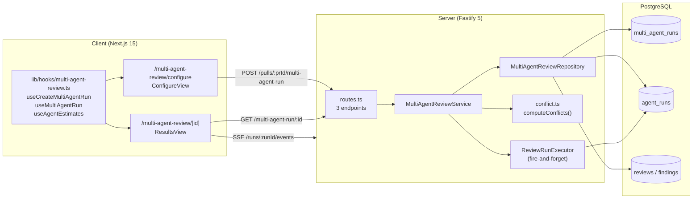
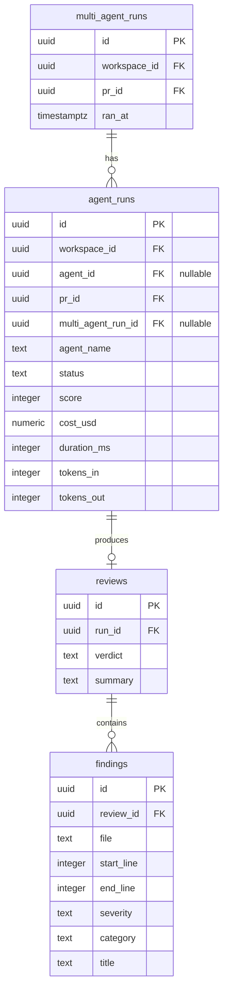

# Multi-Agent Review

## Overview

Multi-Agent Review is a cross-package feature that lets users run multiple review agents against a single pull request in parallel and compare their outputs side by side. A configuration page lets the user pick a PR and select agents; the server creates the run record and fires execution in the background; each agent streams progress over SSE; and a results page shows per-agent columns plus a computed "Where Agents Disagree" section that highlights file regions where agents produced conflicting verdicts.

The feature introduces a `multi_agent_runs` table as a first-class parent entity. Existing `agent_runs` rows link back via a nullable `multi_agent_run_id` FK. Single-agent and "run all" flows (`POST /pulls/:id/review`) are unchanged — their runs have `multi_agent_run_id = NULL`.

---

## Architecture



---

## Key Components

### Routes

**File:** `server/src/modules/multi-agent-review/routes.ts`

Thin Fastify plugin with three endpoints. Every handler resolves the workspace via `getContext()`, delegates to `MultiAgentReviewService`, and returns. Rate limits are applied per route (POST: 10/min; GETs: 120/min).

### MultiAgentReviewService

**File:** `server/src/modules/multi-agent-review/service.ts`

Orchestration layer. No Drizzle operators — all DB access goes through repositories. Responsibilities:

- `createAndExecute` — validates the PR and each agent against the workspace, inserts the `multi_agent_runs` row, inserts per-agent `agent_runs` stubs, then calls `executor.executeRuns()` via fire-and-forget. Returns `{ id, runs }` immediately so the HTTP response is fast and the client can subscribe to SSE before execution finishes.
- `getMultiAgentRun` — fetches the run row, agent columns, and raw findings; delegates conflict computation to `computeConflicts()`; calculates aggregate stats (total_duration_ms = max, total_cost_usd = sum across completed columns); returns the full `MultiAgentRunDetail` shape.
- `getEstimates` — lists all workspace agents and joins with the most recent completed run per agent; computes aggregate estimates (cost = sum, duration = max; `is_partial = true` when any agent lacks historical data).

### MultiAgentReviewRepository

**File:** `server/src/modules/multi-agent-review/repository.ts`

Handles four query groups:

| Method | Purpose |
|---|---|
| `createMultiAgentRun` | INSERT into `multi_agent_runs`, returns new UUID |
| `getMultiAgentRun` | SELECT workspace-scoped row by ID |
| `getRunsForMultiAgent` | N+1-style fetch: runs → reviews → findings per run; shapes `MultiAgentAgentColumn[]` |
| `getFindingsForConflict` | Single JOIN query returning `ConflictFinding[]` (includes `end_line` needed by the conflict algorithm) |
| `getLatestCompletedRuns` | `DISTINCT ON (agent_id)` raw SQL; returns `Map<agent_id, { cost_usd, duration_ms }>` |

`agent_name` is read from `agent_runs.agent_name` (captured at run-creation time) rather than joined from `agents`, so results survive agent deletion.

### conflict.ts

**File:** `server/src/modules/multi-agent-review/conflict.ts`

Pure computation — no I/O, no framework dependencies. Input: `ConflictFinding[]` + `allAgentIds: string[]`. Output: `Conflict[]`.

See "Conflict Computation Algorithm" section below for full detail.

### Shared Contracts

**File:** `server/src/vendor/shared/contracts/multi-agent-api.ts`

New contract file that extends `observability.ts` without modifying it. Exports:

- `MultiAgentRunRequest` — POST body (`{ agent_ids: UUID[] }`, min 1)
- `MultiAgentRunResponse` — POST response (`{ id, runs: ReviewRunTarget[] }`)
- `AgentEstimate` / `MultiAgentEstimate` — GET /agents/estimates shapes
- `MultiAgentAgentColumn` — extends `AgentColumn` with `tokens_in` / `tokens_out`
- `MultiAgentRunDetail` — extends `MultiAgentRun` with `columns: MultiAgentAgentColumn[]`

### Client Hooks

**File:** `client/src/lib/hooks/multi-agent-review.ts`

Three TanStack Query hooks:

| Hook | Behavior |
|---|---|
| `useMultiAgentRun(id)` | `useQuery` polling every 4 s while any column has `status === "running"`, stops otherwise |
| `useCreateMultiAgentRun()` | `useMutation` posting to `/pulls/:prId/multi-agent-run`; on success navigates to `/multi-agent-review/:id` |
| `useAgentEstimates()` | `useQuery` with `staleTime: 60_000` — estimates change only when runs complete |

### ConfigureView

**File:** `client/src/app/multi-agent-review/configure/_components/ConfigureView/ConfigureView.tsx`

Client component. Orchestrates the configure page: PR picker (dropdown over workspace PRs), agent checkboxes (all enabled agents checked by default), an `EstimatePanel` sidebar computed from selected agents' historical data, and a "Run" button. Submits via `useCreateMultiAgentRun` and navigates to the results page on success.

Sub-components: `AgentCheckboxList`, `EstimatePanel`.

### ResultsView

**File:** `client/src/app/multi-agent-review/[id]/_components/ResultsView/ResultsView.tsx`

Client component. Subscribes to `useMultiAgentRun` (polling) and `useRunEvents` (SSE) in parallel. Renders a horizontally scrollable row of `AgentColumnCard` components. Tracks elapsed time with a 1-second interval while any column is running. Detects SSE connection loss by comparing the `sseRunning` flag against DB-reported running columns. Shows `ConflictsSection` only when more than one agent is present.

Sub-components: `AgentColumnCard`, `ConflictsSection`.

### ConflictsSection

**File:** `client/src/app/multi-agent-review/[id]/_components/ConflictsSection/ConflictsSection.tsx`

Client component. Renders the "Where Agents Disagree" section. Each conflict card shows file:line, the conflict title, and per-agent verdict badges (CRITICAL / WARNING / SUGGESTION / ignored). A "Show only conflicts" checkbox filters to entries where the set of verdicts has more than one distinct value.

---

## Data Model

### `multi_agent_runs`

| Column | Type | Notes |
|---|---|---|
| `id` | `uuid` PK | Random default |
| `workspace_id` | `uuid` FK | `workspaces.id` ON DELETE CASCADE |
| `pr_id` | `uuid` FK | `pull_requests.id` ON DELETE CASCADE |
| `ran_at` | `timestamptz` | `defaultNow()` |

### `agent_runs` (relevant additions)

| Column | Type | Notes |
|---|---|---|
| `multi_agent_run_id` | `uuid` FK nullable | `multi_agent_runs.id` ON DELETE SET NULL. NULL for single-agent flows. |
| `agent_name` | `text` NOT NULL | Display name captured at creation time; survives agent deletion. Empty string backfill for pre-existing rows. |



---

## Conflict Computation Algorithm

Implemented in `server/src/modules/multi-agent-review/conflict.ts`. Computed on every `GET /multi-agent-run/:id` call — conflicts are not stored.

**Performance guard:** if total findings exceed 500 or only one agent participated, the function returns `[]` immediately.

**Steps:**

1. **Group by file** — findings are partitioned into per-file buckets.
2. **Cluster by overlapping line range** — within each file, findings are sorted by `start_line`. A sweep-merge algorithm groups findings into clusters: a finding joins the current cluster if `finding.start_line <= currentCluster.maxEndLine`; otherwise a new cluster starts. Two intervals `[a1, a2]` and `[b1, b2]` overlap when `a1 <= b2 && b1 <= a2`.
3. **Build takes per cluster** — for each cluster, one take is built per agent in `allAgentIds`. If the agent has a finding in the cluster, the take uses that finding's `severity` as verdict and `title` as note. If the agent has no finding in the cluster, the take verdict is `'ignored'`.
4. **Emit conflict when agents disagree** — a cluster is a conflict if either (a) the set of verdicts contains more than one distinct value, or (b) not all agents that flagged the region used the same category. Clusters where all agents agree on verdict and category are silently dropped.

The representative finding (first in the sorted cluster) supplies the `file`, `line`, and `title` fields on the emitted `Conflict`.

---

## API Endpoints

### POST /pulls/:prId/multi-agent-run

Create and execute a multi-agent run. Returns immediately after DB rows are created; execution continues in the background.

**Rate limit:** 10 requests/minute.

**Request:**
```json
{
  "agent_ids": ["<uuid>", "<uuid>"]
}
```

`agent_ids` must be non-empty and all UUIDs must belong to the current workspace.

**Response (201):**
```json
{
  "id": "<multi_agent_run_uuid>",
  "runs": [
    { "run_id": "<agent_run_uuid>", "agent_id": "<uuid>", "agent_name": "Security Review" },
    { "run_id": "<agent_run_uuid>", "agent_id": "<uuid>", "agent_name": "Performance Review" }
  ]
}
```

The `runs` array gives the client the `run_id` values needed to subscribe to SSE streams at `GET /runs/:runId/events`.

### GET /multi-agent-run/:id

Fetch full results for a completed or in-progress multi-agent run. Workspace-scoped (returns 404 if the run belongs to a different workspace).

**Rate limit:** 120 requests/minute.

**Response (200):**
```json
{
  "id": "<uuid>",
  "pr_id": "<uuid>",
  "pr_number": 42,
  "ran_at": "2026-08-25T10:00:00.000Z",
  "agent_count": 2,
  "total_duration_ms": 18400,
  "total_cost_usd": 0.0032,
  "columns": [
    {
      "run_id": "<uuid>",
      "agent_id": "<uuid>",
      "agent_name": "Security Review",
      "provider": "anthropic",
      "model": "claude-sonnet-4-5",
      "status": "done",
      "verdict": "REQUEST_CHANGES",
      "score": 72,
      "summary": "Found two high-severity issues...",
      "duration_ms": 18400,
      "cost_usd": 0.0018,
      "tokens_in": 12000,
      "tokens_out": 800,
      "findings": [
        {
          "id": "<uuid>",
          "severity": "CRITICAL",
          "category": "security",
          "title": "SQL injection via unsanitized input",
          "file": "src/db/query.ts",
          "start_line": 42,
          "kind": "finding"
        }
      ]
    }
  ],
  "conflicts": [
    {
      "file": "src/db/query.ts",
      "line": 42,
      "title": "SQL injection via unsanitized input",
      "takes": [
        { "agent_id": "<uuid>", "persona": "Security Review", "verdict": "CRITICAL", "note": "SQL injection via unsanitized input" },
        { "agent_id": "<uuid>", "persona": "Performance Review", "verdict": "ignored", "note": "" }
      ]
    }
  ]
}
```

`total_duration_ms` = max across completed columns (wall-clock parallelism). `total_cost_usd` = sum across completed columns. Both are `0` / `null` while all columns are still running.

### GET /agents/estimates

Pre-run cost and duration estimates for all agents in the workspace, derived from each agent's most recent completed `agent_run`.

**Rate limit:** 120 requests/minute.

**Response (200):**
```json
{
  "agents": [
    { "agent_id": "<uuid>", "agent_name": "Security Review", "cost_usd": 0.0018, "duration_ms": 18400 },
    { "agent_id": "<uuid>", "agent_name": "New Agent", "cost_usd": null, "duration_ms": null }
  ],
  "total_cost_usd": 0.0018,
  "total_duration_ms": 18400,
  "is_partial": true
}
```

`is_partial = true` when at least one agent has no historical data. `total_cost_usd` and `total_duration_ms` are `null` when no agents have any data at all.

---

## Data Flow

```mermaid
sequenceDiagram
  participant U as User
  participant CV as ConfigureView
  participant RV as ResultsView
  participant API as Fastify API
  participant SVC as MultiAgentReviewService
  participant EXEC as ReviewRunExecutor
  participant DB as PostgreSQL
  participant SSE as RunBus &#40;SSE&#41;

  U->>CV: Select PR + agents, click Run
  CV->>API: POST /pulls/:prId/multi-agent-run
  API->>SVC: createAndExecute&#40;workspaceId, prId, agentIds&#41;
  SVC->>DB: Validate PR + agents
  SVC->>DB: INSERT multi_agent_runs row
  loop Per agent
    SVC->>DB: INSERT agent_runs stub &#40;status=running&#41;
  end
  SVC-->>EXEC: executeRuns&#40;&#41; fire-and-forget
  SVC-->>API: Return &#123; id, runs &#125;
  API-->>CV: 201 &#123; id, runs &#125;
  CV->>RV: router.push&#40;/multi-agent-review/:id&#41;

  par Parallel agent execution
    EXEC->>DB: Run agent 1, update agent_runs + reviews + findings
    EXEC->>SSE: Publish events for run 1
    EXEC->>DB: Run agent 2, update agent_runs + reviews + findings
    EXEC->>SSE: Publish events for run 2
  end

  RV->>API: GET /multi-agent-run/:id &#40;polling every 4s&#41;
  RV->>SSE: GET /runs/:runId/events &#40;per running column&#41;
  SSE-->>RV: Stream progress events
  API->>DB: Fetch columns + findings
  API->>SVC: computeConflicts&#40;findings, agentIds&#41;
  API-->>RV: MultiAgentRunDetail &#40;columns + conflicts&#41;
  RV->>U: Render side-by-side columns + conflicts section
```



---

## Client Page Routes

| Route | File | Component |
|---|---|---|
| `/multi-agent-review/configure` | `client/src/app/multi-agent-review/configure/page.tsx` | `ConfigureView` |
| `/multi-agent-review/[id]` | `client/src/app/multi-agent-review/[id]/page.tsx` | `ResultsView` |

### ConfigureView component tree

```
ConfigureView
├── AgentCheckboxList       — one checkbox row per workspace agent
└── EstimatePanel           — cost/duration summary for selected agents
```

### ResultsView component tree

```
ResultsView
├── AgentColumnCard (×N)    — per-agent status, verdict, score, findings list
└── ConflictsSection        — "Where Agents Disagree"; hidden for single-agent runs
```

---

## Configuration

No feature flags or environment variables specific to this feature. The feature is enabled unconditionally when the module is registered in `server/src/modules/index.ts`.

---

## Related

- `server/src/modules/multi-agent-review/routes.ts` — endpoint definitions
- `server/src/modules/multi-agent-review/service.ts` — orchestration
- `server/src/modules/multi-agent-review/repository.ts` — data access
- `server/src/modules/multi-agent-review/conflict.ts` — conflict algorithm
- `server/src/vendor/shared/contracts/multi-agent-api.ts` — Zod contracts
- `server/src/vendor/shared/contracts/observability.ts` — base `AgentColumn`, `Conflict`, `MultiAgentRun` types
- `client/src/lib/hooks/multi-agent-review.ts` — TanStack Query hooks
- `server/src/modules/reviews/run-executor.ts` — `ReviewRunExecutor` (shared with single-agent flow)
- `specs/multi-agent-review/multi-agent-review.spec.md` — behavioral specification
